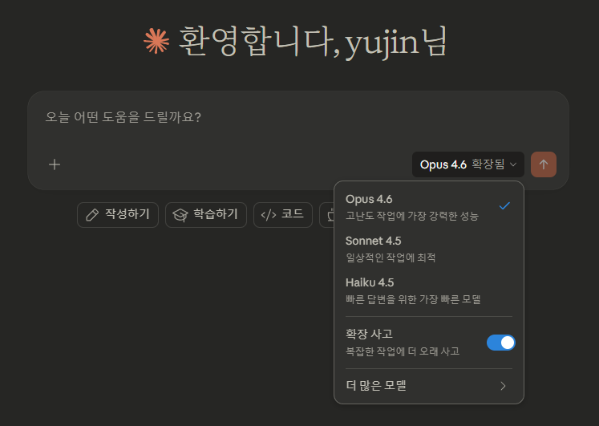
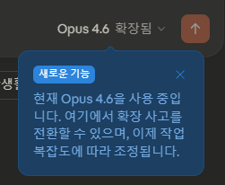
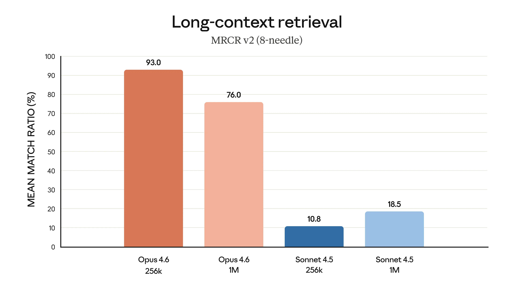
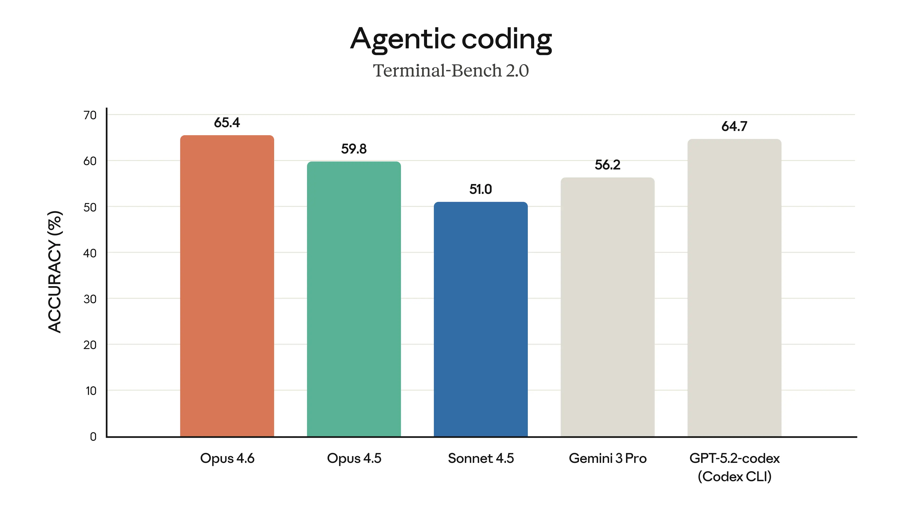

오늘 익숙하게 claude에 들어가 코드를 뽑아내고자 했다.
그런데

Opus 4.6 확장됨

이라고 떠있는데 난 Opus 4.5 애용자였으나 출장 중이라 예고도 못 들었어서 잠깐 당황했지만,
일단 업그레이드됐으니까 기분이 좋은 김에 정리해보고자 했다.

바로 어제 2026년 2월 5일에 Anthropic에서 새로운 모델인 Claude Opus 4.6을 발표했다.

Claude 4.5 패밀리의 최상위 모델인 Opus를 업그레이드한 버전인데, 
이전 모델(Opus 4.5)보다 코딩, 에이전트 작업, 장문 컨텍스트 처리 면에서 확 올라갔다고 한다.

> Claude Opus 4.6은 이전 모델보다 코딩 능력이 향상되었습니다.
> 더 신중하게 계획하고, 에이전트 작업을 더 오래 유지하며,
> 대규모 코드베이스에서 더 안정적으로 작동하고,
> 자신의 실수를 잡아내는 코드 리뷰와 디버깅 능력이 향상되었습니다.

라고 한다.

## 뭐가 달라졌는데

일단 가장 큰 건 **1M 토큰 컨텍스트 윈도우**가 Opus급 모델에 처음으로 적용됐다는 것이다. 베타긴 하지만.

기존에 긴 대화를 하거나 문서를 많이 넣으면 모델이 뒷부분에서 앞부분 정보를 까먹는 "context rot" 문제가 있었는데, Opus 4.6은 이게 눈에 띄게 개선됐다고 한다.
이 부분이 상당히 체감이 될 것으로 예상된다.

코딩 말고도 금융 분석, 리서치, 문서·스프레드시트·프레젠테이션 작업 같은 일반 업무 능력도 같이 올랐다.
## 벤치마크 정리

주요 벤치마크 결과를 요약하면, Claude Opus 4.6은 다음 세 축에서 특히 강점을 보인다.

- **에이전트 코딩**: Terminal-Bench, SWE-bench 기준 최고 수준의 성능
- **장문 컨텍스트 검색**: MRCR 벤치마크에서 대규모 컨텍스트 정확도 크게 개선
- **실무형 지식 작업**: GDPval 기준 금융·법률 등 실무 태스크에서 높은 점수

대충 종합해보면 코딩, 추론, 검색, 장문 맥락 전반에서 현존 최고 수준이라는 평가다.  
(물론 벤치마크 기준이며, 실제 워크로드에서는 차이가 있을 수 있다)

## 안전성

자동화된 행동 감사에서 속임수, 아부, 사용자 환각 조장, 오남용 협조 같은 misaligned behavior 비율이 이전 모델 Opus 4.5와 동일하거나 더 낮게 나왔다고 한다.

특히 사이버보안 능력이 강해진 만큼 새로운 사이버보안 프로브 6개를 추가로 개발해서 악용을 감시하고 있다고 한다. 역으로 오픈소스 소프트웨어의 취약점을 찾고 패치하는 사이버 방어용으로도 모델을 활용 중이라고.

## API 및 제품 업데이트

개발자 입장에서 눈여겨볼 것들이다.

- **Adaptive Thinking**: 이전에는 extended thinking을 켜거나 끄는 이진 선택이었는데, 이제 모델이 알아서 깊게 생각할지 판단한다. 기본 effort level은 high.
- **Effort 레벨**: low, medium, high(기본), max 4단계. 모델이 과하게 생각하는 것 같으면 medium으로 내리면 된다.
- **Context Compaction (베타)**: 긴 대화나 에이전트 작업에서 컨텍스트 윈도우에 도달하기 전에 자동으로 오래된 컨텍스트를 요약·교체해준다.
- **1M 토큰 컨텍스트 (베타)**: 200k 초과 프롬프트에는 프리미엄 가격 적용($10/$37.50 per million input/output tokens).
- **128k 출력 토큰**: 더 큰 출력 작업을 한 번에 처리 가능.

가격은 기존과 동일하게 $5/$25 per million tokens.
모델 스트링은 `claude-opus-4-6`으로 사용하면 된다고 한다.

## Claude Code 업데이트

Claude Code에서 **에이전트 팀** 기능이 리서치 프리뷰로 나왔다.
여러 에이전트를 병렬로 띄워서 팀처럼 자율적으로 협업시킬 수 있다.
코드베이스 리뷰처럼 독립적이고 읽기 위주의 작업에 좋다고 한다.
`Shift+Up/Down`이나 tmux로 서브에이전트에 직접 개입도 가능하다.

## Office 도구 연동

- **Claude in Excel**: 장시간·고난이도 작업 성능 개선. 비정형 데이터를 넣으면 구조를 알아서 추론해주고, 멀티스텝 변경을 한 번에 처리한다고.
- **Claude in PowerPoint** (리서치 프리뷰): 레이아웃, 폰트, 슬라이드 마스터를 읽어서 브랜드에 맞게 유지하면서 덱을 생성해준다. Max, Team, Enterprise 플랜에서 사용 가능.

## 마무리

코딩에 쓰든, 문서 처리에 쓰든, 
이전 Opus 대비 확실히 체감되는 업그레이드일 것 같다.

특히 1M 컨텍스트 윈도우에서의 검색 정확도가 이전 모델들 대비 4배 이상 올라간 건 꽤 의미가 크다고 본다.
기존에 코드를 도움 받을 때, 기존의 특정 드라이버의 modbus 정보라던가, 특정 임베디드 코딩을 할 때
답답한 부분이 많이 있었는데 정말 와닿을 정도로 
코드베이스 작성 또는 리뷰를 할 때 확실히 체감되지 않을까 싶다.

Opus 4.6은 “똑똑해진 모델”이라기보다 **“오래 일 시켜도 안 무너지는 모델”**에 가까워 보인다.

Claude의 단점을 집중적으로 강화시키려고 노력한 게 보이는 버전으로 보이며, 실제론 어떨지 써봐야 알 것 같다.

그러나 기본 가격은 그대로지만, max effort + 1M 컨텍스트를 동시에 쓰면 비용은 확 튈 수 있어서 이 조합은 진짜 필요한 작업에만 쓰는 게 맞아 보인다.

다음부턴 이 아이와 함께한 작업들을 이야기할 수 있을 것 같다.

자세한 내용은 [Claude Opus 4.6 발표 내용](https://www.anthropic.com/news/claude-opus-4-6)에서 확인할 수 있다.