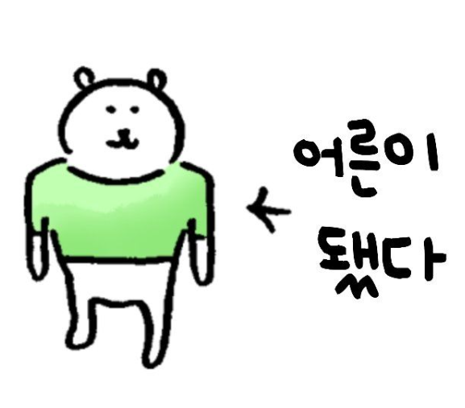
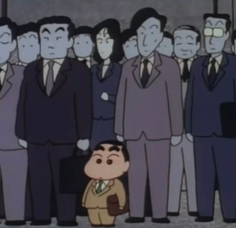
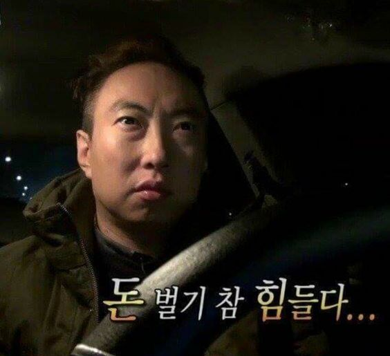
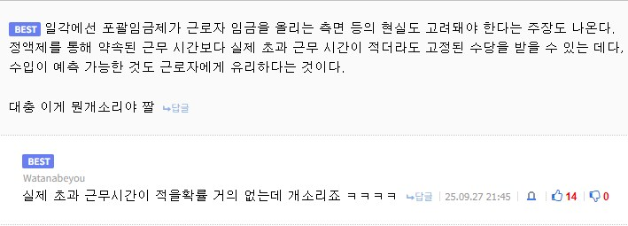
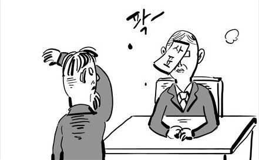
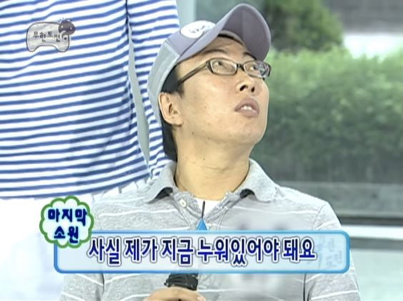

얼마 전에 [올해 거의 절반을 쏟았던 취업 회고](https://velog.io/@dbwls/%ED%95%99%EC%A0%90-%EB%A7%9D%ED%95%9C-%EB%8C%80%ED%95%99%EC%83%9D%EC%9D%98-%EB%AA%B8%ED%86%B5%EB%B0%95%EC%B9%98%EA%B8%B0-%EC%B7%A8%EC%97%85-%ED%9A%8C%EA%B3%A0%EB%A1%9D)를 썼다.
그래서 좀 많이 늦기도 했고 2025 회고록을 작성할까말까 고민을 많이 했는데,

아무튼 진짜 힘들었던 올해 나머지 절반에 대한 예의가 아닌 것 같아서 일단 작성하기로 했다.

---

## 회고..

올해는 평이했던 내 인생 중 가장 다사다난했던 해가 아닌가 싶다.

1월은 4학년 2학기와 병행했던 직무 부트캠프를 수료하고, 
2월까지 동사무소 대학생 아르바이트를 한 후에 대학교 졸업을 했다.

3월 ~ 6월에 이제 잉여롭지만 마음은 편치 않은 백수로서의 취준에 들어간다.

작년부터 힘써온 포트폴리오와 그 내용에 대한 정리, 면접 대비 등의 활동을 해오며,
수십 번의 지원과 면접을 거친 뒤,
결국 6월 중순에 취업 문을 뽀셨다.

그러나

분명 포폴과 면접에선 ROS를 비롯해서 이미 만들어진 로봇에 대한 제어 능력과 환경 적응력을 어필했는데
막상 입사해보니 느낀 점은
> 누군가 마련해준 내 쾌적한 실습 환경은 존재하지 않는다

였다.

---
## 7개월 간의 직장생활

3개월은 수습기간이었으며, 첫 달은 무난했다.
교육도 받고, 잡일을 하기도 하며 내 주요 업무는 단순히 한 가지 정도였다.
STM32 코드 베이스 및 업로드를 뚫는 것에 집중하고, RS485를 통한 통신을 수행하기도 했다.
이또한 처음 해보는 일이었고, 누군가의 도움을 바라기도 좀 그런 상황이었다.

그래도 막 중요한 일을 맡을 단계도 아니고, 이것저것 해보는 흥미로운 시기였다.
그때까진 그렇다고 생각했다.

수습기간 3개월째에 갑자기 내가 맡아도 되는 일인가 싶은 일을 맡게 되었다.

실시간 통신으로 받은 데이터의 기본적인 기능을 제어하는 ui 베이스에 
기능을 보완하고 추가하는 일이었다.

개발 초기부터 참여한 건 아니지만, 아무튼 로봇을 실제로 제어하는 일이다.
로봇의 파라미터 설정을 비롯한 초기 세팅이 되지 않은 상태로 베이스 코드만 존재했고,
완성되지 않은 기능을 완성시키는 일이었으며,
추가적인 기능까지 완성시켜야 했다.

내가 코드 한 줄 실수하면 로봇의 기구가 망가질 수도 있는 일이다.
적어도 그런 중압감을 갖고 임할 수밖에 없었다.
이런 심적 압박은 신입에게 너무 스트레스가 되는데

그렇게 여러가지 일을 병행한 게 3개월, 연말시즌이 찾아왔다.

직장을 처음 다니다보니 이 시즌에 대해 명확하게 알고 대비하지 못했는데, 
급박한 마감 일정에 갑자기 쏟아지는 야근과 휴일 근무.. 이건 장난이 아니었다.

그게 막 눈치보며 강제된다기보다 그냥 일이 많아서 필요했다.

그 점은 충분히 이해하지만, 이제 막 입사한 신입인 나에게 맡긴 일이 그렇게 중요하면 안되지 않나?
팀장님이 날 신뢰해주시는 건 좋지만, 이렇게까지는 아직 좀 힘든 것 같다.

어쨌든 ui를 다루던 건 이제 서버도 건드리게 되었고, 모션 생성부터 기능보완 추가 뭐 등등등
로봇의 좌표계를 다른 외부 센서에 도입시켜 데이터를 다루는 그런..
급하다 해도 모든 게 새로운 나에게 이런 일들을 혼자 맡게 하다니, 지나치게 무겁다.

그래도 아직은 직장에 대해 그렇게 예민하지 않아서 그냥 흐르는대로 일을 수행했고,
결과적으론 나한테 맡겨진 일은 확실하게 잘 해냈다.
신입 이상의 역할은 확실하게 했다.

하지만 개인 시간을 과하게 할애하면서까지 일을 하는 건 장기적으로 좀 아닌 것 같아서,

이번 시즌만 넘기고 나면 일단 내가 얻어가는 것들을 되돌아보고자 한다.
일은 많이 했는데 스스로 얻어가는 게 없으면 회사에 묶이는 느낌이 들어서.

---
## 마무리

회고록을 원래 12월 말부터 쓸 준비를 시작했는데
아니 회사가 1월까지도 너무나 바쁘다.
1월의 8할 이상을 출장을 나와있으니..
이걸 쓰는 동안에도 10일 연속 출장에 시달리고 있다.

출장지에서 로봇의 미세한 조인트 오차 때문에 고생하기도 하고..
배선 문제 때문에 애를 먹기도 했다.
그래도 끝나고 쉬면 다시 괜찮아지겠지.

맡은 일을 끝내고 맡은 일 이상으로 하려고 욕심을 부리다 보니 
>내 욕심과 열정을 온전한 내 능력으로 보고 일이 더 많이 오는 것 같아 그런 부분을 조심해야겠다는 생각이 든다

마냥 행복한 월급루팡이 될 줄 알았던 내가 일을 이렇게 열심히 하다니 충격적이다.

뭐 아무튼 숨쉴 틈도 없이 일이 쏟아지는데.. 
물론 이와중에도 정신력을 짜내서 글을 쓸 시간을 낼 순 있었겠지만
그렇게까지 열정적이진 않은 인간이라 결국 이렇게 늦어지고 말았다.

아무튼 엄청 늦은 2025회고 끝