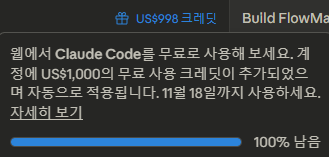
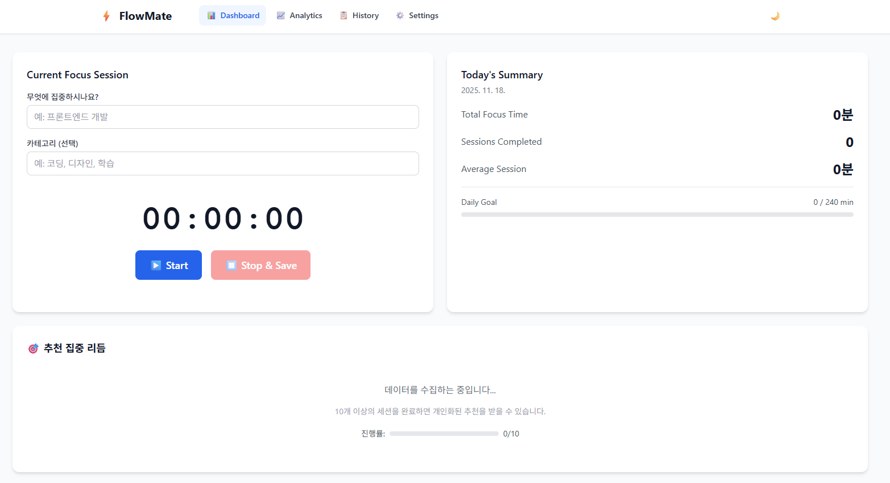
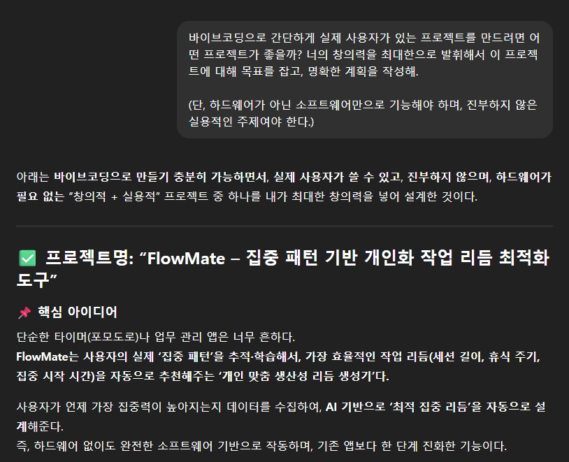
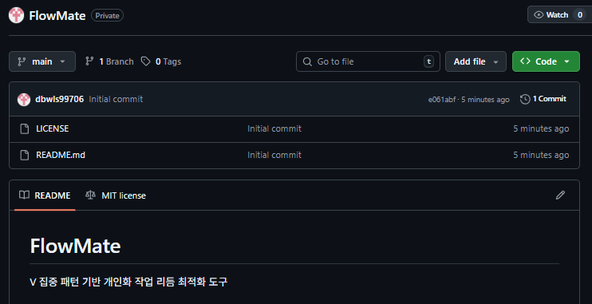
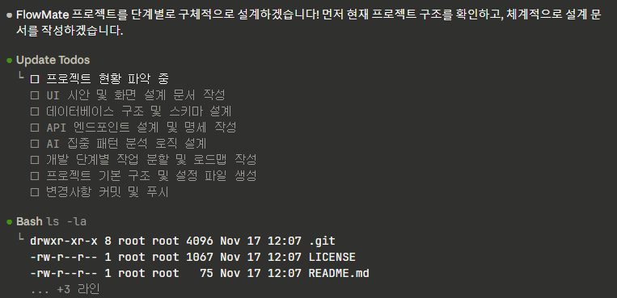
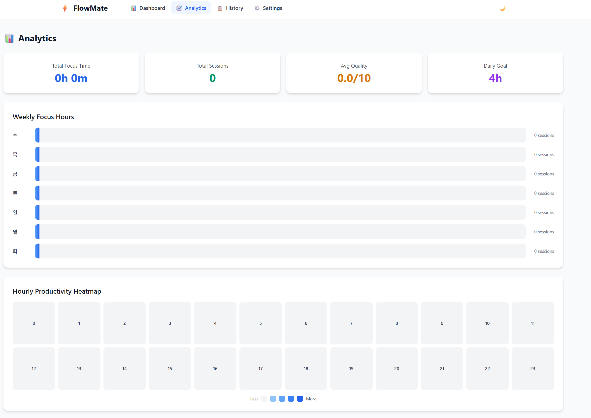

바이브코딩에 대한 신뢰가 사실상 거의 없다고 봐도 될 정도였는데, 생각해보니 명확한 근거가 없었다.
그래서 이번에 AI한테 아이디어부터 코딩까지 짜보면 과연 어디까지 만들어질까 싶었다.
이건 물론 내 능력과 무관한 개발이라고 봐도 된다.(웹 개발 전혀 모름)

>Claude Code on the Web이 무료라길래 충동적으로 시작한 일이다.

결과부터 말하면 실무자가 보기엔 조잡하겠지만 그냥 말그대로 **뭔가**가 완성됐다.
일단 비용이 안 드니까 간단하게 소개하는 등의 사이트를 제작하는 것은 무료로 제공하는 서비스들을 이용하면 충분해보였다.

**🌐 Live Demo**: https://flowmate-project.netlify.app/

---

## 바이브코딩(Vibe Coding)이란?

AI와 대화하면서 코드를 작성하는 개발 방법론이다.
이번엔 전통적인 방식처럼 모든 코드를 직접 타이핑하는 게 아니라,
AI에게 "이런 기능 만들어줘"라고 요청해서 AI가 코드를 작성해주는 걸 그대로 쓸 것이다.

물론 그냥 복붙만 하는 게 아니라, AI가 왜 이렇게 짰는지 이해하고,
필요하면 수정 요청하고, 오류가 생기면 디버깅하는 과정이 핵심이다.

근데 이번엔 내 의도대로 대화를 나눴다기보다 그냥 아예 자동화시켜볼 것이다.
그래야 얘가 어느정돈지 알겠지.

AI는 기본적인 플랜은 ChatGPT로 세우고, Git과 연동되게 web버전으로 새로 나온 **Claude Code on the Web**이라는 걸 사용해볼 것이다.

---

## 프로젝트 기획: ChatGPT로 시작

처음엔 "뭘 만들지?"를 생각할 필요도 없이 일단 ChatGPT한테 물었다.
뭔가 실용적이면서도 너무 복잡하지 않은 주제를 알아서 찾아서 플래닝을 하는 것이다.

그래서 ChatGPT한테 물어봤다.

평소에 로봇 관련 질문을 자주 하다 보니 추가적인 문구가 필요했다.

아무튼 이게 나중에 Claude Code한테 넘겨줄 전체적인 설계도가 됐다.

---

## 개발 과정: Claude Code야 해줘
과정은 나는 잘 모른다. 일단  Claude가 설명해준 내용을 토대로 작성했다.

미리 레포지토리를 만들어야 web에서 로드가 가능하기에 제작해두었다.

### 1단계: 프로젝트 초기 설정

ChatGPT가 만들어준 설계 문서를 Claude Code에게 줬다.

- ⚛️ React + TypeScript + Vite 프로젝트 생성
- 🎨 Tailwind CSS 설정
- 📁 폴더 구조 (components, pages, hooks, store)
- 🔧 ESLint, Prettier 설정

완료됐다.

### 2단계: MVP 기능 구현

이게 뭔지 모른다. 일단 시킨다.

**구현된 기능들:**
- ⏱️ 타이머 (25분 집중 / 5분 휴식)
- ▶️ 시작/일시정지/리셋 버튼
- 🔔 알림 (Web Notification API)
- 💾 세션 기록 (LocalStorage)
- 📋 히스토리 페이지
- ⚙️ 설정 페이지 (타이머 시간 조절)

ChatGPT의 플랜대로 진행되었다.

### 3단계: 상태 관리

Store를 만들어서:
- 세션 추가/삭제/수정
- 설정 저장/불러오기
- LocalStorage 동기화

전부 처리했다.

### 4단계: 다크모드 & 애널리틱스

"너무 진부하다"고 요청했다.

그냥 타이머만 있으면 심심하다며 
Claude는 추가 기능을 만들었다:

**🌙 다크모드**
- Light / Dark / Auto 모드
- 시스템 테마 자동 감지
- 모든 페이지에 일관되게 적용

**📊 애널리틱스 대시보드**
- 주간 집중 시간 바 차트 (최근 7일)
- 24시간 생산성 히트맵 (GitHub 잔디 스타일)
- 통계 카드 (총 세션 수, 평균 집중 시간 등)

차트 라이브러리 안 쓰고 CSS로만 구현했는데도 꽤 예쁘게 나왔다.
(이것도 클로드가 직접 스스로의 코드를 평가한 말이다. 자기애 가득한 자식)

그렇게 완성된 Analytics 대시보드

### 5단계: 배포

Netlify에 배포하는 건 정말 쉬웠다.

1. 빌드 스크립트 실행 (`npm run build`)
2. https://app.netlify.com/drop 접속
3. `frontend/dist` 폴더 드래그 앤 드롭

배포 완료되고 위에서 제시한 것처럼 [URL](https://flowmate-project.netlify.app/)을 받았다.

---

## 오류가 있던 부분들

물론 마냥 순조롭지만은 않았다. AI도 한 번에 온전히 해내긴 힘든지, 로컬에선 빌드가 되지만 git에서의 CI테스트를 몇 번 통과하지 못했다.

아래처럼 막힐 때마다 내 뇌를 거치진 않고 Claude한테 직접적으로 로그를 줘서 해결했다.

### 삽질 1: TypeScript 타입 에러

처음엔 TypeScript를 제대로 이해 못해서 `any` 남발했다.
근데 Claude가 계속 "타입 명시하는 게 좋다"고 해서
Session, Settings 같은 인터페이스를 제대로 정의했다.

타입 에러 덕분에 런타임 버그를 미리 잡을 수 있었고,
VSCode 자동완성도 제대로 동작하기 시작했다.

### 삽질 2: LocalStorage 동기화 이슈

여러 탭에서 동시에 앱을 열면 데이터가 꼬이는 문제가 있었다.
`storage` 이벤트 리스너로 다른 탭의 변경사항을 실시간으로 동기화하니까 해결됐다.

### 삽질 3: GitHub Actions 빌드 실패

npm 캐시 설정이 문제였다.
에러 로그 복사해서 Claude한테 주니까 바로 원인 파악하고 고쳐줬다.

---

## 최종 결과물

이것도 AI가 정리해줬다

**주요 기능**
- ⏱️ 포모도로 타이머 (25분 집중 / 5분 휴식, 사용자 설정 가능)
- 🔔 브라우저 알림 (세션 완료 시)
- 💾 세션 자동 저장 (LocalStorage)
- 📋 히스토리 (모든 세션 기록 확인)
- 📊 애널리틱스 대시보드 (주간 차트, 시간대별 히트맵)
- 🌙 다크모드 (Light / Dark / Auto)
- ⚙️ 설정 (타이머 시간, 알림, 테마)

**기술 스택**
- Frontend: React 19 + TypeScript + Vite
- Styling: Tailwind CSS
- State: Zustand
- Routing: React Router
- CI/CD: GitHub Actions
- Hosting: Netlify

**성능**
- 빌드 크기: 약 280KB (JS + CSS)
- 초기 로딩: 1초 이내
- 오로지 클라이언트만으로 개발된 앱 (서버 없음)

---

## 느낀 점 요약

### 1. 개발 == 문제 해결

코드는 내가 짜든, AI가 짜든, 디버깅이 가장 중요하다고 생각한다.

근데 여기서 Claude Code처럼 프로젝트를 직접적으로 읽을 수 있는 AI들은 오류 문구를 주면 대부분의 경우는 확실하게 수정해준다.

쌩신입 개발자가 왜 점점 사라지는지 알 것도 같다.

### 2. AI에 의존할 수 있는 시대가 얼마 안 남은 것 같다

실제 서비스되고 있는 AI는 데이터가 계속 쌓이고, 많은 이용자를 보유하고 또 주목 받고 있는 LLM 분야는 그에 따라 발전을 지속할 것이고, 
그렇게 경쟁하면서 결국 분야별 특화 AI가 제작될 것이기에 개개인의 능력도 물론 세세한 부분은 필요하겠지만, 
큰 틀을 자동화하는 데에 있어선 프롬프트의 작성이 더욱 중요해질 것 같다.

---

## 마무리

코드를 직접 짜지 않고 별 고민도 안 한 상태로 대화를 통해 무언가를 한다는 게 뭔가 거부감이 들고 그렇지만 또 새롭기도 했다.

이런 방식의 개발의 가장 큰 장점은 당연히 AI가 다 해준다는 거고,
가장 큰 문제점은 나는 아무것도 모른다는 것이다.

유지보수 측면에서 봤을 때 AI가 해당 오류에 대해 대응이 안된다면 정말 그냥 말그대로 방법이 없다.

실전에서 배우는 게 가장 빠르기에 AI로 제작하더라도 결국은 큰 그림 정도는 공부를 해야 한다.
개인이 한 팀의 리더가 되는 느낌이라는 게 적절한 비유일 것이다.

그리고 이번 글에서 제시한 저 프로그램도 결국 나조차도 쓸 마음이 안 드는 조잡한 결과물이다.

결국 아이디어가 중요하며 실제 서비스가 목적이라면 관련 공부까지 철저히 해야한다.
AI는 단지 그 속도를 빠르게 해주고, 프로젝트를 제작함에 있어서 하나의 팀이 되어준다.

결국 적은 지식으로도 빠르게 배우며, 할 수 있는 게 많아지고 본격적인 시작까지의 거리감이 좁혀진다.

일자리 없어진다 없어진다 하지만서도 결국 개발을 할 때 인공지능 어플리케이션의 사용자가 비사용자 집단에 비해 상대적으로 시장을 주도하는 경향을 보이게 될 것 같다.

배울 게 많은 만큼 배우는 방법도 다양하고 개개인에 맞춰지는 세상이 오는 것 같다. 
이왕 할 거면 안 배워도 되게끔 발전하지

오늘 gemini3가 발표되면서 google antigravity가 나왔다는데 그것도 한 번 써봐야겠다. 
듣기로는 AI agent 들을 모아서 일 시키고 그걸 관리감독하는 새로운 IDE?라는데 흥미가 돋는다

---