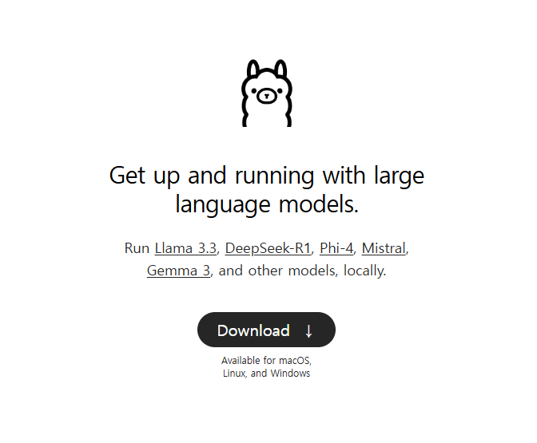
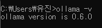
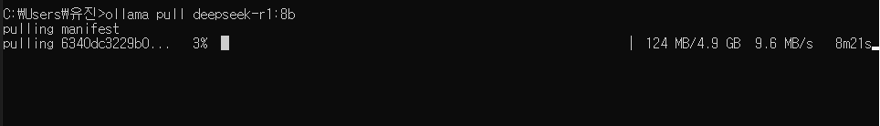
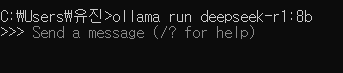
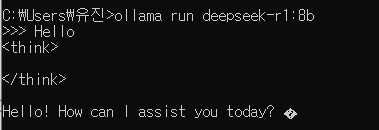
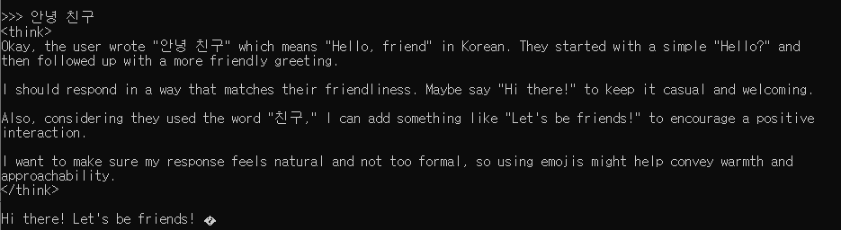

로봇이나 YOLO 관련 프로젝트를 진행하다 보니 **대형 언어 모델(LLM)**에 대한 관심이 생겼다.  

찾아보니 **Ollama**라는 툴이 간단한 명령어로 LLM을 실행할 수 있는 오픈소스 프레임워크라고 하던데…  

그래서 직접 **DeepSeek R1 (8B) 모델을 내 GPU에서 실행**해보며 공부해보기로 했다.
(내 3060ti를 쓰는 거라 소형 모델로..)

---

### Ollama란?  

[Ollama( https://ollama.com )](https://ollama.com/)는 **로컬에서 LLM을 쉽게 실행할 수 있도록 도와주는 툴**이다.
복잡한 설정 없이 **Docker처럼 간단한 명령어로 모델을 다운로드하고 실행할 수 있는 게 가장 큰 장점**이다.
아래 화면에서 다운로드를 누르고 설치하면 된다.

설치가 된다면 명령프롬프트에서 다음과 같은 명령어를 입력해 설치를 확인하자
> ollama -v




###  Ollama의 주요 특징  
- **명령어 한 줄로 LLM 실행 가능** (`ollama run <model>`)
- **CUDA 지원**으로 GPU 가속 가능
- 다양한 **오픈소스 모델 지원** (LLaMA, Mistral, DeepSeek 등)
- 필요할 때만 모델을 다운로드하므로 **설치 과정이 단순**
---


###  DeepSeek R1(8B)이란?  

DeepSeek R1은 중국의 **DeepSeek AI**에서 공개한 **80억 개(8B) 파라미터**를 가진 LLM이며 코드 작성, 문서 요약, 질의응답 등 다양한 작업을 수행할 수 있다.  

> Ollama에서 공식적으로 지원하는 모델이라 별도 설정 없이 바로 실행할 수 있다.. 굿

###  모델 스펙
- **파라미터 수**: 8B
- **아키텍처**: Transformer 기반
- **지원 기능**: 텍스트 생성, 코드 자동 완성, 문서 요약 등

이제 Ollama를 설치하고 **DeepSeek R1 (8B)를 직접 실행**해보자.  

---


###  CUDA & GPU 상태 확인

DeepSeek R1 (8B)은 연산량이 많기 때문에, **NVIDIA GPU와 CUDA 환경이 잘 설정되어 있어야 한다.**  

```bash
nvidia-smi
```
위 명령어를 실행했을 때 GPU 사용량과 CUDA 버전이 정상적으로 표시되면 준비 완료~

---

### 실행하기
단순한 실행은 역시 너무나 간단하다. 아래의 명령어를 입력해 모델을 받아보자 
```bash
ollama pull deepseek-r1:8b
```


<figure style="text-align:center;">
    
    <figcaption style="font-size:15px; color:#808080;">4.9GB...</figcaption>
</figure>

<figure style="text-align:center;">
    
    <figcaption style="font-size:15px; color:#808080;">완료!</figcaption>
</figure>

위와 같이 완료가 됐다면 아래의 명령어로 실행해보자
```bash
ollama run deepseek-r1:8b
```
후에 안 건데.. run만 입력해도 pull이 된다는 것 같다. 다시 한다면 그런 방식으로 해야지

아무튼 여기에 메세지를 입력하기만 하면 된다
예시로 인사를 해보았다.


소형 모델이라 한글은 약간의 고민이 필요한가보다

<figcaption style="text-align:center; font-size:15px; color:#808080; margin-:-10px">
    딥시크 특징 스스로 되묻기
</figcaption>

### 마무리

일단 마지막에 한글을 입력했을 때 스스로 되묻는 로직을 수행했는데 그때 내 GPU가 힘들게 돌아가는 소리가 들렸다. VRAM 최적화 옵션이나 FP16(반정밀도) 옵션 등으로 최적화를 할 수 있다는데 로컬에서 더 심화되게 다루게 되면 그걸 먼저 알아봐야 할 것 같다.

아무튼 이제 **DeepSeek R1** 모델을 **Ollama**를 통해 **내 GPU에서** 복잡한 설정 없이 **LLM**을 손쉽게 실행할 수 있었다.

이제 이 모델을 활용해서 다양한 실험을 해볼 수도 있지만 그전에 먼저 다른 프레임워크도 다뤄보고 장단을 재고 싶다는 생각을 했다.

LLM에 관해 점점 더 많은 지식을 쌓고 싶은데 깊숙히 들어가기엔 아직 너무 많은 길이 남은 것 같다.. 

그래도 뭔가 재미는 있는 듯!