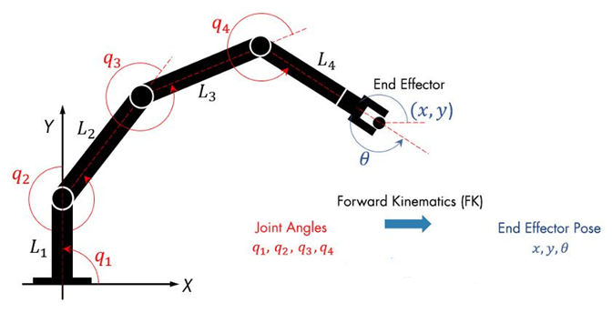
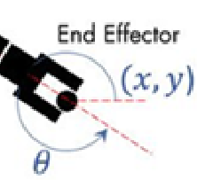
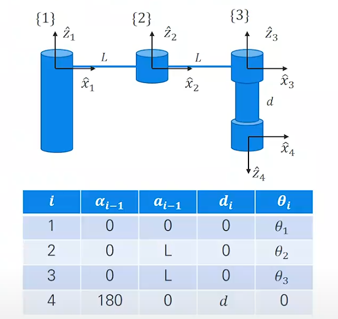
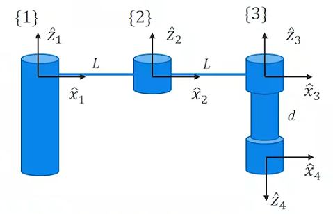

정기구학과 DH파라미터는 로봇 공학에서 로봇의 자세, 움직임을 이해하는 데에 매우 중요한 개념이다.

이런 개념들은 사실 유튜브나 이런 글들로 공부하기보다
책으로 예제와 실습을 통해 한 번 깨우침으로써 개념을 영구적으로 습득하는 것이 중요하다.

그래도 여기까지 왔으면 같이 한 번 살펴보자.

---

## Forward Kinematics(정기구학)
먼저 로봇 정기구학이란 무엇일까
로봇 정기구학이란 건 간단하게 말하면 로봇이 어떻게 움직였는지 설명하는 이론이다.

우리 몸의 팔과 다리처럼 관절을 가진 무언가가 본인의 위치와 방향 같은 것들을 어떻게 계산할 수 있는지,
그리고 길이나, 각도와 같은 정보들을 이용해서 어떻게 움직임을 예측할 수 있는지
그것에 대해 설명하는 그런 이론이라고 보면 된다.

로봇은 여러 관절(joint)와 링크(각 관절을 연결해주는 부분)들로 이루어져 있는데,
이걸 요래저래 움직이다 보면 로봇의 끝단, End Effector라는 것이 움직이게 된다.

여기서 로봇의 Joint와 Link들에 대한 정보를 이용해서 이 End Effector의 좌표를 구해내는 것이 바로 정기구학이다.

### DH parameter
그렇다면 DH 파라미터는 무엇일까
DH 파라미터는 로봇의 각 Joint와 Link들을 수학적으로 모델링하기 위한 매개변수이다.

또한, 이는 각 관절에 대한 정보를 4가지 파라미터로 표현한다.
- **a_ᵢ**: xᵢ축을 따라 zᵢ와 zᵢ₊₁ 사이 거리 (링크 길이)  
- **d_ᵢ**: zᵢ축을 따라 xᵢ와 xᵢ₊₁ 사이 거리 (링크 오프셋)  
- **α_ᵢ**: xᵢ축을 기준으로 zᵢ에서 zᵢ₊₁까지의 회전 각도 (링크 뒤틀림 각)  
- **θ_ᵢ**: zᵢ축을 기준으로 xᵢ에서 xᵢ₊₁까지의 회전 각도 (조인트 회전 각)

이렇게 4개로 표현되는데 이를 더 알기 쉽게 예시를 들며 살펴보자.

먼저 해당 기구는 4번째 조인트까지 존재하고, 
좌표의 각도도 변화가 많이 없는 간단한 구조이다.

여기서 a를 먼저 살펴보면, **a는 x축을 따라 z축 사이의 거리**를 표하므로 1번과 2번, 그리고 2번과 3번 사이에서 값이 L임을 알 수 있다.
(위 그림은 modified 방식이라 α와 a에선 i-1과 i의 관계를 보면 된다.)

또 **d는 z축을 따라 x축 사이의 거리**이므로 마지막 조인트에서만 d

**θ는 보통 DH파라미터에선 로봇이 움직일 때 계속 바뀌는 수치**로 보기 때문에 표에서 보이는 것처럼 **임의의 변수로 설정**해둔다. 
해당 그림으로 한정하고 직관적으로 보면 θ1, θ2, θ3은 모두 0이다.

마지막으로 End effector쪽을 보면 z축이 이전 축의 반대 방향, 즉 180도로 회전한 것을 볼 수 있다. 
이 때문에 **x축을 기준으로 z의 회전 각도를 나타내는 α**는 마지막 4번 조인트에서 180으로 표현된다.

---

### 변환 행렬 정의
그럼 이제 저걸 이용해서 계산을 슬쩍 한 번 해보자.

각 링크에 대한 변환 행렬은 다음과 같은 공식으로  정의된다.

$$
T_i = 
\begin{bmatrix}
\cos\theta_i & -\sin\theta_i \cos\alpha_i & \sin\theta_i \sin\alpha_i & a_i \cos\theta_i \\
\sin\theta_i & \cos\theta_i \cos\alpha_i & -\cos\theta_i \sin\alpha_i & a_i \sin\theta_i \\
0 & \sin\alpha_i & \cos\alpha_i & d_i \\
0 & 0 & 0 & 1
\end{bmatrix}
$$

이게 이제 기본적으로 DH파라미터를 이용해서 계산할 때 필요한 동차변환행렬이라고 보면 된다.
알아두자.

---

### 각 링크의 개별 변환 행렬
이제 각 링크에 따라 각각의 변환행렬을 구해두면 된다.

하나하나 DH파라미터의 값을 대입해서 알아보면
#### $T_1^0$

- $\alpha_0 = 0$, $a_0 = 0$, $d_1 = 0$, $\theta_1 = \theta_1$

$$
T_1 = 
\begin{bmatrix}
\cos\theta_1 & -\sin\theta_1 & 0 & 0 \\
\sin\theta_1 & \cos\theta_1 & 0 & 0 \\
0 & 0 & 1 & 0 \\
0 & 0 & 0 & 1
\end{bmatrix}
$$

#### $T_2^1$

- $\alpha_1 = 0$, $a_1 = L$, $d_2 = 0$, $\theta_2 = \theta_2$

$$
T_2 = 
\begin{bmatrix}
\cos\theta_2 & -\sin\theta_2 & 0 & L \cos\theta_2 \\
\sin\theta_2 & \cos\theta_2 & 0 & L \sin\theta_2 \\
0 & 0 & 1 & 0 \\
0 & 0 & 0 & 1
\end{bmatrix}
$$

#### $T_3^2$

- $\alpha_2 = 0$, $a_2 = L$, $d_3 = 0$, $\theta_3 = \theta_3$

$$
T_3 = 
\begin{bmatrix}
\cos\theta_3 & -\sin\theta_3 & 0 & L \cos\theta_3 \\
\sin\theta_3 & \cos\theta_3 & 0 & L \sin\theta_3 \\
0 & 0 & 1 & 0 \\
0 & 0 & 0 & 1
\end{bmatrix}
$$

#### $T_4^3$

- $\alpha_3 = 180^\circ = \pi$ rad, $a_3 = 0$, $d_4 = d$, $\theta_4 = 0$

$$
\cos\alpha_3 = -1, \quad \sin\alpha_3 = 0
$$

$$
T_4 = 
\begin{bmatrix}
1 & 0 & 0 & 0 \\
0 & -1 & 0 & 0 \\
0 & 0 & -1 & d \\
0 & 0 & 0 & 1
\end{bmatrix}
$$

가 된다.

---

### 최종 변환 행렬
최종적인 변환 행렬은 다음과 같다

$$
T = T_1 \cdot T_2 \cdot T_3 \cdot T_4
$$

이 행렬을 계산하면, 베이스 프레임에서 End Effector까지의 최종 위치와 자세를 구할 수 있다.

---
위 그림에서처럼 모든 각 $\theta_i = 0$으로 설정하면 개별 행렬들은 다음과 같이 단순화된다.

#### $T_1$

$$
T_1 =
\begin{bmatrix}
1 & 0 & 0 & 0 \\
0 & 1 & 0 & 0 \\
0 & 0 & 1 & 0 \\
0 & 0 & 0 & 1
\end{bmatrix}
$$

#### $T_2$

$$
T_2 =
\begin{bmatrix}
1 & 0 & 0 & L \\
0 & 1 & 0 & 0 \\
0 & 0 & 1 & 0 \\
0 & 0 & 0 & 1
\end{bmatrix}
$$

#### $T_3$

$$
T_3 =
\begin{bmatrix}
1 & 0 & 0 & L \\
0 & 1 & 0 & 0 \\
0 & 0 & 1 & 0 \\
0 & 0 & 0 & 1
\end{bmatrix}
$$

#### $T_4$

$$
T_4 =
\begin{bmatrix}
1 & 0 & 0 & 0 \\
0 & -1 & 0 & 0 \\
0 & 0 & -1 & d \\
0 & 0 & 0 & 1
\end{bmatrix}
$$

---

#### 전체 행렬 $T = T_1 \cdot T_2 \cdot T_3 \cdot T_4$

$$
T = 
\begin{bmatrix}
1 & 0 & 0 & 2L \\
0 & 1 & 0 & 0 \\
0 & 0 & 1 & 0 \\
0 & 0 & 0 & 1
\end{bmatrix}
\cdot
\begin{bmatrix}
1 & 0 & 0 & 0 \\
0 & -1 & 0 & 0 \\
0 & 0 & -1 & d \\
0 & 0 & 0 & 1
\end{bmatrix}
=
\begin{bmatrix}
1 & 0 & 0 & 2L \\
0 & -1 & 0 & 0 \\
0 & 0 & -1 & d \\
0 & 0 & 0 & 1
\end{bmatrix}
$$

---

#### 결과

- 위치 (translation): $\begin{bmatrix} 2L & 0 & d \end{bmatrix}^T$
- 자세 (rotation):
  - $x$축: 변함 없음
  - $y$축: 반전됨
  - $z$축: 반전됨

즉, End-effector는 base로부터 **$x$ 방향으로 $2L$만큼**, **$z$ 방향으로 $d$만큼** 이동했으며, **$y$와 $z$축 방향이 반전된 자세**를 가진다는 것을 알 수 있다.

여기서 End-effector의 좌표가 왜 -d가 아닌 d인지 궁금한 경우가 있을 것이다.
이는 월드 좌표계에 익숙해져서 혼동이 온 것으로 볼 수 있다.
**월드 좌표계에서 봤을 때, End-effector는 -d로 움직인 것이 맞다.**
그러나 DH 파라미터에서 정의하는 위치와 방향은 각 링크 좌표계 기준이기 때문에 d로 표현한다.
즉, **마지막 프레임의 z축 방향은 아래쪽을 향하고 있으므로**,
해당 프레임 기준으로 +z 방향으로 d만큼 이동하면 실제로는 월드 기준 –z 방향으로 움직이는 결과가 된다.

이처럼 DH 파라미터에서의 d 이동은 해당 프레임의 z축 방향을 기준으로 한 결과이므로, 
월드 좌표계에서의 실제 위치와 혼동하지 않도록 주의해야 한다.

## 마무리
오랜만에 마주하는 개념이지만서도 서당개 3년이면 풍월을 읊는다는 말처럼,
한 번이라도 배운 적이 있다면 다시 배우는 데에 있어서는 처음보다는 조금 더 수월한 것 같다.

아무튼 이래저래 개념들을 정리하고 있는데 사실 그 이유는 어느정도 스스로에게 강제성을 주기 위해서다.
이렇게 공부하면 괜히 쓰다가 만 글을 더 이어서 작성하게 되고, 
또 설명할 수 없는 부분이 있으면 더 공부하게 된다.

뭐가 어쨌던 간에 기본적인 지식들을 탄탄하게 하는 데에 더더 힘써야겠다는 생각이다.