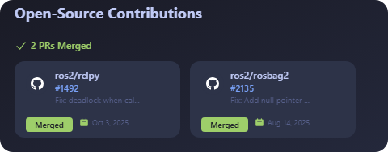

이전에 오픈소스에 기여하면서 관련하여 작은 관심이 생겼다.

그러나 이 관심에 대한 이유를 생각해보니
차곡차곡 쌓여가는 내 기여 목록 때문인 것 같다. (물론 지금까지 두 번밖에 안 했지만)

여튼, 결국 스스로의 스펙이 되려면 이를 누군가가 알아줘야 할 텐데
나처럼 velog에 올리는 식으로 기록을 남길 순 있겠지만
github에선 결국 profile에 올리고자 할 것이다.

내 레포지토리의 PR이야 지저분할 거고, 
타인의 저장소에 기여한 경우에 이제
프로필에 이를 어필할 수 있는 카드를 만들어보자는 생각을 했다.

---

## [OSS Contribution Card](https://github.com/dbwls99706/OpenSource-contribution-card)

> 외부 오픈소스 프로젝트에 머지된 PR만 자동으로 수집해서 카드로 보여주는 위젯

방식은 다른 프로필 위젯들처럼 간편하게 서버를 만들어서 하려고 했는데 
비용이나 그런 측면에서 아쉬웠다.

그래서 찾아봤는데 **GitHub Actions** 방식이 리미트도 거의 없고 
github 내에선 영구적이라고 판단하여 채택하게 되었다.

---

### 주요 기능

- **외부 기여만 표시** - 내 레포 제외, 다른 프로젝트에 머지된 PR만
- **자동 업데이트** - GitHub Actions로 매일 자동 갱신
- **5가지 테마** - light, dark, nord, dracula, tokyo
- **자동 테마 감지** - GitHub 라이트/다크 모드에 따라 자동 색상 전환
- **org/user 필터링** - 특정 org만 표시하거나 제외 가능
- **PR 번호 표시** - 각 카드에 실제 PR 번호 표시 (#1492 등)
- **정렬/필터 옵션** - 날짜순, PR 수 기준, 최근 N개월만 등

---

## 사용 방법

### 1. 파일 복사

자신의 프로필 레포지토리 (username/username)에 다음 파일들을 복사한다:

📁 **폴더 구조**
- `.github/workflows/update-contributions.yml`
- `src/index.js`
- `src/fetch-contributions.js`
- `src/generate-svg.js`
- `package.json`

폴더가 없으면 본인 username 레포지토리에 
.github/workflows/와 src/ 폴더를 먼저 생성해야 한다.

> [OpenSource-contribution-card 레포지토리 바로가기](https://github.com/dbwls99706/OpenSource-contribution-card)

### 2. Actions 권한 설정

레포지토리 **Settings** → **Actions** → **General**:

1. Workflow permissions 섹션에서
2. "Read and write permissions" 선택
3. Save 클릭

### 3. README에 이미지 추가

프로필 README.md에 다음 코드를 추가한다:

``

### 4. 실행

자동: 하루 3번 API 호출(1시, 9시, 17시)

수동: Actions 탭 → Update Contributions SVG → Run workflow

첫 실행: 파일 복사 후 Actions 탭에서 수동으로 한 번 실행해야 `contributions.svg`가 생성된다.

---

## 커스터마이징

### 테마 변경

레포지토리 Settings → Secrets and variables → Actions → Variables에서 설정:

| Variable | 설명 | 기본값 |
|----------|------|--------|
| THEME | 테마 선택 | light | 
| AUTO_THEME | GitHub 테마 자동 감지 (true/false) | false |
| MAX_REPOS | 표시할 최대 PR 수 | 6 |
| TITLE | 커스텀 타이틀 | Open-Source Contributions |
| SORT_BY | 정렬 기준 (date / count) | date |
| MONTHS_AGO | 최근 N개월만 표시 | 전체 |
| INCLUDE_ORGS | 포함할 org/user만 표시 (쉼표 구분)  | 전체 |
| EXCLUDE_ORGS | 제외할 org/user (쉼표 구분) | - |

### 자동 테마 감지 (권장)

AUTO_THEME을 true로 설정하면 GitHub의 라이트/다크 모드 설정에 따라 SVG 색상이 자동으로 전환된다.

CSS의 `@media (prefers-color-scheme: dark)` 미디어 쿼리를 활용한 방식이다.

AUTO_THEME=true를 사용하면 THEME 설정은 무시된다.

### org/user 필터링

특정 org나 user의 PR만 표시하거나 제외할 수 있다.

- `INCLUDE_ORGS=ros2,kubernetes` → 해당 org/user의 PR만 표시
- `EXCLUDE_ORGS=my-company` → 해당 org/user의 PR 제외

> INCLUDE_ORGS가 설정되면 EXCLUDE_ORGS는 무시된다.

---

## 동작 원리

핵심은 GitHub Search API의 쿼리다:

`author:{username} type:pr is:merged -user:{username}`

- `author:{username}` - 내가 작성한 PR
- `type:pr` - PR만
- `is:merged` - 머지된 것만
- `-user:{username}` - 내 레포 제외

이렇게 하면 **외부 프로젝트에 기여한 PR만** 정확히 필터링된다.

GitHub Actions가 매일 이 쿼리를 실행하고, 결과를 SVG로 변환해서 자동 커밋한다.

---

## 마무리

먼저 내 프로필에 적용해봤는데 

이렇듯 아직 난 두 번밖에 기여 안 했지만,
앞으로 더 기여하게 되면 카드가 자동으로 채워질 것이다.
그런 게 가시적으로 보이니까 더 뿌듯할 수 있을 거라 생각한다.

오픈소스 기여를 시작했거나, 이미 하고 있는 분들에게 조금이라도 유용하길 바란다.

> 🔗 **GitHub**: https://github.com/dbwls99706/OpenSource-contribution-card

글이나 프로젝트에 대해 댓글이나 이슈, PR, github velog 맞팔도 환영

