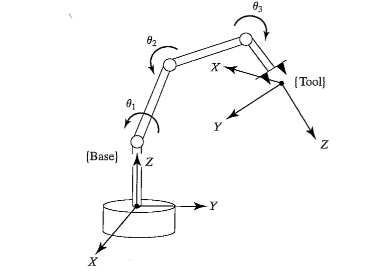

이래저래 공부를 하다보니 복습할 게 너무나도 많다.

간단하게 정리하는 것보다 침착하게 차근차근 상세하게 다뤄보며,

개념에 대해 이야기할 때, 스스로 당당해지는 것을 목표로 Robotics에 관한 기본 개념을 다시 다뤄보고자 한다.

---
## Transformation Matrix

**Transformation Matrix**는 그 말 그대로 **변환 행렬**이다.

그래서 그게 뭐냐면 로봇의 관절 위치나 끝단의 자세를 설명하기 위해서,
각 관절마다 서로 다른 기준 좌표계 사이의 관계를 이해해야 하는데
이를 수학적으로 표현한 것이 바로 변환 행렬이라는 것이다.

근데 또 이게 뭐냐고 할 수도 있으니, 로봇 팔 그림을 하나 가져와보자

자 이런 그림을 봤을 때, 베이스 링크와 말단의 좌표가 다른 걸 볼 수 있다.

근데 이런 좌표를, 말단에서부터 자세를 재든 베이스부터 위치를 찾든

어쨌든 해당 좌표로의 변환이 필수적일 것 같다는 생각이 들지 않나 (아님 말고)

그런 거 모르겠다는 사람도 일단 그렇군. 하고 넘어가보자.

---

### 동차 변환 행렬
아무튼 그렇게 좌표를 변환하기 위해서 쓰는 것이 변환 행렬이다.

로보틱스에서 변환 행렬은 보통 **4×4** 형태로 구성되며, 
**회전(Rotation)**과 **이동(Translation)**을 함께 포함한다.

그리고 이러한 구조를 가진 행렬을 **동차 변환 행렬**라고 한다.

$$
T = 
\begin{bmatrix}
R & \mathbf{t} \\
\mathbf{0}^T & 1
\end{bmatrix}
$$

- $R$: 3×3 회전 행렬
- $\mathbf{t}$: 3×1 위치 벡터 (이동)
- $\mathbf{0}^T$: 1×3 제로 벡터
- 1: 동차 좌표계의 마지막 요소

3차원인 회전행렬에서 이동까지 고려하기 위해 4x4행렬이 필요했고 
이를 문제 없이 계산하기 위해 [0 0 0 1] 부분이 존재한다고 보면 된다.

이 행렬을 이용하면 어떤 기준점의 위치를 한 좌표계에서 다른 좌표계로 변환할 수 있다.

어떤 B좌표계를 기준으로 하는 점이 있을 때, 
이를 A좌표계로 보내서 계산을 하고 싶다고 그러면 아래처럼 계산한다

$$
\mathbf{p}_A = T_{AB} \cdot \mathbf{p}_B
$$

여기서 $T_{AB}$는 프레임 B에서 A로의 변환 행렬이고,
그리고 이의 역행렬은 A에서 B로의 변환 행렬이라고 보면 된다.

여기서 $\mathbf{p}$ 같은 경우는 4x4행렬과 곱해야 하기 때문에, $\mathbf{p} = [x, y, z, 1]^T$ 로 계산되고, 이는 동차 좌표라고 한다.

---

### 기본 회전 행렬

자 그럼 이제 변환행렬이 뭔지는 감이 왔을 텐데,

그 하나하나의 요소들이 어떤 값을 가지는지는 어느정도 이해가 더 필요할 것이다.

회전 행렬을 먼저 알아보자면,
각 축을 기준으로 회전할 때 사용되는 3x3 형식의 행렬이라고 보면 되고 
자세한 형태는 아래에서 설명하겠다.

**X축 회전**:

$$
R_x(\theta) =
\begin{bmatrix}
1 & 0 & 0 \\
0 & \cos\theta & -\sin\theta \\
0 & \sin\theta & \cos\theta
\end{bmatrix}
$$

**Y축 회전**:

$$
R_y(\theta) =
\begin{bmatrix}
\cos\theta & 0 & \sin\theta \\
0 & 1 & 0 \\
-\sin\theta & 0 & \cos\theta
\end{bmatrix}
$$

**Z축 회전**:

$$
R_z(\theta) =
\begin{bmatrix}
\cos\theta & -\sin\theta & 0 \\
\sin\theta & \cos\theta & 0 \\
0 & 0 & 1
\end{bmatrix}
$$

이는 각각 θ만큼 회전한 회전행렬 값이라고 보면 된다.

또 이런 회전 행렬을 조합하여 복합한 회전 행렬로도 표현할 수 있다. 

예시를 하나 들어서 설명하자면, Z-Y-X 순서로 회전할 때 다음과 같이 표현된다

$$
R = R_z(\gamma) \cdot R_y(\beta) \cdot R_x(\alpha)
$$

여기서 $$R$$ 사이의 저 요상한 기호들을 순서대로 감마 베타 알파라고 하는데 
이게 각 값들이 회전한 각도라고 보면 된다. 
보통 저렇게 xyz의 각도를 각각 $\alpha\beta\gamma$로 표현한다.

그리고 행렬이라는 게 원래 회전의 순서에 따라 결과가 달라지므로 순서를 잘 지켜야 한다.

---

### 이동 벡터 $\mathbf{t}$

지금까지 회전 행렬에 대해서는 살펴봤으니, 
이제는 $\mathbf{t}$에 대해서도 알아보자.

회전 행렬이 **방향**을 바꿔주는 역할인데, 방향만 바꿔서는 저 멀리 있는 좌표로 이동할 수 있을 리가 없다.
이런 상황에서 이동 벡터는 **위치**를 바꿔주는 역할을 한다.

여기서 $\mathbf{t}$는 보통 다음과 같은 형태를 가진다:

$$
\mathbf{t} = 
\begin{bmatrix}
x \\
y \\
z
\end{bmatrix}
$$

이 값들은 아까 예시로 들었던 B에서 A좌표계로 변환하는 행렬로 이야기하면, 
B가 A로부터 얼마나 떨어져 있는지를 나타내는 것이다.

$\mathbf{t}$가 만약에 $[0.5, 0, 0]$라면 (A좌표계 원점에서 B좌표계 원점까지의 벡터), 
B좌표계는 A로부터 x축 방향으로 0.5m 떨어진 위치에 놓여 있다는 뜻이다.

변환 행렬은 이렇게 회전 행렬 $R$과 이동 벡터 $\mathbf{t}$를 결합함으로써, 
회전과 이동을 **동시에 한 번에 표현**할 수 있게 해주는데
이것이 바로 **4×4 동차 변환 행렬을 쓰는 이유**다.

---

## 마무리

변환 행렬은 로봇공학을 공부한다면, 반드시 익히고 넘어가야 할 기본 개념이다.

본인이 협동로봇을 하든, 자율주행을 하든, 그것이 연구든 개발이든
좌표 변환은 로봇 팔의 자세 추정, Path Planning, 센서 캘리브레이션 등을 진행할 때,
정확한 위치와 방향을 계산하는 작업들에 필수적으로 사용된다.

앞으로 정기구학이나 역기구학 같은 내용을 단순히 개념만 뭉뚱그려 공부하지 않고,
하나씩 다시 정리하면서 글로 남길 계획이다.
거기서도 이 좌표 변환 개념도 분명 언급하게 될 것 같다.

물론 나도 빨리 이런 기초 개념을 끝내고 Physical AI나 최근에 나온 엔비디아의 GR00T N1 같은 
실제로도 흥미로운 그런 논문들에 대해서 공부해보고 싶지만,
그걸 또 이해하기 위해선 조급해하지 않고 차근차근 개념부터 다시 복습하며 탄탄하게 쌓아가는 게 먼저다.

갈 길이 멀다~