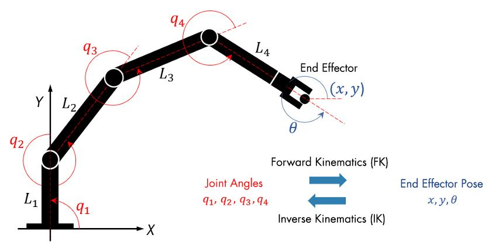
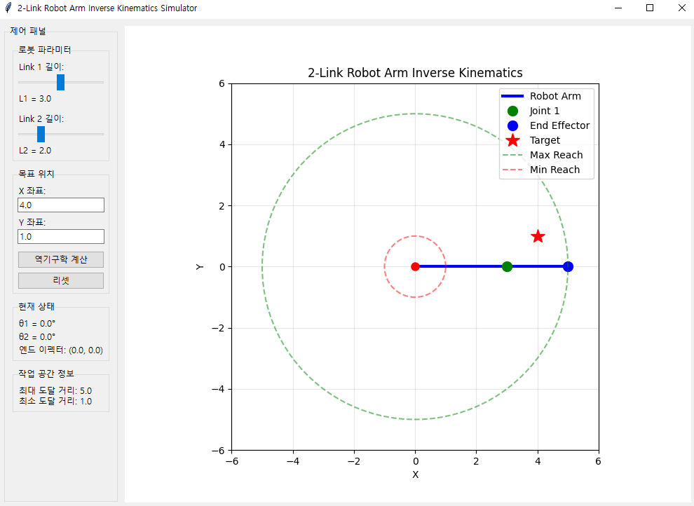
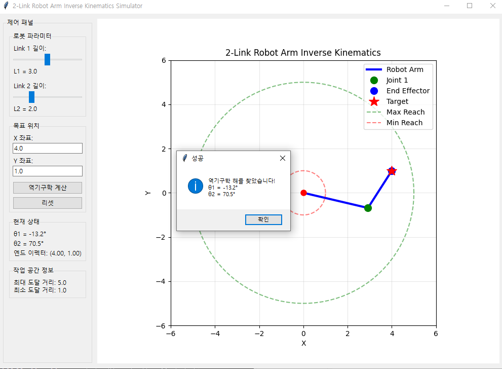
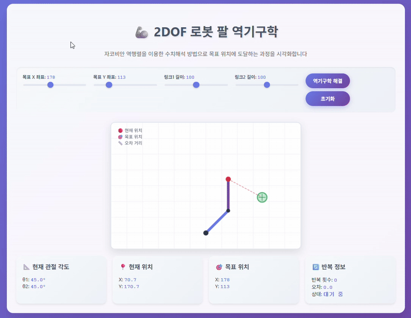

로보틱스 분야에 대해서 이것저것 공부를 하고 있는데, 하면 할수록 부족함을 더 느끼는 것 같다.
필요한 것들이 너무 많아서 조금 더 열심히 해뒀어야 한다는 후회도 가득한 느낌.. 
좋게 보면 우매함의 봉우리를 넘었다는 거 아닐까 b

아무튼 지금 포스팅하는 주제와 같은 건 정말 기본 중의 기본이라서 매니퓰레이터를 다룰 거라면 무조건적으로 알아둬야 하는 지식이다.

물론 그럼에도 정기구학보단 복잡해진다.

# 역기구학이란?

**역기구학(Inverse Kinematics)**은 로봇의 End-Effector가 도달하고자 하는 목표 위치를 알 때, 
그렇게 움직이기 위해 각 관절이 어디로 얼마나 회전해야 하는지를 역으로 계산하는 과정이다.

쉽게 말하면 로봇 손을 저기 저 지점으로 보내고 싶은데, 
그러기 위해선 각 관절의 자세를 어떻게 할까? 
라는 질문에 대한 수학적 해답을 찾는 과정이라고 보면 된다.


이름으로 대충 유추할 수 있듯이, 
이전에 학습했던 **정기구학(Forward Kinematics)**과는 정반대의 개념이다.

요즘 비전이나 이런 걸로 자동적으로 무언가 동작을 수행하고 싶어하는데, 그럴 때 이런 역기구학을 쓴다.

---

그런데 역기구학 문제는 하나의 정답만 있는 것이 아닐 수 있으며, 
로봇의 구조나 요구되는 성능에 따라 다음과 같은 방법을 사용해서 풀 수 있다.

### 1. 기하학적 방법

로봇 팔의 구조를 2D 평면에 투영하고, 삼각함수와 같은 기하학 법칙을 이용해 직접 각도를 계산하는 가장 직관적인 방법이다.

이의 장점은 계산이 매우 빠르고 이해하기 쉽다는 것이다.

그러나 이러한 방식은 구조가 단순한 로봇(2-3 자유도의 평면 로봇)에만 적용 가능하다. 
관절이 많아지고 구조가 복잡해지면 기하학적으로 풀기 불가능하다고 보면 된다.

예를 들어서 설명하려고 [gui 코드](https://github.com/dbwls99706/ik_sim/blob/main/ik.py)를 하나 가져왔다.

먼저 목표 위치 (x, y)를 가져온다.
```x = self.x_var.get()
    y = self.y_var.get()
```
코사인 법칙을 이용하여 두 번째 관절의 각도(theta2)를 계산한다.
```
    cos_theta2 = (x**2 + y**2 - self.L1**2 - self.L2**2) / (2 * self.L1 * self.L2)
```
acos의 입력값은 -1과 1 사이여야 하므로 범위를 제한
```
    cos_theta2 = max(-1, min(1, cos_theta2)) 
    theta2 = math.acos(cos_theta2)
```
계산된 theta2를 이용하여 첫 번째 관절의 각도(theta1)를 계산한다.
```
    k1 = self.L1 + self.L2 * math.cos(theta2)
    k2 = self.L2 * math.sin(theta2)
    theta1 = math.atan2(y, x) - math.atan2(k2, k1)
```
계산된 각도를 로봇에 적용한다.
```
    self.theta1 = theta1
    self.theta2 = theta2
```
이렇게 작성한 코드는
결과적으로는



성공적으로 역기구학을 수행할 수 있음을 알 수 있다.

### 2. 대수적 방법

**정기구학(FK)을 나타내는 행렬 방정식으로부터 역방정식을 유도**하여 해를 구하는 방식이다.
로봇의 링크와 관절 관계를 나타내는 변환 행렬(DH 파라미터)을 사용해 수식을 풀게 된다.

우리가 아는 정기구학의 방법을 역으로 푸는 방법이라고 알아두면 된다.

간단하게 2DOF 로봇 팔을 예로 들어보면,
끝점 위치 $(x_u, y_u)$를 이용해 관절 각도 $\theta_1$과 $\theta_2$를 구하는 과정을 살펴볼 수 있다.

이 방법은 다음과 같은 정기구학 공식에서 시작한다.

$$
x_u = l_1 \cos(\theta_1) + l_2 \cos(\theta_1 + \theta_2)
$$
$$
y_u = l_1 \sin(\theta_1) + l_2 \sin(\theta_1 + \theta_2)
$$

여기서 $l_1, l_2$는 각각 첫 번째와 두 번째 링크의 길이이다.
이 두 식을 각각 제곱하여 더하면 $\theta_1$ 항을 소거하고 $\theta_2$에 대한 식을 얻을 수 있다.

$$
x_u^2 + y_u^2 = (l_1 \cos\theta_1 + l_2 \cos(\theta_1+\theta_2))^2 + (l_1 \sin\theta_1 + l_2 \sin(\theta_1+\theta_2))^2
$$

식을 전개하고 삼각함수 항등식 $\cos^2\alpha + \sin^2\alpha = 1$, $\cos\alpha\cos\beta + \sin\alpha\sin\beta = \cos(\alpha-\beta)$ 을 이용해 정리하면,

$$
x_u^2 + y_u^2 = l_1^2 + l_2^2 + 2l_1l_2\cos\theta_2
$$

이를 통해 $\cos\theta_2$ 값을 직접 구할 수 있다.

$$
\cos\theta_2 = \frac{x_u^2 + y_u^2 - l_1^2 - l_2^2}{2l_1l_2}
$$

여기서 $\theta_2$는 $\arccos$ 함수를 통해 얻을 수 있으며,
보통 팔꿈치가 위로 꺾이는 자세(Elbow Up)와 아래로 꺾이는 자세(Elbow Down),
즉 두 개의 해($\pm \theta_2$)가 존재한다.

이제 구해진 $\theta_2$를 이용해 $\theta_1$을 구할 차례이다. 원래의 정기구학 식을 $\theta_1$에 대해 정리하면 다음과 같다.

$$
x_u = (l_1 + l_2 \cos\theta_2)\cos\theta_1 - (l_2 \sin\theta_2)\sin\theta_1
$$
$$
y_u = (l_1 + l_2 \cos\theta_2)\sin\theta_1 + (l_2 \sin\theta_2)\cos\theta_1
$$

여기서 $k_1 = l_1 + l_2 \cos\theta_2$, $k_2 = l_2 \sin\theta_2$ 로 치환하면,

$$
x_u = k_1 \cos\theta_1 - k_2 \sin\theta_1
$$
$$
y_u = k_1 \sin\theta_1 + k_2 \cos\theta_1
$$

이 연립방정식은 `atan2` 함수를 이용하여 $\theta_1$에 대한 해를 다음과 같이 구할 수 있다.

$$
\theta_1 = \text{atan2}(y_u, x_u) - \text{atan2}(k_2, k_1)
$$

이처럼 대수적 방법은 삼각함수와 연립방정식을 직접 풀어 해를 찾는 과정이다. 이는 기하학적으로 풀기 어려운 복잡한 로봇에도 적용 가능하며, **가능한 모든 해를 찾을 수 있다**는 장점이 있다.

그러나 로봇의 자유도가 높아질수록 비선형 연립방정식을 푸는 과정이 매우 복잡해지고 어렵다. 또한 해가 존재하지 않거나 여러 개(Multiple Solutions)가 나올 수 있어 분석하기에 까다로운 단점이 있다.

### 3. 수치 해석적 방법

이건 **자코비안(Jacobian) 행렬**을 사용해 반복 계산으로 해에 점진적으로 근접하는 방식이다.
목표 지점을 향해 팔을 조금씩 움직이며 오차를 줄여가는 과정이라고 보면 된다.
대표적으로 **뉴턴-랩슨(Newton-Raphson)** 방법과 **자코비안 역행렬(Jacobian Inverse)** 기반의 방법이 존재한다.

> 자코비안은 로봇의 **관절 속도**와 **손끝 속도** 간의 선형 관계를 나타내는 행렬이다.  
> `손끝 속도 = 자코비안 × 관절 속도`로 표현되며, 손끝을 원하는 방향으로 움직이기 위해 각 관절을 얼마나 빨리 움직여야 하는지 알려준다.

2DOF 로봇 팔의 경우, 자코비안 행렬은 다음과 같다:

$$
J = \begin{bmatrix}
-l_1 \sin(\theta_1) - l_2 \sin(\theta_1 + \theta_2) & -l_2 \sin(\theta_1 + \theta_2) \\
l_1 \cos(\theta_1) + l_2 \cos(\theta_1 + \theta_2) & l_2 \cos(\theta_1 + \theta_2)
\end{bmatrix}
$$

이 행렬을 이용해 목표 위치 $(x_d, y_d)$와 현재 위치 $(x_c, y_c)$의 오차 $\Delta e = [x_d - x_c, y_d - y_c]^T$를 계산하고, 관절 각도 변화량 $\Delta \theta = J^{-1} \Delta e$를 구해 각도를 업데이트한다.

아래는 자코비안에 대해 이해하기 위해 바이브코딩으로 작성한 [역기구학 html 코드](https://github.com/dbwls99706/ik_sim/blob/main/ik_jacobian.html)이다.
여기서 자코비안 행렬을 계산하는 부분은
말했듯 관절 각도에 따라 자코비안을 구성하고 이를 역행렬로 변환해 관절 각도를 업데이트하는 방식이다.

```js
function calculateJacobian(th1, th2) {
    const j11 = -l1 * Math.sin(th1) - l2 * Math.sin(th1 + th2);
    const j12 = -l2 * Math.sin(th1 + th2);
    const j21 = l1 * Math.cos(th1) + l2 * Math.cos(th1 + th2);
    const j22 = l2 * Math.cos(th1 + th2);
    return [[j11, j12], [j21, j22]];
}
```


이 방법은 로봇 구조가 복잡해도 적용 가능한 **범용성**이 뛰어나다. 비선형 방정식을 다룰 때도 유용하다.

단점은 반복 계산 때문에 계산량이 많아 실시간 제어 시 속도가 느려질 수 있고, 초기 추정값에 따라 해에 수렴하지 못하거나 엉뚱한 값으로 발산할 위험이 있다. 또한 **특이점(Singularity)** 근처에서는 해가 불안정해진다는 점이 까다롭다.

---

## 특이점(Singularity)

역기구학을 다룰 때 반드시 마주치는 개념이 바로 **특이점(Singularity)**이다. 
이는 로봇이 특정 자세를 취했을 때, **자유도를 잃어버려 움직임이 제한되거나 예측 불가능해지는 지점**을 의미한다.

수학적으로는 **자코비안 행렬의 역행렬이 존재하지 않는 상태**를 말한다.

더 직관적인 예시는 다음과 같다.


1. **손목 특이점 (Wrist Singularity)**: 여러 관절로 이루어진 로봇 손목이 일직선으로 정렬되면, 특정 방향으로 손목을 회전시키는 능력을 상실하게 된다.
2. **어깨 특이점 (Shoulder Singularity)**: 로봇 팔의 어깨 관절이 특정 방향으로 정렬될 때, 예를 들어보자면 팔이 어깨와 수직으로 위치하게 될 때, 특정 방향으로의 회전이 제한되어 제어가 어려워진다.
3. **팔꿈치 특이점 (Elbow Singularity)**: 사람 팔을 일자로 쭉 펴면, 그 상태에서 손끝을 몸 쪽으로 더 당기는 것은 불가능하다. 로봇 팔도 마찬가지로 작동 범위를 벗어나는 경계에서 특이점을 만난다.

그냥 제어의 영역을 넘어가거나 베이스 링크에 지나치게 가깝다거나 하는 등, 사람 팔로도 불가능할 것 같은 영역에 대해서 특이점이라고 한다.

이러한 특이점에서는 로봇을 제어하는 데에 있어서 심각한 문제가 발생한다.

### 무슨 문제가 발생하냐
이는 제어 방식이나 코드에서의 형식에 따라서 문제가 달라질 수 있는데 크게는

1. **제어 불능**: 자코비안의 역행렬 계산이 불가능해져, 원하는 방향으로 손끝을 움직이기 위한 관절 각도 계산이 실패한다. (역행렬의 분모가 0이 되어 발산한다고 보면 된다)
2. **관절 속도 급증**: 특이점 근처에서 아주 작은 손끝 움직임을 만들기 위해 특정 관절이 매우 빠른 속도로 움직여야 하는 현상이 발생하여 로봇에 큰 무리를 준다.
3. **의도치 않은 움직임**: 로봇이 특정 방향으로의 움직임이 잠겨버리거나, 의도와 다른 방향으로 튕겨 나갈 수 있다.

---

## 특이점 회피 방법

그럼 특이점이 어떤 경우에 어떤 치명적인 문제가 생기는지 알아봤으니 회피 방법도 생각해보자.

### 1. 경로 계획 (Path Planning)
가장 근본적인 방법으로,
로봇의 작업 경로를 계획할 때 특이점이 발생하는 자세를 **미리 회피하도록 경로를 설계**하는 것이다.
로봇의 작업 공간을 분석하여 특이점 영역에 진입하지 않도록 하는 것이 좋다.

### 2. 감쇠 최소제곱법 (Damped Least Squares, DLS)
자코비안 역행렬을 이용한 수치 해석법의 문제를 보완한 기법이다. 
특이점 근처에서 역행렬이 발산하는 것을 막기 위해
**감쇠 계수(Damping Factor)**를 더해 안정성을 확보한다.
이는 Levenberg-Marquardt 알고리즘이라고도 불린다.

수식은 다음과 같다.
$$
\Delta\theta = J^T (JJ^T + \lambda^2 I)^{-1} \Delta x
$$
* $\Delta\theta$: 계산된 관절 각도의 변화량
* $\Delta x$: 목표 손끝 위치까지의 오차 벡터
* $J$: 자코비안 행렬
* $\lambda$: 감쇠 계수 (이 값이 클수록 특이점 근처에서 안정적이지만, 정확도는 약간 떨어질 수 있다.)

### 3. 특이점 지표 기반 회피
**자코비안 행렬의 행렬식이나 조건수**와 같은 지표를 실시간으로 모니터링한다. 

이 지표 값이 특정 임계치에 가까워지면(특이점에 가까워지면) 위에서 소개했던 DLS와 같은 대체 알고리즘으로 전환하는 방식이다.

이를 통해 특이점에서는 댐핑 계수를 통해 동작하고, 그 외에는 이를 없애 정확성을 유지하는 식으로 진행된다.

---

## 마무리

역기구학은 단순히 수학 문제를 푸는 것이 아니라
로봇이 현실 세계에서 안전하고 효율적으로 임무를 수행하게 만드는 기술이다.

로봇의 정밀한 제어를 한다거나 사람들이 원하는 기능(비전을 기반으로 한 자동분류 등)을 수행하는 모든 곳들에 역기구학이 녹아들어있다.

물론 소개한 방법 이외에도 실제로 이보다 훨씬 복잡하고 경우의 수도 많겠지만,
적어도 이게 왜 중요한지, 왜 필요한지와 같은 질문에 대한 감은 잡을 수 있을 것 같다.

나도 아직 공부 중인 입장이라, 깊은 이론이나 식에서 부족한 부분이 있을 수 있다.
혹시 틀린 부분이나 더 쉽게 설명할 수 있는 부분이 있다면 
그냥 가지 말고 댓글이나 메일로 알려주시면 매우 감사