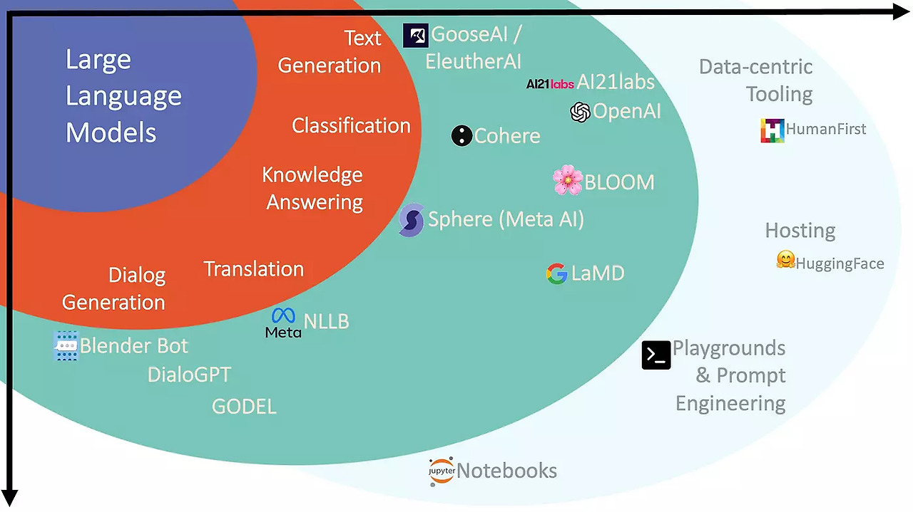
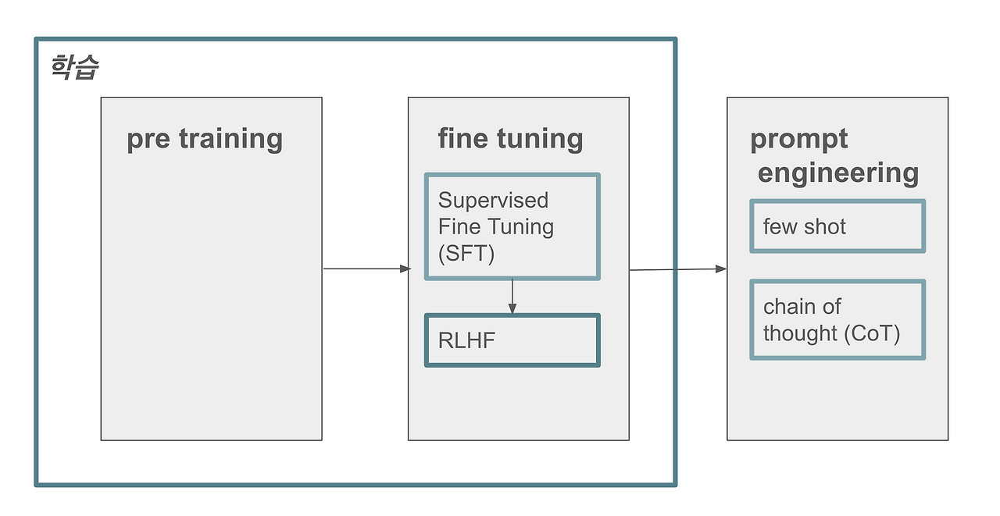
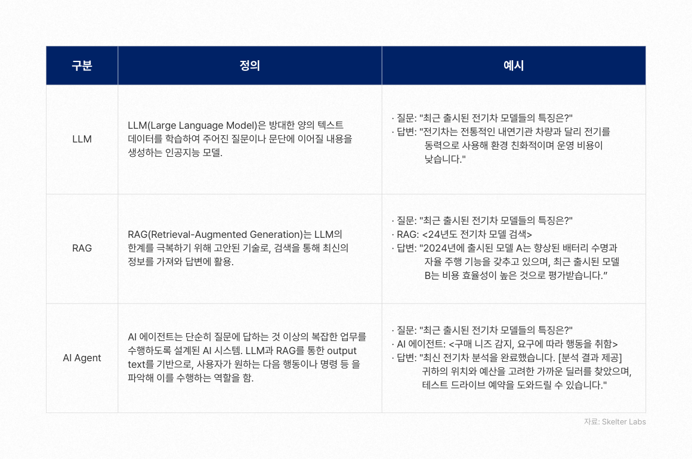

현재 로보틱스 방향으로 공부 중이지만서도, 결국 모든 기술의 최종점엔 이 자연어 처리와 생성형 AI가 적용될 것이라 생각한다. 때문에 이에 대한 공부가 모든 분야에서 필수적인 지식이 될 것이며 상세한 이론과 실무를 익히기 전에 그 개념부터 차근차근 이해하고자 한다.

## 1. LLM이란?

LLM은 대규모 언어 모델**(Large Language Model)**의 약자로, 방대한 텍스트 데이터를 학습하여 자연어를 이해하고 생성할 수 있는 인공지능 모델이다.

### 1.1 LLM의 작동 원리

LLM은 주로 **트랜스포머** 아키텍처를 기반으로 한다. 트랜스포머는 일종의 신경망 모델이며, 다음의 핵심 구성 요소를 통해 텍스트 내 단어 간의 관계를 학습한다:

- **Self-Attention:**
  입력된 문장의 각 단어가 다른 단어들과 의 연관성을 파악할 수 있도록 가중치를 부여하는 메커니즘이다.
  
- **Multi-Head Attention:**
  여러 개의 자기 주의 메커니즘을 병렬로 사용하여, 서로 다른 관점에서 단어 간 관계를 학습한다.
  
- **Positional Encoding:**
  트랜스포머는 순서를 고려하지 않는 구조이기 때문에, 단어의 순서 정보를 추가하여 문맥의 순서를 학습할 수 있도록 한다.

LLM의 학습 과정은 일반적으로 세 가지 단계로 이루어진다:

1. **Pre-training(사전 학습):**
   방대한 텍스트 데이터를 사용해 언어의 일반적인 패턴, 문법, 단어 간 관계 및 일상 지식을 학습한다.

2. **Supervised Fine-tuning(SFT):**
   특정 작업에 맞게, 입력과 원하는 출력의 쌍(레이블)을 제공하여 모델이 해당 작업의 특성을 학습하도록 조정한다. 최근에는 Few-shot 학습처럼, 적은 예시만으로도 작업을 수행하는 방식도 주목받고 있다.

3. **강화 학습(RLHF: Reinforcement Learning from Human Feedback):**
   인간의 피드백을 바탕으로 보상 모델을 구축하고, 이를 통해 모델의 응답을 더욱 유용하고, 정확하며, 안전하게 개선하는 단계이다.

### 1.2 LLM의 한계점

- **Knowledge Cut-Off(지식의 제한):**
  모델은 학습 시점의 데이터까지만의 정보를 반영하므로 최신 뉴스의 정보나 최근에 업데이트된 내용은 반영하기 어렵다. 이 부분이 LLM의 주된 한계점이 아닐까 싶다.

- **Hallucination(환각):**
  AI는 단순히 통계적으로 가장 높은 확률의 단어를 예측하기 때문에 사실을 판별할 기능은 없다. 사실과 다른 정보를 자신감 있게 생성할 수 있는 현상이다. 대표적으로 "세종대왕 맥북 프로 던짐 사건" 등이 있다..

- **맥락 제한:**
  단기적인 문맥 유지는 가능하지만, 긴 문서를 요약하거나 장기적인 대화에서 일관성을 유지하는 것은 어렵다. 입력할 수 있는 텍스트의 길이(컨텍스트 윈도우)에 제한이 있어, 매우 긴 문서나 대화를 완전히 반영하지 못할 수 있다.

- **복잡한 추론 능력의 한계:**
  복잡한 논리적 추론이나 최신 정보가 요구되는 상황에서는 정확도가 떨어질 수 있다. 기존에 학습한 데이터를 바탕으로 답변을 생성하기 때문에, 완전히 새로운 개념을 만들어내는 능력이 제한적이며 인간처럼 직관적이거나 감성적인 창작 활동에서 한계가 있음.

## 2. RAG(Retrieval-Augmented Generation)이란?

**RAG**는 검색 증강 생성(Retrieval-Augmented Generation)의 약자로, LLM의 한계를 보완하기 위해 외부 지식 소스를 활용하는 기술이다. 기본적으로 RAG는 검색(Retrieval)과 생성(Generation)을 결합하여, 최신 정보 및 신뢰성 높은 데이터를 바탕으로 응답을 생성한다.

### 2.1 RAG의 작동 원리

  

  <a href="https://www.elastic.co/kr/what-is/retrieval-augmented-generation">출처: elastic 홈페이지</a>

RAG는 두 가지 주요 단계로 나뉜다:

1. **검색(Retrieval) 단계:**
   - 사용자의 질문이나 프롬프트를 분석하여 외부 데이터베이스나 문서 저장소에서 관련 정보를 검색한다.
   - **의미적 검색(Semantic Search):**
     벡터 임베딩을 활용해 텍스트의 의미를 수치화하고 그 수치와의 유사성을 기반으로 관련 정보를 찾아낸다.
   - **키워드 기반 검색:**
     BM25와 같은 알고리즘을 사용해 키워드를 중심으로 문서를 검색하는 기법도 사용된다.

2. **생성(Generation) 단계:**
   - 검색된 정보를 원래의 질문과 결합하여 LLM에 입력함으로써 보다 최신 정보와 사실에 기반한 응답을 생성한다.
   - 이 과정은 단순한 텍스트 생성이 아니라 검색된 문서의 내용을 참고해 LLM에 그저 물어보는 답변보다 신뢰도가 높아진다.

### 2.2 RAG의 구현 과정

RAG 시스템을 구축하기 위한 일반적인 절차는 다음과 같다:

1. **문서 수집 및 전처리:**
   - 관련 문서나 데이터베이스, 웹사이트 등에서 정보를 수집하고 정제한다.

2. **청킹(Chunking):**
   - 긴 문서를 단위(청크) 별로 나눈다.  
   - 단순한 일정 길이 분할 뿐 아니라 문맥을 고려한 스마트 청킹(Smart Chunking) 기법도 사용된다고 한다.

3. **임베딩(Embedding) 생성:**
   - 각 청크의 의미를 벡터 공간에 표현하는 임베딩을 생성하여 텍스트의 의미적 특성을 수치화한다. (임베딩은 텍스트를 컴퓨터 언어 즉, 각각의 벡터 수치로 표현한다고 보면 된다.)

4. **벡터 데이터베이스 구축:**
   - 생성된 임베딩을 저장하고, 효율적으로 검색할 수 있도록 벡터 데이터베이스를 구축한다.

5. **검색 및 생성 파이프라인 구성:**
   - 사용자 질문에 대해 관련 정보를 검색한 후 이를 기반으로 LLM이 응답을 생성하는 전체 파이프라인을 구성한다.

### 2.3 RAG의 장점

- **최신 정보 제공:**
  검색을 통해 웹에서 제공하는 최신 정보를 반영할 수 있다.

- **환각 현상 감소:**
  외부 신뢰할 수 있는 문서를 참조함으로써 사실과 다른 허위 정보를 생성하는 가능성을 줄인다.

- **출처 제공:**
  검색된 정보의 출처를 명시함으로써 응답의 신뢰성을 높일 수 있다.

- **도메인 특화 응용:**
  특정 분야나 조직에 맞게 커스터마이징된 지식을 활용할 수 있다.

- **데이터 프라이버시:**
  기업 내부 데이터나 민감한 정보를 외부 학습 데이터에 포함시키지 않고 필요할 때 안전하게 접근할 수 있다.  
  (단, 검색된 데이터의 보안 및 접근 제어는 별도의 관리가 필요하다.)

## 3. 결론

**LLM**은 자연어 이해나 문장 생성 능력이 뛰어나긴 하지만 최신 정보 반영과 환각 문제 등 한계를 지닌다.(물론 한글 문장 생성은 아직도 모자르다고 생각..) **RAG**는 이러한 한계를 극복하기 위해 외부 지식을 효과적으로 활용하기 위해 신뢰할 수 있는 정보를 검색을 통해 얻어옴으로써 보다 정확함과 동시에 최신의 응답들을 생성할 수 있다.

두 기술의 결합은 구글링 등 사용자가 직접 정보를 찾아 허위 정보를 걸러내는 등의 과정을 그치지 않을 수 있는 미래를 제시한다. 단순한 텍스트 생성에서 벗어나 지식 기반 시스템 및 전문 분야 응용에서 상당한 발전을 이끌어내고 있으며 앞으로도 이를 통해 많은 산업과 분야에서 그 역할이 더욱 확대될 것이다. 
각 로직이나 알고리즘에 대한 상세한 이해를 하기 전에 가장 기본적이고 이론적인 과정을 거치는 것이 큰 도움이 되는 것 같다. 결국 인간이 다루는 기술의 최종점은 모든 곳에 자연어로 접근할 수 있어야 한다고 생각하기 때문에 이에 대한 공부를 더 해나갈 필요가 느껴진다.