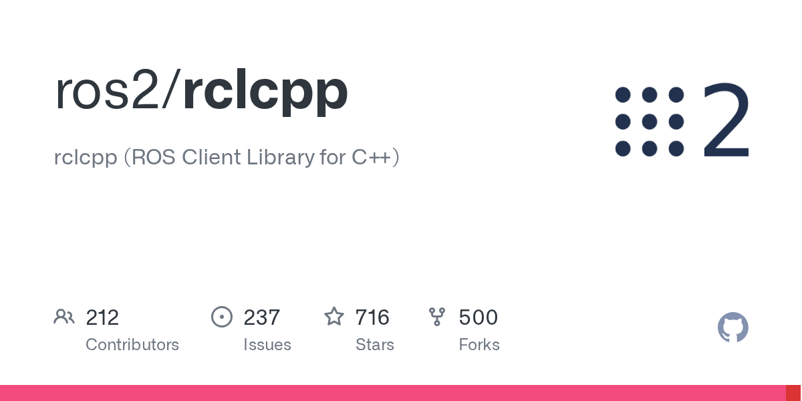
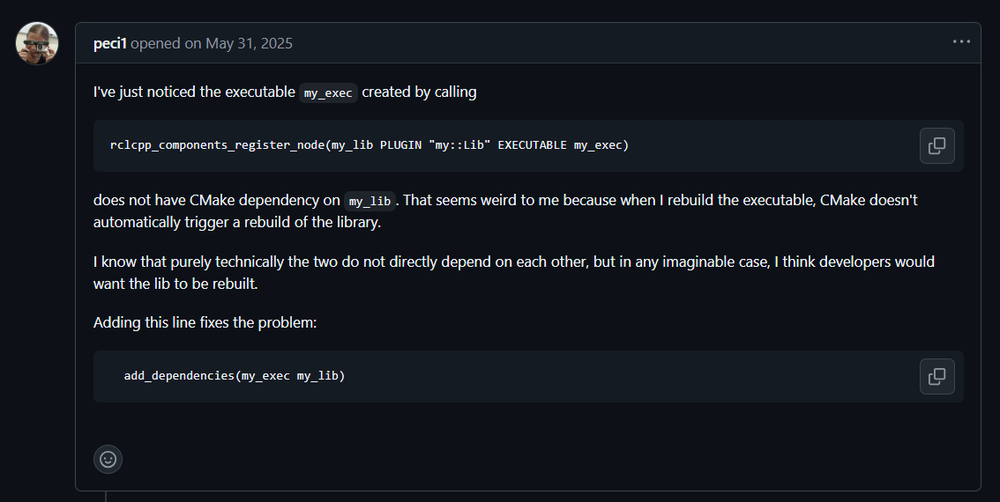
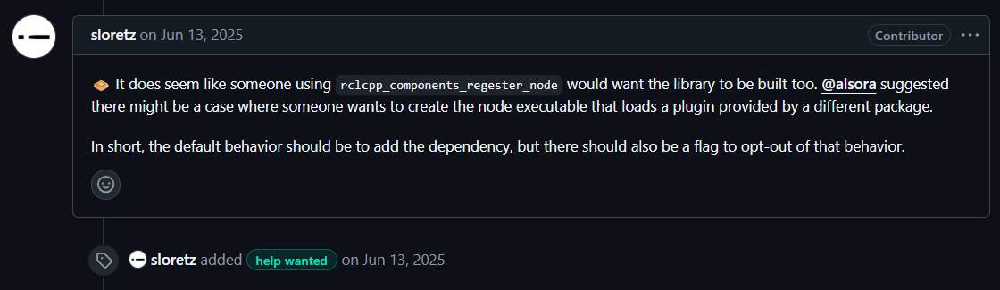
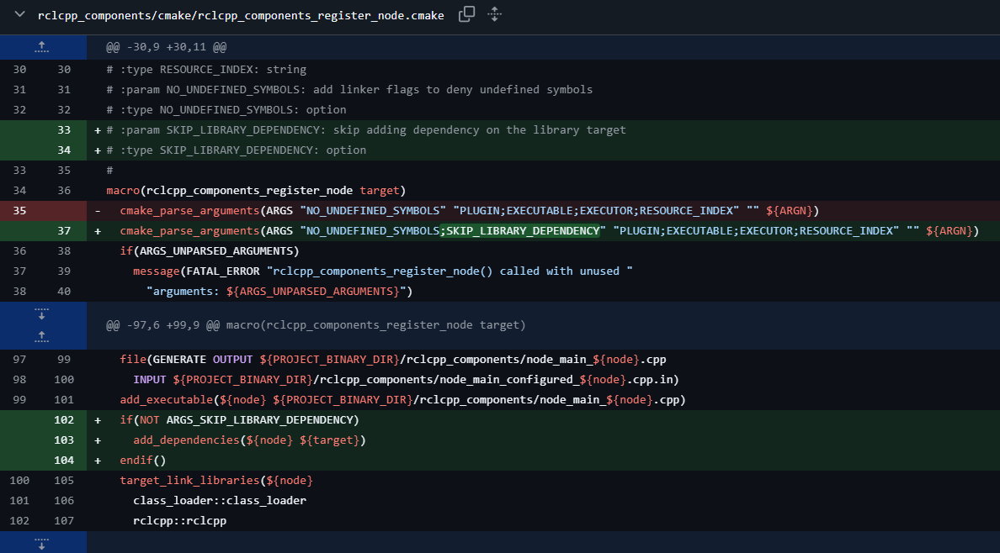
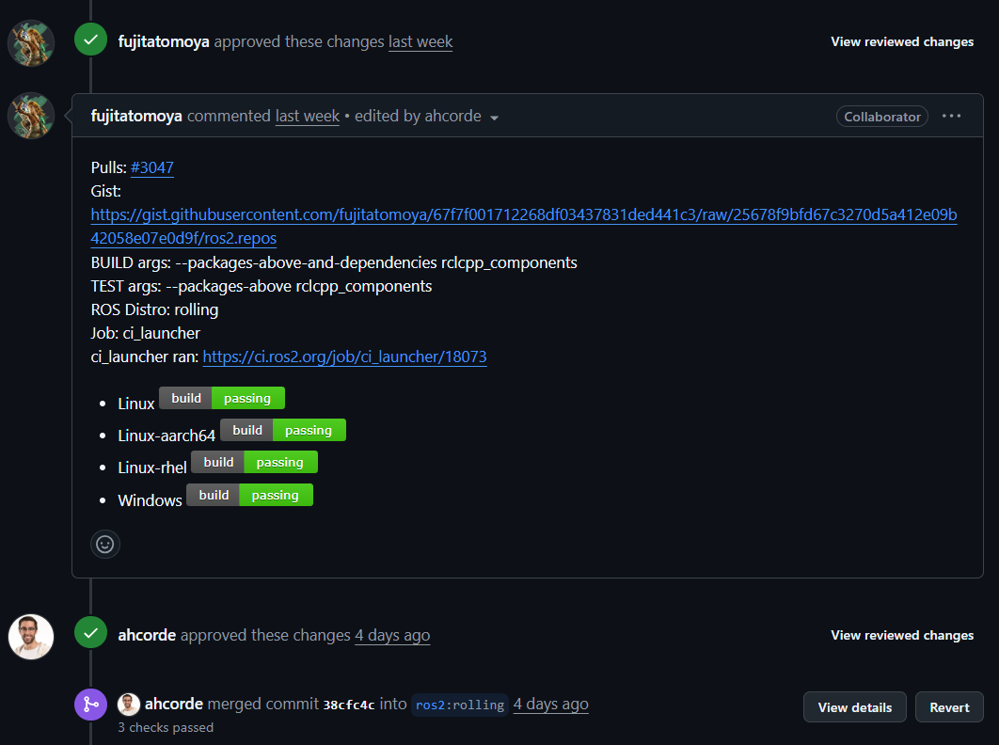
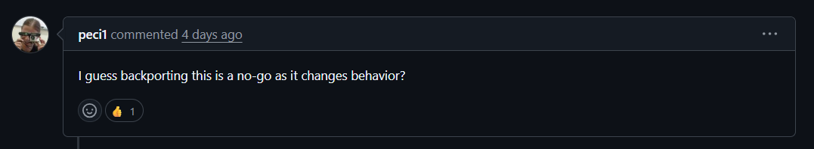

rosbag2, rclpy에 이어 세 번째 ROS 오픈소스 기여를 하기로 했다.
이번엔 rclcpp.

ROS를 cpp에서 사용하게 해주는 유용한 라이브러리다.
취준 기간에 ROS 관련 많은 공고를 찾아봤는데, python과 더불어 ROS는 cpp도 어느 정도 필수 역량으로 여겨지는 듯했다.

rclpy 관련 프로젝트는 많지만 rclcpp 프로젝트는 없는 나로서는 어필할 방법이 없었고,
그에 따라 관련 개인 프로젝트가 필요함을 느꼈다.
그런데 그걸 진행하기 전, 
라이브러리에 기여를 함으로써 코드에 대한 이해를 늘림과 동시에 어필할 거리를 만들어 진행하고자 했다.
~~그래야 좀 자신감이 좀 생길 듯했다.~~

이번에도 목표는 사용자 경험을 바꾸는 의미있는 기여를 제안하기보단 이슈를 해결하여 Contributor로서 이름을 남기는 거였다.
적당한 이슈를 찾아 파일을 분석하고, 이슈점을 재현하고 개선할 부분을 찾아보는 게 중요했다.

## 이슈 찾기

평소처럼 ROS2 저장소들 이슈를 뒤지다가 `rclcpp#2868`을 발견했다.

이슈 링크: [ros2/rclcpp#2868](https://github.com/ros2/rclcpp/issues/2868)

**문제**: `rclcpp_components_register_node`로 만든 executable이 library를 의존하지 않아서, library만 수정하면 executable이 재빌드되지 않는다.

쉽게 말하면 컴포넌트 라이브러리를 수정해도 노드 실행파일이 다시 빌드되지 않는 문제.

### 이 수정이 왜 필요한가
개발할 때 컴포넌트 라이브러리만 수정하고 빌드하면 
실행파일이 옛날 버전을 쓰게 된다.
디버깅할 때 "분명 고쳤는데 왜 안 바뀌지?"하는 상황.
무조건적으로 clean build 해야 한다는 소리다.

## 이슈에서의 방향 제시

좋았던 건 이슈에서 이미 해결 방향을 제시해뒀다는 점이다.
오픈소스 기여가 잘된 경험을 토대로 보면, 방향을 제시한 이슈가 확실히 merge가 잘됐다.
아마 사람마다 코드 스타일이나 원하는 지점이 다른데, 그걸 해당 레포의 규칙이나 그런 걸 찾기보다
이렇게 방향을 제시해주면 난이도가 상당히 낮아지는 것 같다.

이슈 작성자인 @peci1이 add_dependencies 추가를 제안했고, 리뷰어 @sloretz가 여기에 덧붙여

> the default behavior should be to add the dependency, but there should also be a flag to opt-out of that behavior

라고 코멘트했다. 기본 동작으로 의존성을 추가하되, opt-out 플래그도 제공하라는 방향이다.

이 정도면 간단하게 할 만하다고 판단했다.

## PR

`#2868` 이슈 분석 후, Claude와 함께 코드 수정을 진행했다.

수정은 6줄 추가, 1줄 삭제 정도였다.

기존 매크로는 `add_executable()`로 실행파일만 만들고 끝이었다.
CMake에서 `add_executable()`은 빌드 순서를 보장하지 않기 때문에, library가 바뀌어도 executable이 그걸 모른다.
`add_dependencies()`를 걸어야 "이 타겟이 바뀌면 나도 다시 빌드해"라는 관계가 생긴다.

그니까 수정한 부분이 뭐하는 코드냐면:
- `add_dependencies()`: CMake한테 "executable 빌드하기 전에 library부터 빌드해"라고 알려줌
- `SKIP_LIBRARY_DEPENDENCY`: 플러그인이 다른 패키지에 있을 때 순환 의존성 방지

PR 올리고 3일 기다렸다.

## 리뷰와 Merge

fujitatomoya가 CI를 돌렸다.

- Linux ✅
- Linux-aarch64 ✅
- Linux-rhel ✅
- Windows ✅
전부 통과했고,

2명의 메인테이너 승인.

그리고 9분 후, 바로 merge됐다.

## 마무리

이후 이슈 작성자인 @peci1이 작성한 코멘트다.
>backporting this is a no-go as it changes behavior?

동작이 바뀌는 수정이라 기존 배포판에는 backport가 어려울 수 있다는 의미다. 현재로선 rolling에만 반영된 상태.

6줄짜리 수정이어도 기본 동작을 바꾸면 stable 배포판에는 못 들어간다.
오픈소스에서는 수정의 크기보다 영향 범위가 중요하다는 걸 체감했다.
SKIP_LIBRARY_DEPENDENCY 옵션을 같이 넣은 이유도 결국 이런 맥락이다.
기존 사용자 중에 의도적으로 의존성을 안 건 경우가 있을 수 있으니까.

아무튼 이번에도 느낀 건, 이슈에서 리뷰어나 제안자가 방향 제시하고, 메인테이너의 반박도 없는 이슈 = 쉬운 이슈로 볼 수 있다는 것이었고,
그렇게 이슈를 찾아서 개선하여 CI만 통과된다면 거의 merge 확정인 것 같다.

이슈 카드를 만든 김에 적어도 6개의 오픈소스 PR을 통과시키고, 이를 자랑스럽게 걸어두고 싶다.

### 링크

- Merged PR: https://github.com/ros2/rclcpp/pull/3047
- Issue: https://github.com/ros2/rclcpp/issues/2868