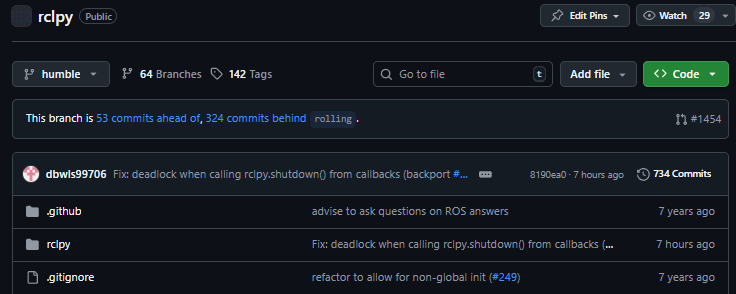
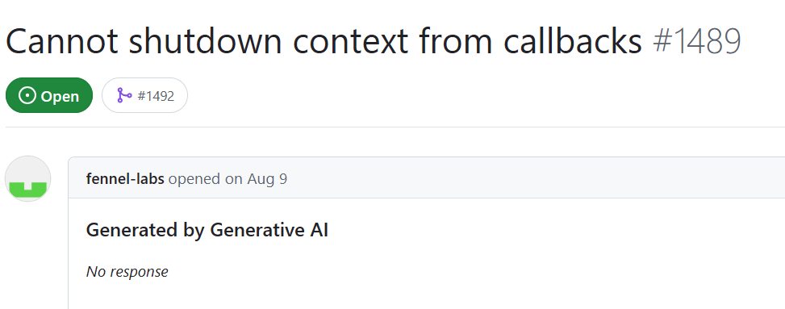
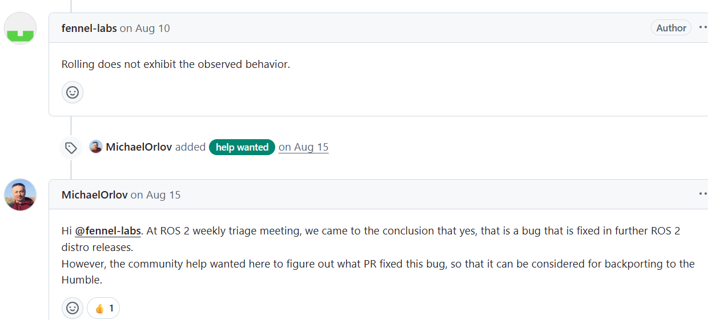
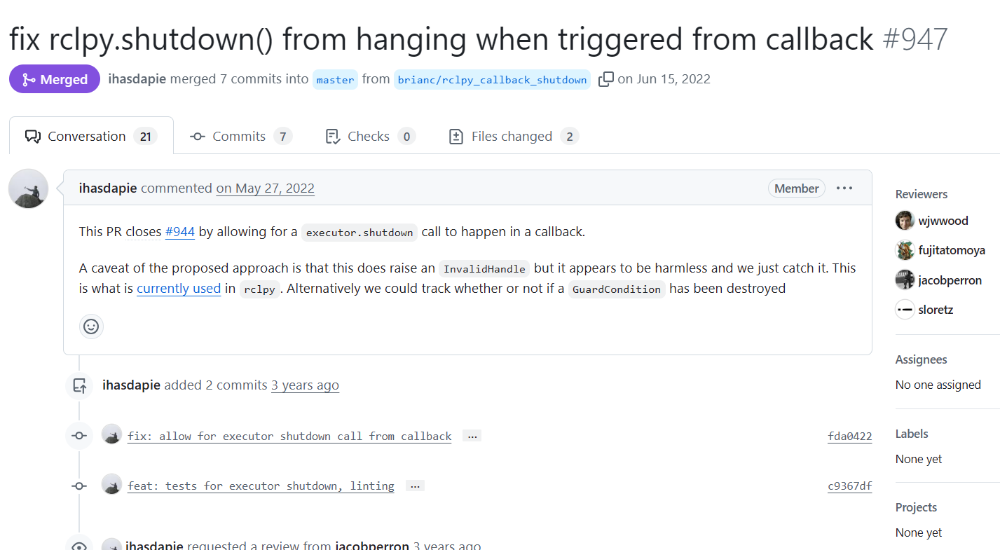
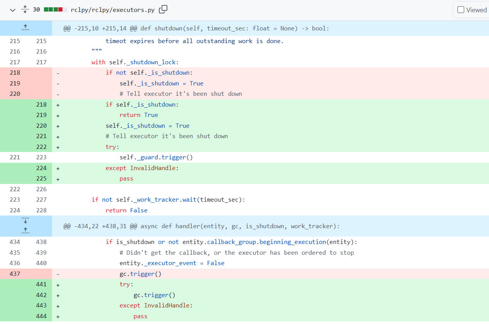
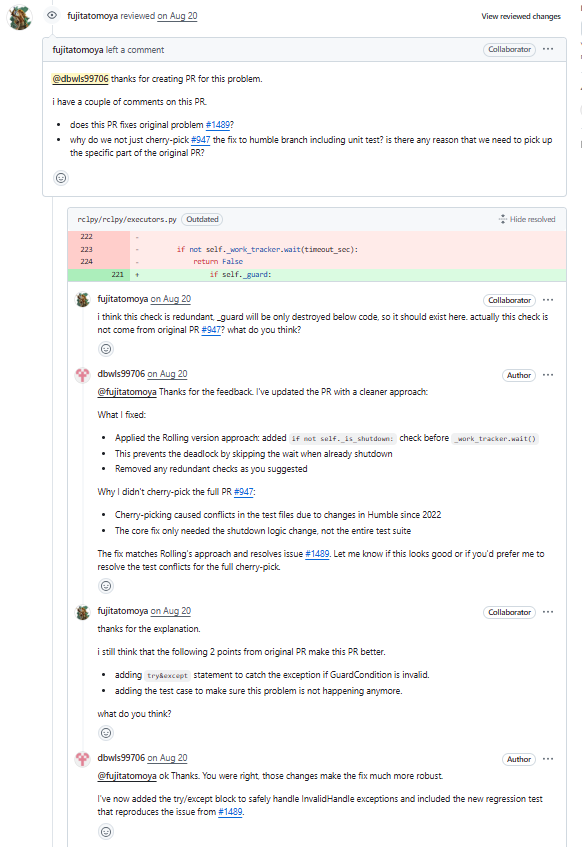
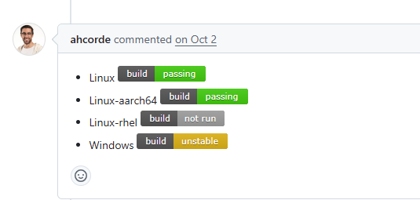
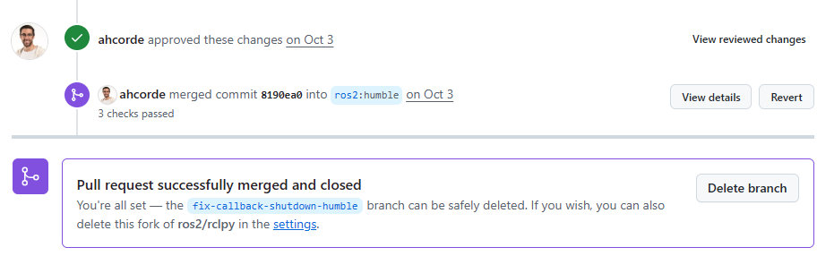
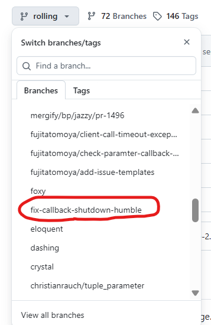

이번에 `rosbag2`에 기여하게 되면서 생각보다 오픈소스에 기여하고, 그것을 어필하는 일이 그렇게까지 난해한 일이 아니라는 생각이 들었다. 
사용하던 소스들의 구조나 규칙 등에 대한 이해도도 늘고 간단하게 취미처럼 하기 좋은 것 같다. (근데 그게 포스팅까지 이어지는 건 두 달이 걸렸다. 사유는 귀찮아서,,)

이전과 같은 방식으로 rclpy의 humble버전에 있던 이슈를 해결하여 merge에 성공했다. 물론 모든 코드에 대해 기여한 게 아니라 브랜치 하나에 기여한것이라 직접적으로 레포지토리의 contributor가 된 것은 아니지만 humble이 LTS버전이라는 것을 생각하면 나름 좋은 기회였다고 생각한다.

## 1. 문제 파악: Callback에서 rclpy.shutdown() 호출 시 Deadlock 현상 발생

이번에 발견한 이슈는 ROS 2 Humble 버전을 사용하며 직접 겪어봤을 법한 문제였다.

이슈 링크: [ros2/rclpy#1489 - Cannot shutdown context from callbacks](https://github.com/ros2/rclpy/issues/1489)

문제: 타이머나 구독자의 콜백 함수 내부에서 rclpy.shutdown()을 호출하면, 노드가 종료되지 않고 그대로 멈춰버리는(deadlock) 현상이 발생했다.

원인: 이 버그는 이미 최신 버전(Rolling)에서는 수정되었으나, 해당 수정 사항이 Humble 버전에 적용되지(백포트) 않아 발생하고 있었다.

## 2. 해결 방향
관리자(MichaelOrlov)가 help wanted 딱지를 걸고 언급하며, 이 문제를 해결한 원본 PR을 찾아 백포트해달라고 요청하고 있었다.

사실 그냥저냥 오류만 픽스하면 될 줄 알았는데.. 아무튼 시작을 했으니 이것저것 키워드로 PR을 찾아봤다. 그리고 긴 조사 끝에, 이 문제를 해결한 원본 PR이 [**#947**](https://github.com/ros2/rclpy/pull/947)임을 알아냈다.

## 3. Backport 시도: Cherry-pick 실패

원본 PR(#947)을 찾았으니, 이제 humble 브랜치에 적용할 차례다. 
Backport하는 과정에서 흔히 쓰는 방식인 git cherry-pick이라는 게 있길래 그것을 사용해 원본 PR의 커밋을 가져오려 했다.

하지만 역시나 한 번에 되는 일이 없는 세상. cherry-pick은 수많은 conflict(충돌)를 뱉어내며 실패했다. rolling 브랜치와 humble 브랜치 사이의 코드 차이가 꽤 누적되어 있었고, 수정해야 하는 executor.py 파일은 그동안 많은 collaborator들에 의해 수정된 상태였기 때문이랜다.

단순히 커밋을 가져오는 것은 불가능하다고 판단하여, backport를 수동으로 진행하기로 했다.

## 4. 수동 Backport와 메인테이너의 리뷰

cherry-pick이 실패했기 때문에, PR #947의 'Files changed' 탭을 열어 rolling 브랜치에 적용된 코드 변경 사항을 한 줄 한 줄 분석했다.

원본 PR(#947)의 핵심은 shutdown()이 callback 내부에서 호출될 때, 이미 context가 destroy되었을 수 있으므로 self._guard.trigger() 호출 시 발생하는 InvalidHandle 예외를 try...except로 잡아주는 것이었다.

`humble` 브랜치의 `rclpy/rclpy/executors.py` 파일을 열어 이 로직을 적용했다. 그런데 humble 버전의 코드는 rolling과 구조가 미묘하게 달랐기에, `self._guard.trigger()`를 호출하는 부분이 `shutdown()` 메소드 외에도 handler 내부, `_wait_for_ready_callbacks` 내부 등 총 세 군데에 존재했다. 이 세 곳 모두에 
>try...except InvalidHandle: pass 

구문을 추가했다.

또한, 이 버그를 검증할 테스트 코드(`rclpy/test/test_executor.py`)도 추가했다. 원본 PR의 테스트 케이스를 참고하되, humble 환경에 맞게 spin_once를 루프에서 실행하며 shutdown이 호출되었는지 확인하는 방식(`test_shutdown_from_callback_no_deadlock`)으로 새로 작성했다.(이 test 부분은 AI를 상당히 많이 활용했다.)

그리고 이 변경 사항을 담아 PR(#1492)을 생성했고,

얼마 지나지 않아 메인테이너에게서 리뷰가 달렸다.

"왜 원본 PR(#947)을 cherry-pick하지 않았나? 원본 PR의 특정 부분만 가져와야 할 이유가 있나?" 이런 질문이 나왔으며, 그에 따라 내가 생각하는대로 답변했다.(w. 파파고)

cherry-pick이 conflict 때문에 실패해서 수동으로 작업했다고 답글을 달았다. (사실 메인테이너가 의심할 법도 한 게 내가 이 과정에서 처음에 shutdown 로직을 잘못 이해하고 엉뚱하게 수정했다가 `force-push`로 덮어썼었다,,)

## 5. 기다림 끝에 Merge

다행히 메인테이너와의 대화를 통해 수동으로 적용된 코드가 원본 PR의 의도와 일치함을 확인했다.

왜 아직도 unstable이 뜨지? 하고 순간 당황했지만, 실패한 테스트 로그를 자세히 살펴보았는데 다행히 이 실패는 내가 수정한 `executor.py`의 deadlock 로직과는 전혀 관련이 없는 python_allocator 관련 테스트였다.

찾아보니 오픈소스 프로젝트에서는 종종 이렇게 기존 main (혹은 humble) 브랜치 자체에 불안정한 테스트가 존재한다고 한다. 아무튼 중요한 건, 내 변경 사항과는 무관하게 CI가 실패한 것이다.

메인테이너도 이 사실을 인지하고, 내 PR이 문제의 원인이 아니라고 최종 판단하여 무사히 merge될 수 있었다.
## 6. 마무리
rosbag2에 이어 rclpy에도 작은 기여를 성공적으로 마쳤다. 기존의 PR을 백포트해오는 과정이 신기하기도 하고 cherry pick이 성공하면 그냥 merge되는 건가 이런 게 궁금하기도 하다. 아무튼 덕분에 rolling과 humble 브랜치 간의 코드 차이를 직접 분석하고 executor의 동작 로직을 더 깊게 파고들 수 있었다.

이전부터 실제로 프로젝트에 직접 활용했었던 humble 버전의 python 라이브러리에 기여를 한다는 게 신기하다. ROS 2 Humble 사용자들에게 나의 수정 사항이 반영된 패치가 배포될 것을 생각하니 좀 머쓱하기도 하다.

아니 근데 PR의 브랜치가 그대로 들어가서 지금 내가 임시로 만든 잉여 브랜치가 실제 오픈소스에 들어가있는데 이거 원래 이런가? 

이게 맞나

아무튼 오픈소스 기여는 거창한 기능 개발이 아니더라도, 이렇게 특정 버전에다가 수정 사항을 backport 하는 것만으로도 충분히 기능적으로 가치 있는 일임을 다시금 깨닫는다. 

앞으로도 좀 여유로운 시즌이 오면 이것저것 이슈 찾아봐야지