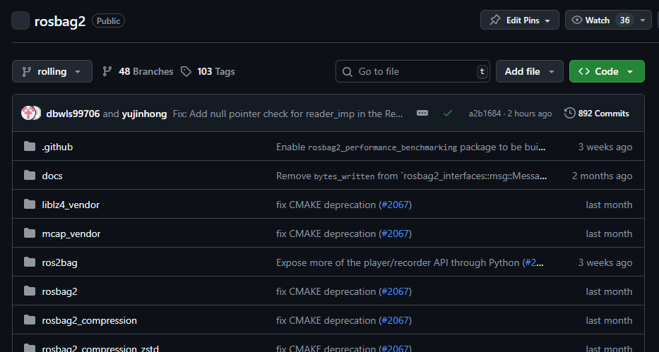
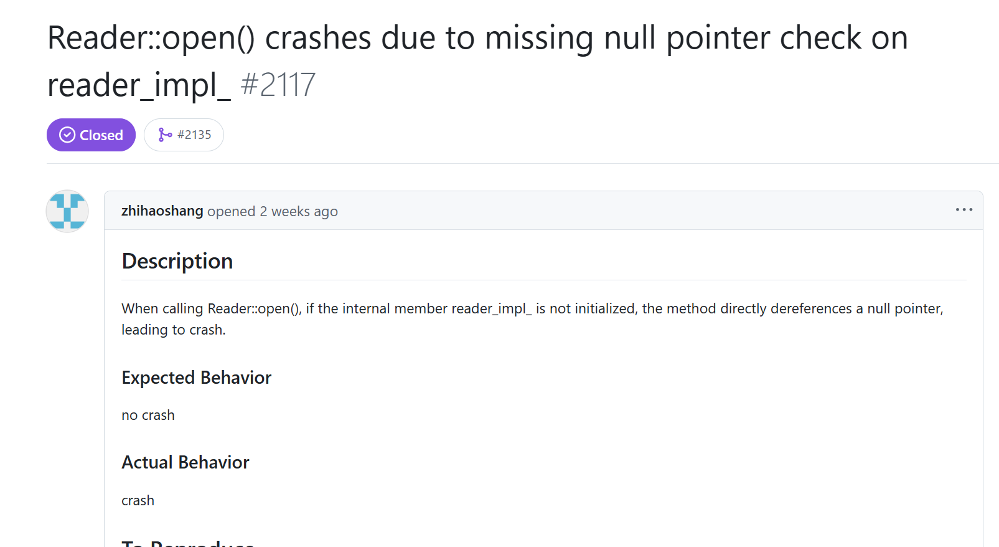
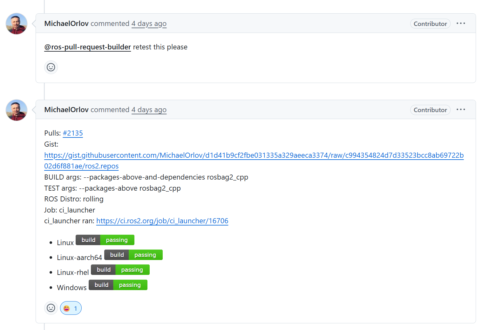
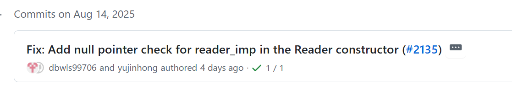
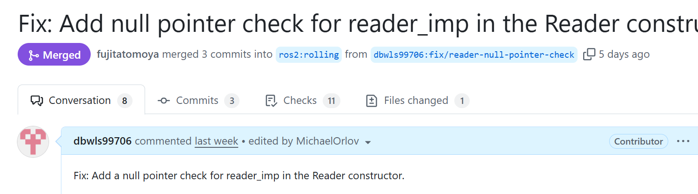

velog를 둘러보다가 [오픈소스 프로젝트에 기여하는 글](https://velog.io/@rewq5991/nodejs-contribution)을 보았다. 흥미가 생겨 나도 디버깅 정도는 야무지게 할 수 있지 않을까? 해서 이것저것 둘러보았다. 그중에서도 ros 관련한 패키지들을 둘러보고, 나도 위 글에서 나온 방법처럼 [이슈수집기](https://contribution-issue-collector.streamlit.app/)로 분석을 했는데 rosbag2에서 너무나도 간단해보이는 문제를 발견했다. 
너무나도 간단한 수정이었지만, 현재 다니는 회사에선 git을 적극적으로 활용하진 않기에 PR(Pull Request)을 올리고 리뷰를 받으며 최종 머지(Merge)되기까지의 과정을 체험해보고자 수정을 시작했다.

---

## 1. 문제 파악: Reader::open() 함수 충돌
이슈수집기가 이것저것 이슈에 대해 다양하게 추천해주는데 그중에서도 추천 1번으로 간단한 이슈를 발견했고, 오픈소스 기여를 맛보기하려는 나에겐 최고의 선택으로 보였다.

이슈를 살펴보면 `rosbag2`의 `Reader` 클래스에는 `open()`이라는 메소드가 있는데 이 메소드를 호출할 때, 내부 멤버 변수인 `reader_impl_`가 초기화되지 않은 상태(즉, `nullptr`)이면, 그대로 역참조하여 프로그램이 충돌하는 버그가 있다는 이슈를 찾을 수 있었다.


- **이슈 링크:** [ros2/rosbag2#2117](https://github.com/ros2/rosbag2/issues/2117)
- **원인:** `reader_impl_` 포인터를 사용하기 전에 유효성(null 여부)을 검사하는 로직이 누락되어 있었다.
- 제공된 테스트 코드를 실행하면, `Reader` 객체가 비정상적으로 생성된 후 `open()`이 호출될 때 AddressSanitizer 로그와 함께 충돌이 발생했다.

---

## 2. 해결 방향

처음에는 문제가 발생하는 `open()` 함수에 `if (!reader_impl_)` 와 같은 방어 코드를 추가하는 것으로 그냥 그저 간단하게 해결하려 했고, 그대로 PR을 보냈었다.

하지만 리뷰어인 **MichaelOrlov**가 더 나은 접근 방식을 제안했다.

> "IMO we should do this check in constructor and fail on construction since this is an ill-formed scenario."
>
> (의견: 이건 잘못 형성된 시나리오이므로, 생성자에서 이 체크를 수행하고 객체 생성에 실패하게 해야 한다.)

즉, 문제가 될 수 있는 상태는 최대한 빨리, **객체가 생성되는 시점(생성자)**에서부터 막아야 한다는 의견이었다. 유효하지 않은 `Reader` 객체가 생성되어 시스템 내부에 돌아다니는 것 자체가 잠재적인 위험이기 때문이다.

생각해보니 너무 맞는 말이다. 문제가 간단하다고 너무 풀어졌나.

#### 최종 수정 코드 (`reader.cpp`)

이 피드백을 반영하여, `open()`이 아닌 **생성자**에서 `reader_impl_`이 `nullptr`인지 확인하고, 만약 `nullptr`이면 `std::invalid_argument` 예외를 던지도록 수정했다.

**수정 후**
 ```cpp
 // reader.cpp
 Reader::Reader(std::unique_ptr<reader_interfaces::BaseReaderInterface> reader_impl)
 : reader_impl_(std::move(reader_impl))
 {
  if (!reader_impl_) {
    throw std::invalid_argument("Reader implementation is a nullptr.");
  }
 }
 ```

이렇게 하면 `Reader` 객체는 항상 유효한 상태로만 생성되는 것을 보장할 수 있다.

그렇다. 수정한 건 이게 전부다. 

---

## 3. Pull Request 제출 과정

1.  **Fork & Clone:** `ros2/rosbag2` 저장소를 내 GitHub 계정으로 포크하고, 로컬에 클론했다.
2.  **브랜치 생성:** `fix/reader-null-pointer-check` 라는 이름의 브랜치를 만들고 코드를 수정했다.
3.  **첫 커밋:** `git commit -s` 옵션을 사용하여 커밋에 내 서명을 추가했다.
4.  **PR 생성 및 리뷰:** GitHub에 PR을 생성하고 이슈를 연결했다. 그 다음날에 리뷰어의 피드백을 받을 수 있었다.
5.  **삽질 1: `uncrustify` 실패:** 리뷰어의 코드를 반영한 후 테스트를 실행했는데, `uncrustify`라는 코드 스타일 검사에서 실패했다. 원인은 들여쓰기였다. ROS2 프로젝트는 2칸 들여쓰기를 따르고 있었는데 나도 모르게 탭을 두 번 눌렀나보다. 아무튼 코드를 수정한 후 다시 push했다.
6.  **삽질 2: `retest` 요청:** 코드 스타일 수정 후에 상태가 바로 갱신되지 않아 리뷰어가 retest 해달라고 했는데 내가 씻고 있었다(;;). 그래서 직접 코멘트로 테스트를 다시 실행해주셨다.


7.  **최종 병합(Merge)**: 모든 CI 테스트가 통과되고, 다른 리뷰어의 최종 승인을 받아 내 자잘한 코드가 `ros2/rosbag2`의 `rolling` 브랜치에 병합되었다.


그렇게 Contributor가 되다.




---

## 4. 마무리

정말 작은 버그 수정임에도 여러 과정을 거쳤지만, github를 활용하고, 
오픈소스에 PR을 올리는 과정 등에 대해 이해하는 과정이 될 수 있었다.

이런 자잘한 코드도 리뷰어와 소통을 하며 merge까지 가는 과정이 신기하기도 하고 아무튼 그랬다.

현재 업무에 rosbag을 활용하지도 않고, 다른 오픈소스에 더 기여할진 모르겠지만
이것저것 해보는 건 다 경험이기도 하고 경험이 많다고 나쁜 건 전혀 없으니까