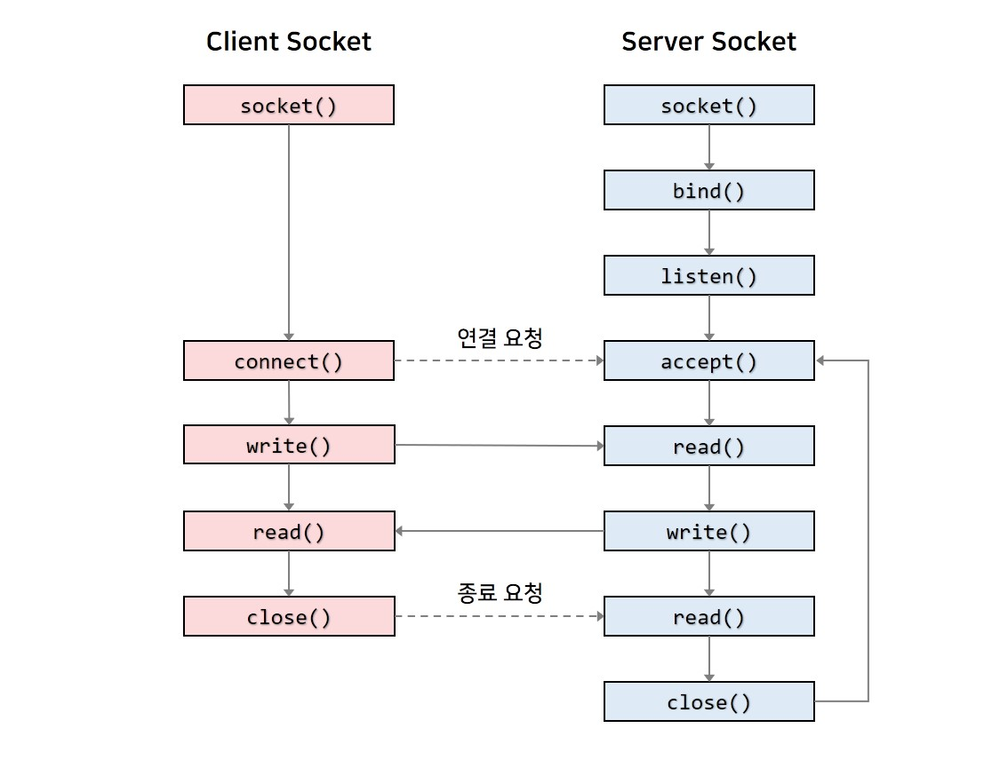

로봇을 다루는 업무를 하다 보면 각 장비의 네트워크를 다뤄야 하는 상황이 필연적인데
나에게도 그날이 오고야 말았다. (신입인데 벌써?)

아무튼 그동안 이름만 알고 있던 TCP, UDP와 같은 통신들을
실제로 **선정해서 다뤄야 하는 상황**이 생겼다.

구글에 네트워크 글들을 찾아보면 대부분 상세한 이론 설명부터 나온다.

물론 중요하긴 한데,
머리부터 들이밀며 박치기로 시작할 땐 그걸 전부 소화할 여유는 없고
당장 필요한 건 **그래서 그게 뭐고, 어떤 상황에서 뭘 써야 좋은 건데?**였다.

아무튼 개념을 받아들이는 입장에서 한 번 정리해보자.

---

## 이게 과연 뭘까

통신에 대해 다루게 돼서 네트워크에 대한 설명을 듣다보면
TCP, UDP, Modbus, 소켓 통신 같은 말들이 한꺼번에 등장한다.

처음엔 뭐가 뭔지 감도 안 잡히지만,
조금만 정리해보니 각각이 뭔지 알 수 있었다.

단순하게 나누면 이렇다.

- **TCP / UDP**
  - 전송 계층
  - 데이터를 **어떻게 보내고 받을지**에 대한 규칙
- **Socket(소켓)**
  - 운영체제가 제공하는 **통신 인터페이스(API)**
  - 프로그램이 TCP/UDP를 실제로 쓰게 해주는 창구
- **Modbus**
  - 응용 계층
  - 데이터를 형식과 의미에 대한 규칙

쉽게 말하면

> TCP/UDP는 그냥 통신 규칙이고
> Socket은 그 규칙을 쓰기 위한 상자 같은 것이고
> Modbus는 그 통신 규칙을 정해서 선정된 계층의 위에 올라가는 데이터 형식에 대한 규칙이다.

이렇게 나눠서 보면
각 용어가 머릿속에서 서로 섞이지 않을 것이다.

---

## TCP – 정확한 전달

TCP는 데이터를 **빠짐없이, 순서대로** 전달하는 데 목적이 있는 통신이다.

이를 위해 TCP는 내부적으로 꽤 많은 일을 하는데

- 연결을 먼저 맺고
- 데이터가 잘 도착했는지 확인하고
- 순서가 어긋나거나 빠지면 다시 보낸다

덕분에

- 데이터 유실이 없고
- 순서가 보장되며
- 이에 따라 높은 신뢰성을 가지게 된다

대신 그만큼

- 데이터 지연이 발생할 수 있고
- 실시간성은 상대적으로 떨어질 수 있다

실무에서 TCP는 주로
명령, 설정, 상태 값처럼
**절대 틀리면 안 되는 데이터**에 쓰일 것이다.

그러니까 TCP는 아무래도 속도보다 **정확성이 중요한 쪽**이라는 것이다.

---

## UDP – 빠르게 보내기

UDP는 TCP보다 훨씬 단순하다.

- 연결 과정 없고
- 수신 확인 없고
- 그냥 보내는 게 끝이다.

그래서
- 지연이 거의 없고
- 구조가 단순하며
- 실시간 처리에 유리하다

하지만
- 데이터가 유실될 수 있고
- 순서에 보장이 없으며
- 중복 수신이 가능하다.

빠른 속도를 위해선 이정도를 감수해야 할 때 사용한다.

뭐 지속적으로 새로 갱신되는 데이터나 
하나쯤 빠져도 다음 데이터가 바로 덮어주는 구조에 사용될 것이며,

정리하자면 속도와 실시간성이 우선인 쪽에 사용한다.

하드 리얼 타임이 필요한 경우가 아니라면, 가장 실시간성이 좋다고 봐도 무방하다.

---

## Socket 통신

소켓(Socket)은 TCP나 UDP처럼 통신 자체가 아니라
**프로그램이 네트워크 통신을 하기 위해 사용하는 인터페이스**다.

간단하게 말하자면

TCP 통신을 한다는 말을 그냥 **TCP 소켓을 열어서 통신**한다고 생각하면 된다.

소켓은 운영체제가 제공하는 기능이고, 보통 이런 흐름을 따른다.

그니까 소켓은 양방향 통신의 흐름을 만들기 위한 연결점이라고 생각하면 된다.

---

## Modbus

Modbus는 데이터를 어떻게 주고받을지 정해둔 프로토콜이다.

구조는 단순하다.
- 레지스터 기반 주소 체계
- 요청(Request) / 응답(Response)
- 읽기 / 쓰기 명령이 명확함

덕분에

- 구현이 쉽고
- 디버깅이 편하며
- 장비 간 호환성이 좋다

Modbus TCP는 TCP 위에서(client/server),
Modbus RTU는 RS485 같은 시리얼 통신 위에서(master/slave) 동작한다.

그니까 그냥 방금 봤던 전송 방식인 TCP나 Serial통신 위에 얹혀서 동작하는 규칙이다.

산업 현장에서 오래 쓰이는 이유가 그냥 여기저기 갖다대기 좋은 표준 같은 거라서 같다.

---

## 마무리
이렇게 정리한 내용에 대해 헛점이 있을 수 있다.
처음부터 완벽히 이해하고 시작하는 개념이 아니라,

그냥 당장에 해당 지식이 필요해져서 다시 보게 되는 개념에 가깝다.

역시 인생은 무언가에 대비할 시간도 안 준다.

정리 잘 된 이론 글은 이미 많고, GPT 같은 AI도 충분히 잘 설명해준다.
그리고 그건 필요할 때 다시 보면 된다.

지금 단계에서는
내 머리속이 꼬이지 않게 이 정도로 정리해두는 것만으로도 충분하다.

막히거나 필요하면 또 깊숙이 공부해야겠지만 일단은 넘어가자.