Turtlebot3 메뉴얼에 머신러닝이 업데이트됐다

이는 강화학습 중에서도 DQN이라는 에이전트로 Deep Q-Network 라는 건데 Q-Learning이라는 알고리즘을 활용한 방식이다.

## Deep Q-Network가 뭔데
그게 뭐냐면 그냥 말 그대로 깊은 Q-Learning인데 

여기서 이건 또 뭐냐 하실 사람들을 위해 설명하자면

Q-Value라는 **행동-가치함수**라는 값을 이용해서 
지금 이 상태(state)에서 어떤 행동(action)을 했을 때 
얼마나 이득(reward)을 볼 수 있는지를 계속해서 학습하는 방식이라고 한다. 

우리가 아는 강화학습 그 자체인 모습

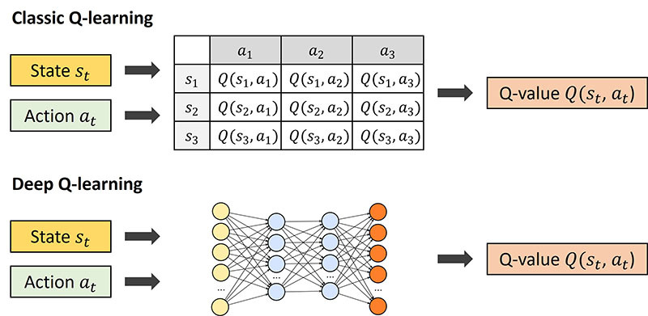

아무튼 DQN은 이런 강화학습을 CNN이라는, 
우리가 비전이나 이미지 관련 AI를 쓸 때 많이 들어봤던 인공지능을 이용해서 학습을 한다.
이를 도입하기 전에도 물론 강화학습과 딥러닝의 결합 시도가 있었지만, 
불안정하거나 수렴하지 않는 문제점이 있어서 결국 튀어나온 게 DQN이라고 보면 된다.

loss function은 Huber loss를 쓰고 이런 개념이 궁금하지 않다면 그냥

**게임에서 클리어할 수 있는 가장 빠른 방법을 찾는 우리 뇌 비슷한 거**

라고 생각해두자.

## 설치

일단 처음이니까 파일들을 까보고 제대로 학습하기 전에 메뉴얼을 따라 설치해보자.
일단 [여기](https://emanual.robotis.com/docs/en/platform/turtlebot3/machine_learning/)를 클릭해서 이것저것 설치해보자. 내 환경은 아래 적어두겠다.
>ubuntu 22.04 ROS2 Humble python 3.10.12

혹시 중요한 파일 같은 게 있다면 가상 환경에서 해도 좋다. 알아서 하자.

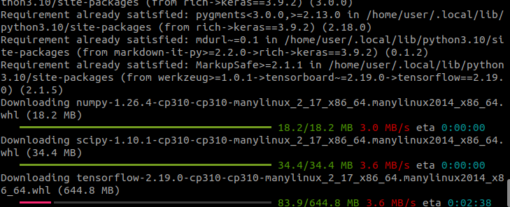

~~타임아웃 걸리는 바람에 분리해서 다운했다.~~

아무튼 다 다운하고 나면, 이제 turtlebot3 워크스페이스에 로보티즈에서 만든 패키지를 다운 받으란다.

>cd ~/turtlebot3_ws/src/
git clone -b humble https://github.com/ROBOTIS-GIT/turtlebot3_machine_learning.git
cd ~/turtlebot3_ws && colcon build --symlink-install

그 밑에 아래처럼 써있는데
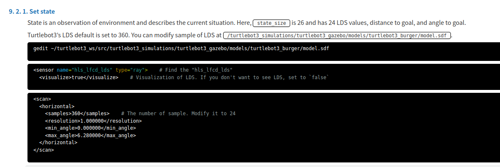

저 모델은 시뮬레이터에 소환할 turtlebot3 버거 모델의 정보라고 보면 된다.

이를 수정하라는 건데 visualize는 말 그대로 라이다가 시뮬에서 보이고 말고를 수정하라는 거고,
그것보다 LDS(Laser Distance Sensor)값이 기본이 360이니, 24로 줄여달라는 것이다. 

왜 수정하냐면, 딥러닝을 돌려야 하니까 님들 컴퓨터가 360 그대로 두고 하면 리소스가 터져버릴 거라는 이유다.
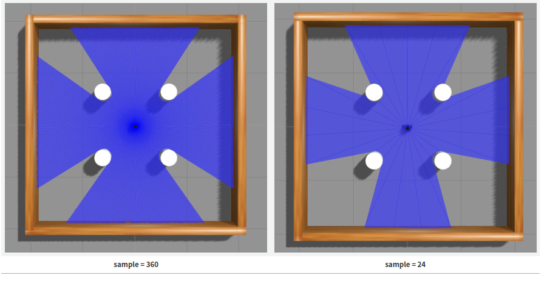

---

## 학습시켜보자

아무튼 이래저래 설치하고 이전 환경과 충돌하는 등 우여곡절이 있어서 그냥 다 재설치를 했다.

gazebo가 잘되나 한 번 실행해봤는데

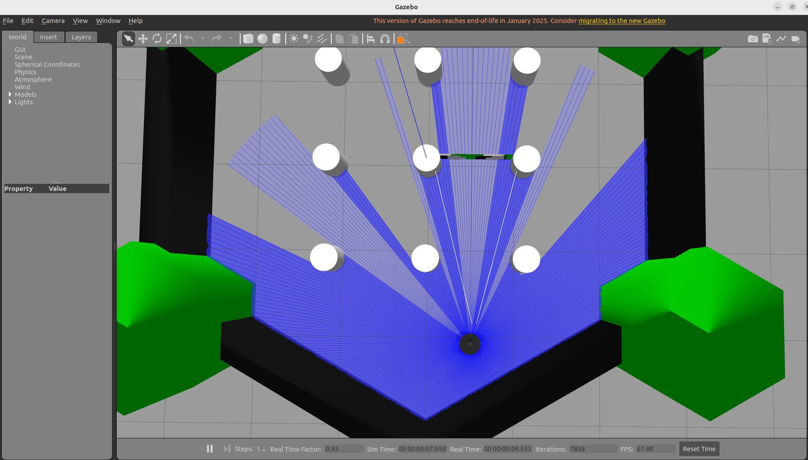

와플이 떠있어서 다시 버거로 `export TURTLEBOT3_MODEL=burger`를 입력해 실행했다.

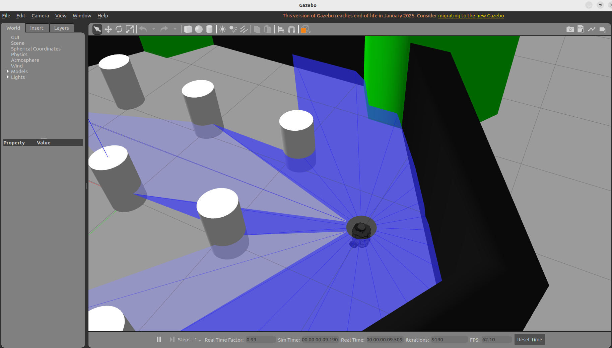

gazebo 화면은 휠로 확대/축소, shift 누르고 마우스 드래그하면 각도를 변경할 수 있다.

아무튼 이렇게 잘 실행된다면 이제 강화학습 노드를 튜토리얼을 실행시켜보자.
#### Gazebo 맵 실행
>ros2 launch turtlebot3_machine_learning turtlebot3_dqn_stage{num}.launch.py

메뉴얼에선 stage 4개를 준비해놨는데 1번은 빈 공간이고 2번으로 하겠다.

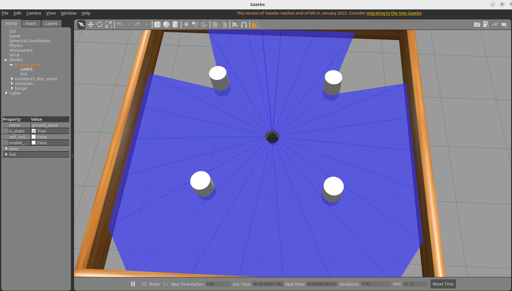

이제 각각 노드들을 켜주고 학습을 시작해보자.

#### Gazebo 환경노드
>ros2 run turtlebot3_dqn dqn_gazebo {$stage_num}

여기서 goal을 찍어주며 학습을 시키는 것이다.
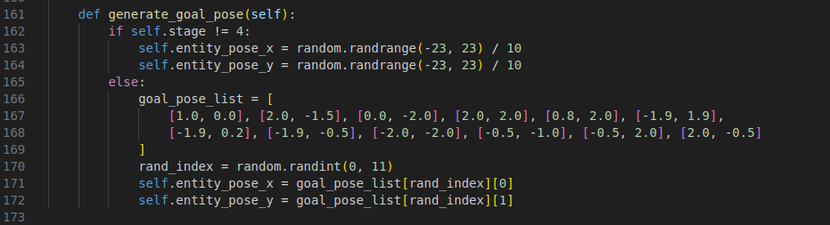

이렇게 스테이지 1, 2, 3은 랜덤좌표로, 
스테이지 4의 경우는 미로처럼 여기저기 벽이 있어서 리스트로 goal을 찍어주는 걸 볼 수 있다.
#### Dqn 환경노드
>ros2 run turtlebot3_dqn dqn_environment

이는 말 그대로 리워드를 계산하는 등, 강화학습 환경을 관리해준다.
#### 훈련시키는 DQN Agent 노드
>ros2 run turtlebot3_dqn dqn_agent {$stage_num} {$max_training_episodes}

*스테이지는 말 그대로 스테이지 넘버고, max_training_episodes는 실행할 에피소드의 횟수라고 생각하면 된다.*

난 스테이지 2, max 트레이닝 에피소드는 10으로, 기본설정과 같이 설정했다. 

너무 적은 것 같긴 한데 뭐 튜토리얼이니까 해보고 응용하는 게 중요한 거라, 아무튼 이를 모두 실행해보면

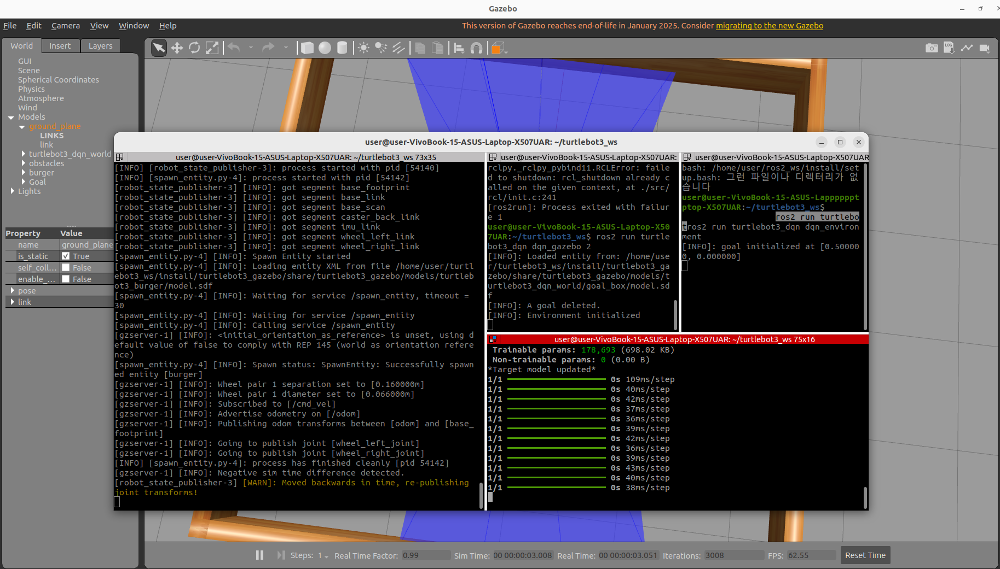

이렇게 학습하는 걸 모니터링할 수 있고,

이렇게 귀엽게 알아서 돌아다니는 걸 볼 수 있고,

꽤 시간이 걸리니, 유튜브 같은 걸 보고 오면 되겠다.

이래도 정 심심하면 `ros2 run turtlebot3_dqn action_graph` 같은 걸 실행해보면서 
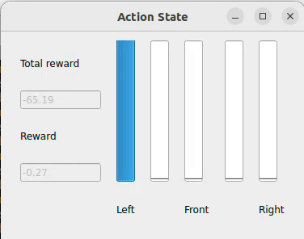

액션 상태나 총 보상 뭐 그런 것들을 확인해보면 된다.
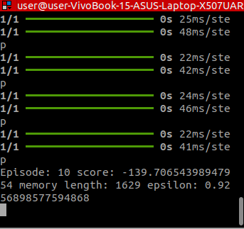

그런데 여기서 끊기지 않고 결과 load도 되지 않는다.
끊는 거야 main함수에서 spin 없애면 되겠지만 그게 문제가 아닐 것이다.
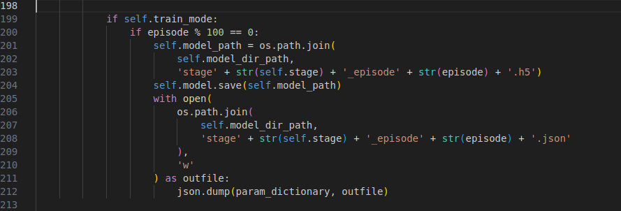

실행 코드를 찾아보니 결과를 load하기 위해선 파일이 h5와 json파일이 필요한데 이게 100번마다 적용된다는 것을 확인할 수 있다.

물론 100번도 안되면 스코어가 너무 낮아서 학습이 아니라고 봤을 수 있지만,
우린 기능을 써보고, 프로젝트 같은 곳에 쓰기 전에 튜토리얼을 따라보는 거니까
그냥 10으로 수정하고 다시 해보자.
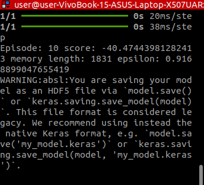

저장되면서 경고가 하나 뜨는데 그냥 keras로 하지 왜 h5로 저장했냐 이런 말로 이해하면 된다.

아무튼 이제 `turtlebot3_machine_learning/turtlebot3_dqn/saved_model` 폴더를 열어서 살펴보면
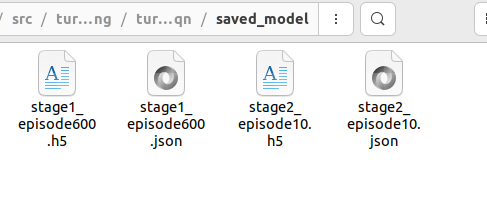

기본 파일과 함께 내가 학습시킨 결과가 저장됨을 알 수 있다.

## 테스트
대강 학습이 완료됐다면 테스트해보자.
#### 학습 모델 테스트 코드
>ros2 run turtlebot3_dqn dqn_test {$stage_num} {$load_episode}

내가 볼 에피소드가 10이니까 `ros2 run turtlebot3_dqn dqn_test 2 10`을 입력해보자.

이렇게 점수가 낮아선지 휘청거리지만 아무튼 어딘가로 잘 가는 걸 볼 수 있다.

또 `ros2 run turtlebot3_dqn result_graph` 라는 걸로 큐값의 최대값 평균과 총 보상 이런 걸 그래프로 확인할 수 있는 툴이 있는데 
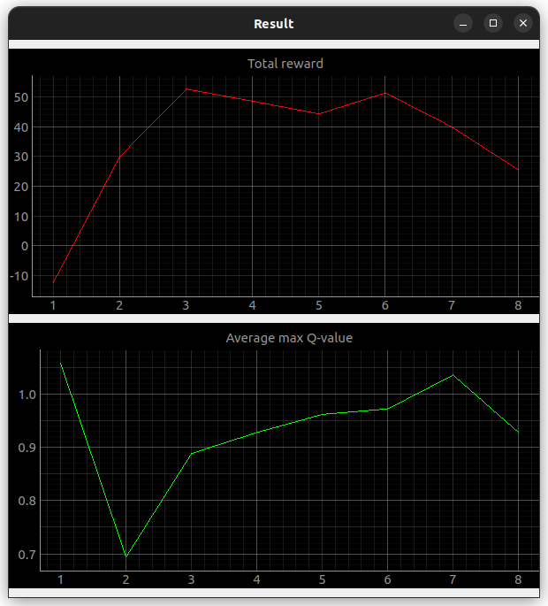

요런 모습으로 나온다고 한다.
이를 보고 싶다면 학습 전에 이를 실행시키고 쭉 보시면 된다.

## 마무리

아무튼 이래저래 튜토리얼을 학습해봤고, 
이를 튜닝하거나 대강 활용해서 프로젝트 하나를 하고 코드를 대략적으로라도 익혀 놓으면 
이래저래 강화학습 dqn알고리즘을 써봤다! 정도로는 활용할 수 있을 것 같다.