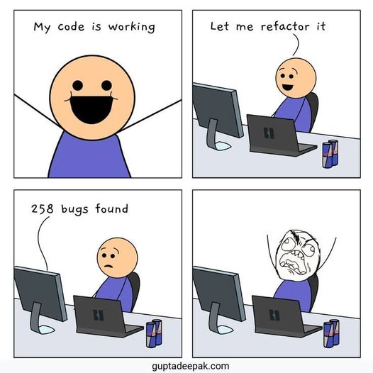
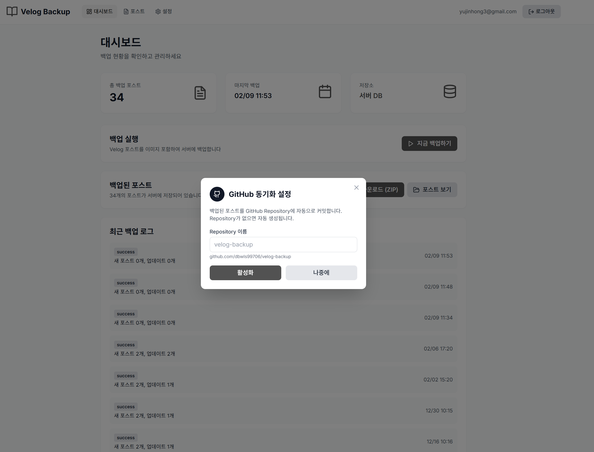
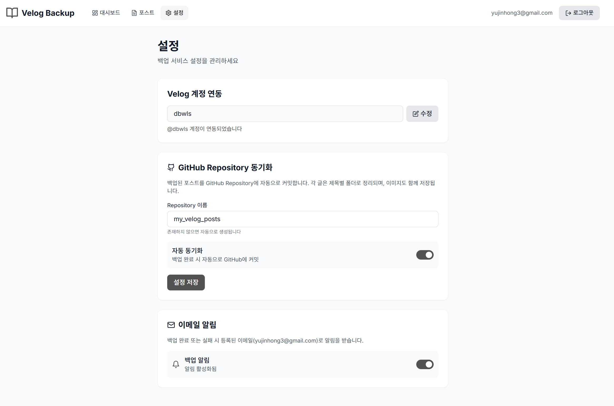
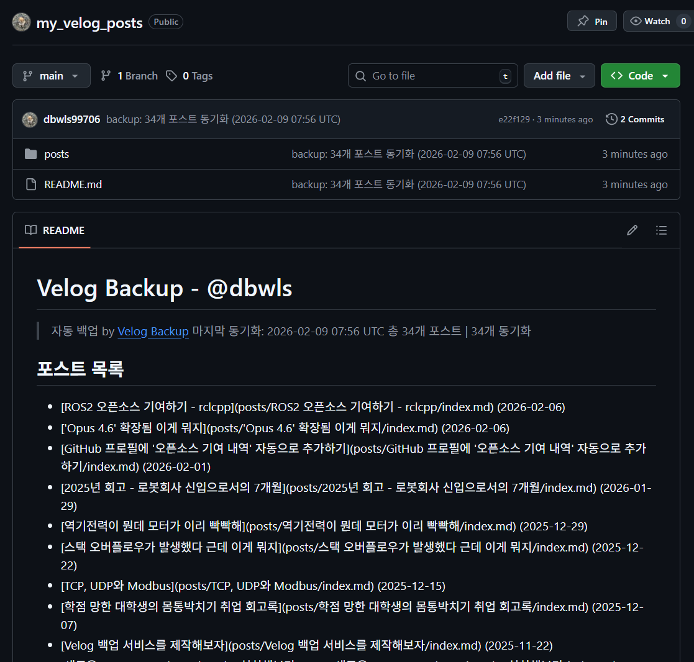
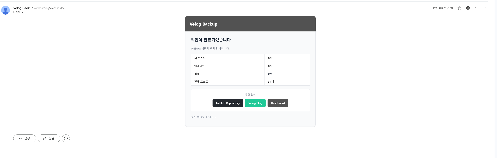
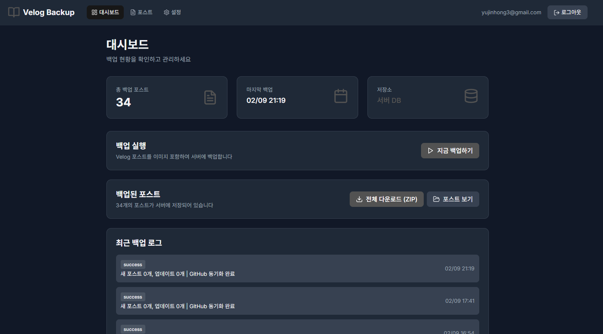
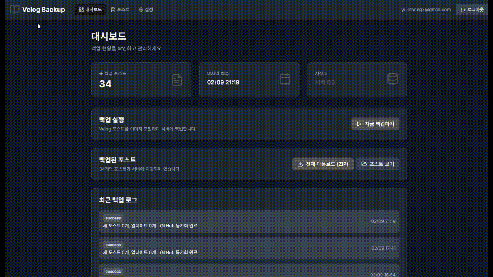
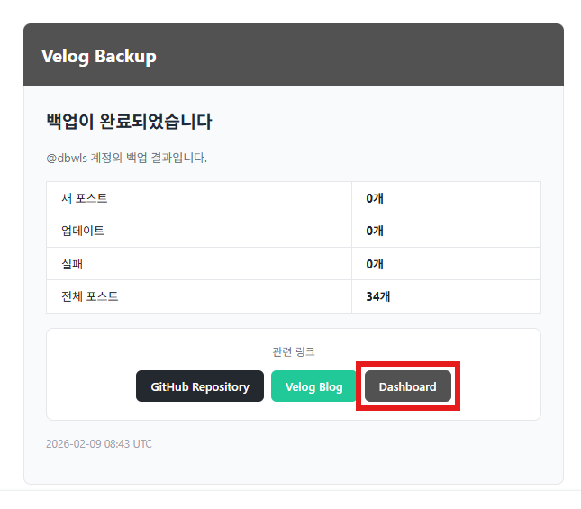
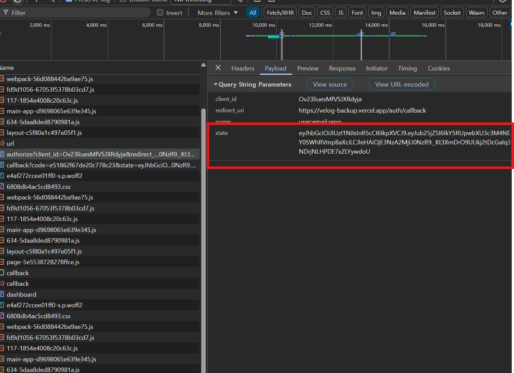

이전에 만든 [Velog Backup](https://velog-backup.vercel.app) 서비스의 코드를 다시 들여다봤다.

솔직히 동작만 하면 됐지 하고 넘긴 부분이 많았는데, 
다시 보니 신경 쓰이는 게 한두 개가 아니었다. 


페이지 전환이 느리다거나, 코드 자체가 좀 지저분하다거나. (빌드 중 발생한 warning을 무시한 것도 여러 개였다.)

그래서 이참에 한번 싹 개선하고 생각해뒀던 기능들도 추가하기로 했다.

이번 글에서는 그렇게 Velog Backup 서비스의 UX, 백엔드 안정성, 보안, 코드 품질을 중심으로 진행한 개선 내용을 정리하고자 한다.

이 글은 서비스를 제작하고 방치하지 않았다는 증빙이 될 것이다. 


>[Velog-Backup 링크 ](https://velog-backup.vercel.app/)

---
## GitHub 레포지토리 연동 자동 백업


먼저 불안정한 무료 vercel 서버에 저장하는 게 마음에 걸렸다.
나는 Supabase에서 기록을 볼 수 있지만 사용자는 아니니까.

그래서 다운로드 버튼을 만들었으나, 
그건 글 하나하나 저장하는 번거로움을 없애려고 만든 이 프로젝트의 취지와는 거리가 있었다.

그래서 GitHub와 연동하여, 레포지토리에 업로드되도록 기능을 추가했다.


my_velog_posts로 레포 이름을 설정하고 지금 백업하기 버튼을 누르면

위처럼 레포지토리가 생성되고 메일 알람을 켜놨다면 메일이 간다.


메일 서비스는 resend를 활용했다.

추가로 이번엔 온전한 백업을 위해 이미지를 따로 파일로서 저장했다.

그 이미지들은 백업 레포지토리의 images 폴더에 저장된다.

---

## 다크 모드 지원

Tailwind CSS의 `dark:` 접두사를 활용해서 다크 모드를 구현했다. 기존 스타일 옆에 `dark:bg-gray-800` 같은 클래스를 추가하는 방식이라, 별도의 테마 파일 없이도 라이트/다크를 동시에 관리할 수 있었다.


처음엔 색상 조합이 안 맞아서 눈이 아팠는데, 배경-텍스트 간 명도 차이를 충분히 주는 게 핵심이었다. `gray-900` 배경에 `gray-100` 텍스트처럼 단계를 크게 벌려야 가독성이 살아난다.

시스템 설정에 맞춰 자동 적용되고, 처음 들어갈 때 흰 화면이 번쩍이는 것도 잡아뒀다.

---

## 페이지 전환 개선

대시보드 → 포스트 → 설정 탭을 왔다 갔다 할 때마다 전체 화면이 로딩 스피너로 뒤덮이는 게 거슬렸다.
원인은 단순했다. 각 페이지에서 `if (loading) return <LoadingSpinner />` 이런 식으로 처리하고 있었는데, Header까지 전부 사라졌다가 다시 나타나니까 화면이 깜빡거리면서 느려 보였던 것이다.

### 해결

1. **UserContext에서 사용자 데이터를 캐싱**해서, 한번 로그인하면 페이지 이동 시 다시 API를 호출하지 않도록 했다.
2. **Header는 즉시 표시**하고, 데이터가 로딩되는 콘텐츠 영역만 인라인 스피너로 처리했다.

```tsx
// Before: 전체 화면이 스피너로 교체됨
if (userLoading || statsLoading) return <FullPageLoader />;

// After: Header는 유지하고 콘텐츠만 로딩
return (
  <Layout>
    {statsLoading ? <InlineLoader /> : <DashboardContent />}
  </Layout>
);
```



체감 차이가 꽤 크다. 특히 탭을 빠르게 왔다 갔다 하면 Header가 안 깜빡이니까 훨씬 자연스럽다.

### 홈 링크에서 무한 로딩 렉 문제 해결

백업 완료 알림 이메일의 Dashboard 버튼을 누르면, 
화면이 전체 로딩 → 헤더만 있는 로딩 사이를 왔다갔다 하면서 심한 렉이 걸렸다.

원인을 추적해보니 홈(`/`)과 대시보드(`/dashboard`) 사이에서 무한 리다이렉트가 발생하고 있었다.



미리 로그인해둔 상황에서
홈에서 토큰이 있으니 대시보드로 이동 → 대시보드에서 유저 정보가 아직 없으니 홈으로 이동 → 다시 홈에서 대시보드로... 이 반복이었다.

React의 useEffect가 자식 컴포넌트부터 실행된다는 걸 몰랐던 게 핵심이었다. 대시보드(자식)의 체크가 유저 정보를 불러오는 Provider(부모)보다 먼저 실행되면서 "유저가 없다"고 잘못 판단한 것이다. Provider에서 불필요하게 로딩 상태를 조기 완료 처리하던 한 줄을 제거하니 해결됐다.

디버깅에 시간이 꽤 걸렸지만, React의 이펙트 실행 순서를 제대로 이해하게 된 좋은 경험이었다.

뭐 일단은 메일도 Dashboard로 정확히 이동하게 수정도 해놓았다.

---

## 백엔드 안정성 개선

여기가 제일 할 게 많았다. 
Claude가 해주긴 하는데 아무튼 번잡해서 고민거리가 꽤 있었다.

### 중복 백업 방지

백업 버튼을 빠르게 두 번 누르면 백업이 두 번 실행되는 문제가 있었다. BackgroundTask로 돌아가니까 프론트 쪽에서 막아도 의미가 없었다.

```python
# 이미 진행 중인 백업이 있으면 차단
in_progress = db.query(BackupLog).filter(
    BackupLog.user_id == current_user.id,
    BackupLog.status == BackupStatus.IN_PROGRESS
).first()

if in_progress:
    raise HTTPException(status_code=409, detail="이미 백업이 진행 중입니다")
```

### PostCache UniqueConstraint

같은 사용자의 같은 slug 포스트가 중복 저장될 수 있는 구조였다. DB 레벨에서 `(user_id, slug)` 유니크 제약 조건을 걸었다.

```python
__table_args__ = (
    UniqueConstraint('user_id', 'slug', name='uq_post_cache_user_slug'),
)
```

### verify_username 최적화

Velog 사용자명을 확인할 때 **모든 포스트를 다 가져오고 있었다.** 존재만 확인하면 되는데 전체 포스트를 페이지네이션 돌리고 있었으니 낭비가 심했다.

```graphql
# Before: 전체 포스트 조회
posts(username: $username) { id title ... }

# After: 1개만 확인
posts(username: $username, limit: 1) { id }
```

그 외에도 Velog API 호출에 `httpx` timeout 30초 설정을 추가해 무한 대기를 방지했다.

---

## 코드 정리

Python 3.12부터 `datetime.utcnow()`가 deprecated됐는데, 5개 파일에서 쓰고 있었다. 전부 `datetime.now(timezone.utc)`로 교체했다.

```python
from datetime import datetime, timezone

# Before (deprecated)
datetime.utcnow()

# After
datetime.now(timezone.utc)
```

그 외 리팩토링 항목:

| 항목 | Before | After |
|:---:|:---:|:---:|
| 로깅 | `print()` | `logger.error()` |
| 예외 처리 | `except:` (bare) | `except Exception:` |
| 앱 시작 | `@app.on_event` | `lifespan` |
| import | `__import__` | `from ... import ...` |

`__import__` 쓴 건 왜 그랬는지 모르겠다. 아마 import 순서 꼬일까봐 급하게 넣은 것 같은데, 정식으로 import 하는 구조로 수정했다.

---

## OAuth CSRF 보호 (state 파라미터)



GitHub OAuth 로그인 흐름에 `state` 파라미터가 없었다. 
CSRF 공격에 취약하다는 점을 Claude가 짚어줬는데, 그냥 넘기기엔 찜찜해서 추가했다.

### 동작 원리

1. 백엔드에서 **JWT로 서명된 state 토큰** 생성 (10분 만료)
2. GitHub 인증 URL에 state 포함
3. GitHub이 콜백할 때 state를 그대로 돌려줌
4. 백엔드에서 **state JWT 서명 + 만료 검증**

```python
# state 생성
state_payload = {
    "nonce": secrets.token_urlsafe(16),
    "exp": datetime.now(timezone.utc) + timedelta(minutes=10),
}
state_token = jwt.encode(state_payload, SECRET_KEY, algorithm="HS256")
```

JWT 방식이라 서버에 별도 세션 저장소가 필요 없고, 토큰 자체가 검증 수단이 되니까 stateless하게 처리가 가능하다.


---

## GitHub 레포 존재 확인 경고


GitHub 동기화 설정에서 레포 이름을 입력하면 없으면 자동 생성, 있으면 그냥 사용하는 구조인데, 
문제는 사용자가 이미 다른 용도로 쓰고 있는 레포 이름을 입력하면 `README.md`가 덮어써진다는 거였다.

그래서 **설정 저장 전에 레포 존재 여부를 확인**하고, 
이미 있으면 경고를 띄우도록 했다.

"그래도 사용"을 눌러야만 저장이 진행된다. 
본인이 인지하고 쓰는 거면 상관없지만, 실수로 덮어쓰는 건 막아야 하니까.(내가 실수할 뻔해서 만든 거 맞다.)

---

## 마무리

진행한 프로젝트를 이렇게 관리하는 이유는..
아이디어가 생각나고 그걸 행동력으로 밀어붙여서 실행하려고 했는데,
그렇게 되면 그냥 잡다한 프로젝트들의 공장장이 되는 기분이 들 것 같았다.

그래서 일단 지금 있는 프로젝트들에 대해 조금 더 유지보수를 진행하고 점차 늘려가고자 했다.


아무튼 이번 개선사항들을 정리하면 다음과 같다.

- **기능 추가**: GitHub 레포지토리 자동 생성(private 기본), 이미지 파일 백업, 이메일 알림(Resend)
- **프론트**: 다크모드(시스템 설정 감지 + flash 방지), 페이지 전환 속도 개선, redirect 루프 수정
- **백엔드**: 중복 백업 방지, DB 유니크 제약, API 타임아웃, 입력 검증
- **보안**: OAuth state 파라미터 CSRF 보호, GitHub 레포 private 기본 생성
- **코드 품질**: datetime.utcnow 교체, bare except 제거, deprecated 코드 정리
- **UX**: 다크모드, GitHub 레포 존재 시 덮어쓰기 경고

이렇듯 간단한 프로젝트는 AI로 초안부터 디버깅까지 함께하고, 이후 코드 리뷰도 AI와 함께하는 것 같다.
개발자라는 직업이 없어지는 게 아니라 일하는 방식이 바뀔 거라는 게 자꾸만 실감이 나는 것 같다.
뒤쳐지지 않기 위해선 계속 무언가를 하고 있는 게 큰 도움이 되고 덤으로 마음의 위안도 된다.

마무리 끝

> **GitHub**: https://github.com/dbwls99706/Velog_Backup
> **Service**: https://velog-backup.vercel.app