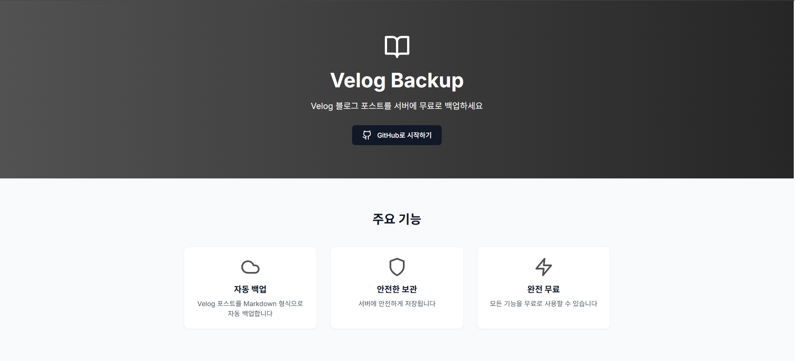
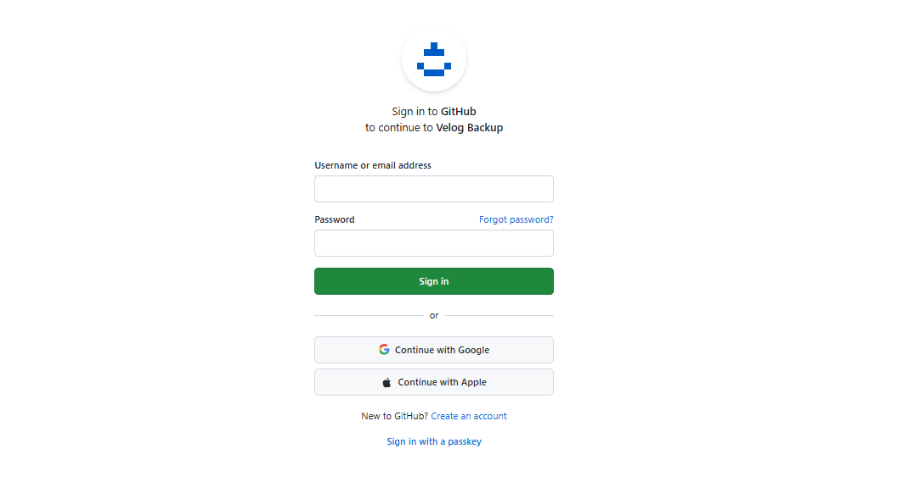
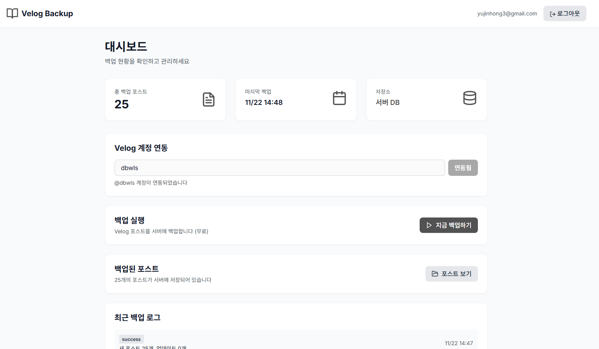
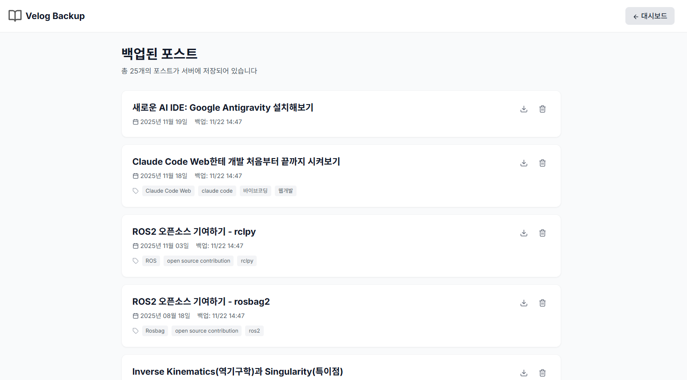
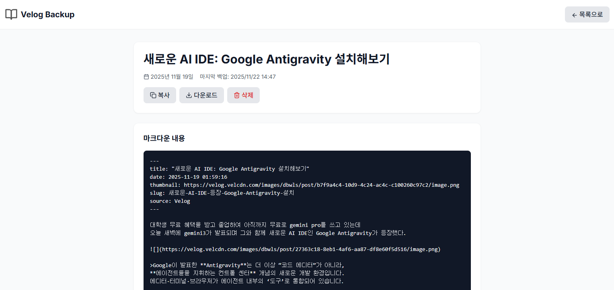
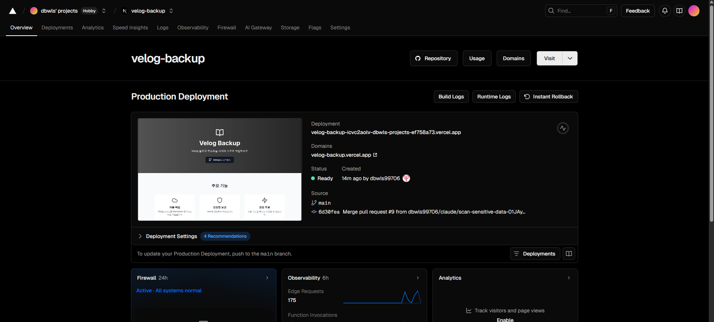
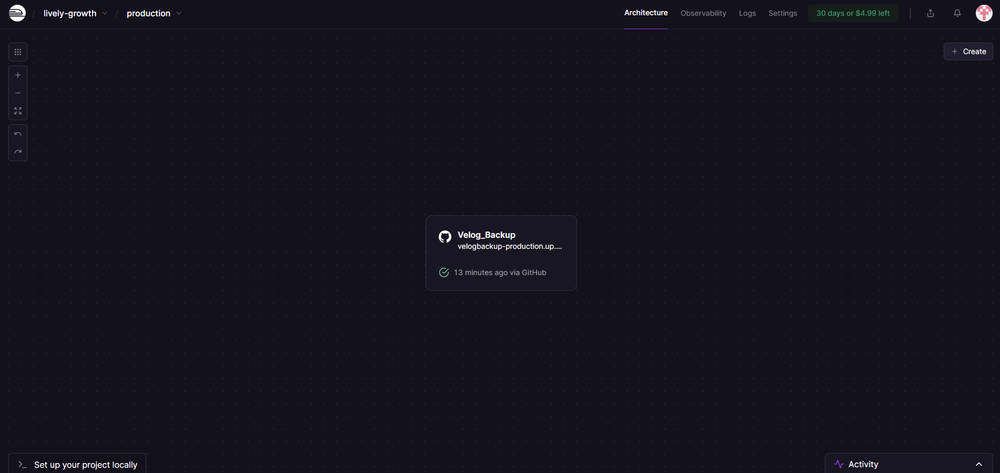
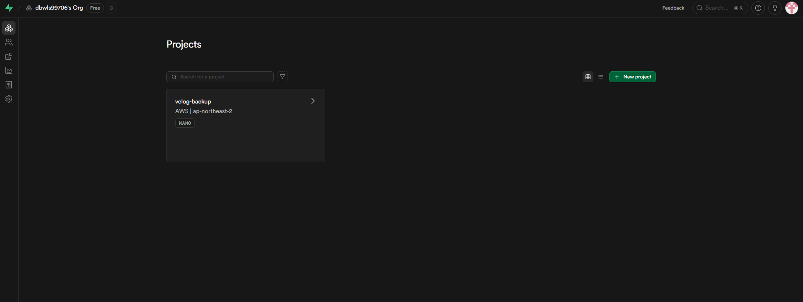
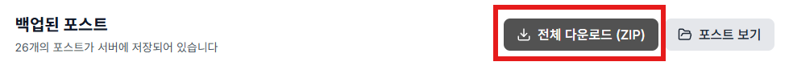

## 만들고자 한 이유

최근에 Velog에 글들을 게시하며 남들은 어떻게 쓰나 보기 위해 이곳저곳 들르며 구경을 하고 있었는데

아래와 같은 글들이 다수 존재하는 것을 발견했다.

게시글을 확인해보니 광고 이외의 글은 지워진 건지 원래 없던 건지 아무튼 없었다.

물론 해킹인지 아닌지는 모른다.

그러나 이 불안감은 백업의 필요성을 느끼게 했다

근데 또 하나하나 저장하는 건 그냥 귀찮으니
그래서 만들기로 생각한 게 **[Velog 백업 프로그램](https://velog-backup.vercel.app)**.

## 사용법
첫 화면이다.

여기서 github 계정으로 로그인을 누르면

해당 창이 뜨는데 로그인하면 된다.
github의 OAuth를 썼으니 안심해도 괜찮

로그인하면 대시보드가 나오는데 여기서 `계정 아이디를 입력`하여 연동하고 `지금 백업하기`를 누르면 된다.

백업 버튼 누르면 Velog에서 글 전부 긁어와서 저장됨

따로 DB를 굴리는 거라 Velog에서 삭제해도 여기선 남아있다.

백업된 글은 목록에서 확인 가능하며,
클릭하면 마크다운 원본 그대로 볼 수 있다.

## 개발 과정

개발 자체는 이해도가 부족하기에 저번처럼 Claude Code한테 거의 다 시켰다.
"Velog 백업 SaaS 만들어줘"로 시작해서 배포까지 한 세션에 끝냈다.(추후 수정은 세션 하나를 더 열어야 하긴 했다)
물론 이번엔 내가 원하는 바가 있었기에 삽질도 많고 세션 길이도 상당히 길었다.

중간에 삽질한 것들을 정리해보자면
- Google OAuth가 복잡해서 GitHub OAuth로 변경
- Railway에서 Supabase 직접 연결 하는 과정에서 환경변수 설정 실수해서 여러 번 애먹음
- JWT 토큰 타입 문제로 401 에러 → Claude로 디버깅 → 수정(이 과정이 좀 길었다)

AI가 갖고 있는 코드를 빌드하고 에러가 났을 때, 
원래 로그 던져주면 이 부분 때문에 안된다고 알아서 고쳐줄 텐데
그 로그가 참 세세하게 제시되어야 한다는 걸 다시금 느꼈다.

## 기술 스택(이건 거의 Claude가 작성했다)

**Frontend**
- Next.js 14 (App Router) + TypeScript + Tailwind CSS
- Axios 인터셉터로 JWT 토큰 자동 처리
- Vercel에 배포

Vercel 화면

**Backend**
- FastAPI + SQLAlchemy + Pydantic
- GitHub OAuth 로그인 → JWT 발급
- Velog GraphQL API로 글 크롤링
- 입력 유효성 검사 및 에러 핸들링
- Railway에 배포

railway 화면

**Database**
- Supabase PostgreSQL
- users, post_caches, backup_logs 세 개 테이블
- 사용자별로 데이터 분리되어 있어서 다른 사람 백업은 못 봄

supabase 화면

각각의 사이트가 github와 연동되어 생각보단 평이하게 진행됐다.

역시나 바이브 디버깅은 망망대해에서 표류하는 느낌이었지만 그래도 어찌저찌 됐다.

## 배포

Vercel, Railway, Supabase 전부 무료 티어로 운영

Railway는 완전 무료는 아니고 $5 크레딧이 주어지는데,
초과하면 서버가 꺼지고 추가 요금은 안 나감.(그래서 사용자에 따라 사이트가 락이 걸릴지도)
데이터는 Supabase에 있어서 서버 꺼져도 날아가진 않는다.

## 마무리
Frontend, Backend, DB를 모두 활용해보는 경험이었는데 일단 각 사이트에서 제공하는 API를 연동하여 쓰다 보니 상당히 얕은 상태에서 작성을 하게 되었다.

또한, 아무래도 무료 티어를 쓰다보니 서버 자체는 불안정할 것이다.

그래도 혹시나 궁금한 분이 있다면 들어가보시길

👉 https://velog-backup.vercel.app
👉 https://github.com/dbwls99706/Velog_Backup

---
### 추가사항

다운로드 버튼을 추가했으니 백업 후에 다운하셔도 좋을 것 같다.