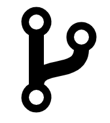
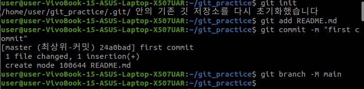
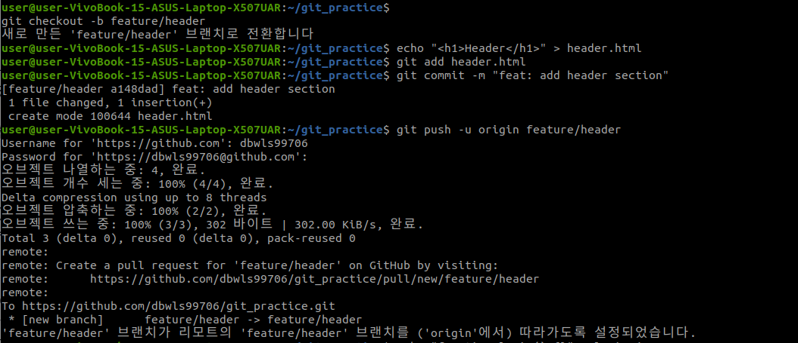
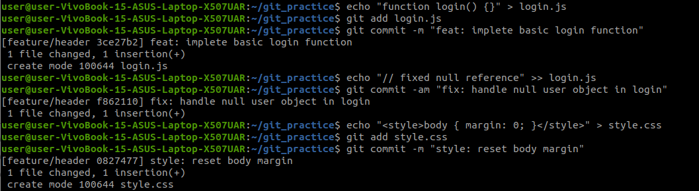
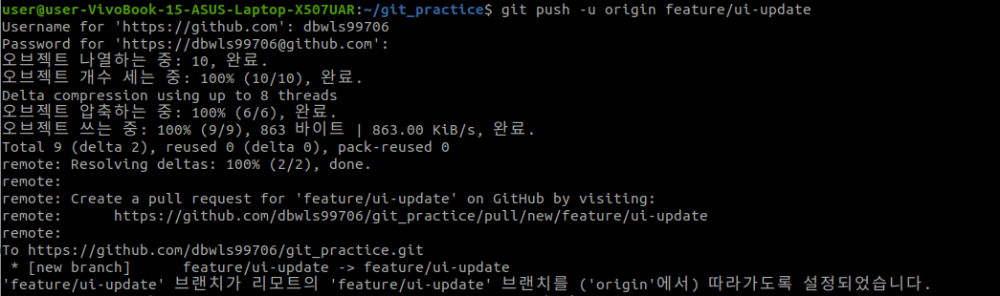
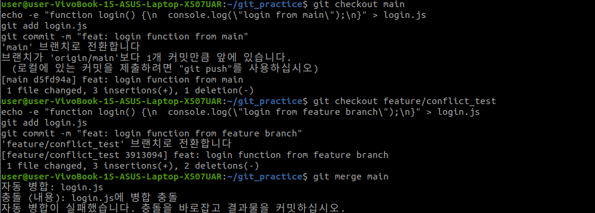
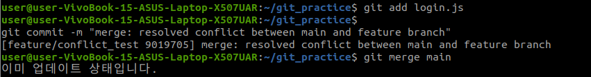
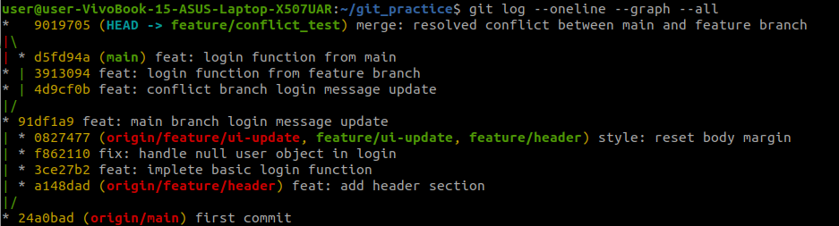

git의 기본 명령어와 함께 **커밋**과 **브랜치**에 대한 실습과 동시에 충돌 해결 실습도 다루어 볼 것이다. 실습은 `git_practice`라는 디렉토리에서 진행되었으며, 내 깃허브의 [git_pratice](https://github.com/dbwls99706/git_practice)라는 레포지토리를 만들어서 작업을 수행했다.

---

## 커밋이란?


**커밋(Commit)**은 git에서 작업 내용을 저장소에 기록하는 행위를 의미한다. 이는 파일의 변경 사항을 스냅샷(snapshot) 형태로 저장하며, 프로젝트의 히스토리를 관리하는 핵심 요소이다.

### 커밋의 구성 요소
1. **스테이징 영역(Staging Area)**:
   - commit이 가능한 영역으로, 커밋하기 전 파일을 담아두는 공간이다.
   - `git add` 명령어로 변경된 파일을 스테이징 영역에 추가한다.
2. **커밋 메시지**:
   - `-m` 옵션으로 커밋의 목적이나 내용을 간략히 설명한다.
   - 예: `"feat: add login function"` (기능 추가), `"fix: resolve bug"` (버그 수정).
3. **커밋 해시**:
   - 각 커밋은 고유한 해시 값(예: `24a0bad`)으로 식별된다.
   - 이를 통해 특정 커밋을 참조하거나 되돌릴 수 있다.

### 커밋 작업 흐름
1. 파일 수정 후 `git add <파일명>`으로 스테이징한다.
2. `git commit -m "메시지"`로 커밋을 생성한다.
3. 필요 시 `git commit -am "메시지"`로 수정된 파일을 자동 스테이징 후 커밋한다.

### 유의사항
- 커밋은 논리적이면서도 작은 단위로 나누는 것이 좋다.
- 의미 있는 메시지를 작성하여 협업 시 이해를 돕는다.

---


## 브랜치란?


**브랜치(Branch)**는 git에서 독립적인 작업 흐름을 만들기 위한 도구이다. 기본 브랜치(`main` 등)에서 분기하여 새로운 기능을 개발하거나 문제를 수정할 수 있다.

### 브랜치의 주요 특징
1. **독립성**:
   - 각 브랜치는 서로 영향을 주지 않으며, 별도의 히스토리를 가진다.
   - 예: `feature`에서 작업 중에도 `main`은 그대로 유지된다.
2. **병합(merge)**:
   - 브랜치 작업이 완료되면 `git merge`로 다른 브랜치에 통합할 수 있다.
3. **가벼움**:
   - 브랜치는 포인터로 동작하므로 생성 및 삭제가 빠르다.

### 브랜치 작업 흐름
1. `git branch <브랜치명>`: 새 브랜치를 생성한다.
2. `git checkout <브랜치명>`: 브랜치로 전환한다.
   - 또는 `git checkout -b <브랜치명>`으로 생성과 전환을 동시에 수행한다.
3. 작업 후 커밋한다.
4. `git push origin <브랜치명>`으로 원격 저장소에 업로드한다.

### 브랜치 관리 명령어
- `git branch`: 현재 브랜치 목록을 확인한다.
- `git branch -d <브랜치명>`: 브랜치를 삭제한다.
- `git branch -M <새이름>`: 브랜치 이름을 변경한다.

### 협업에서의 활용
- `main`: 안정적인 코드를 유지한다.
- `feature/*`: 새로운 기능을 개발한다.
- `fix/*`: 버그를 수정한다.

---

## git 초기화 및 첫 커밋

git 저장소를 초기화하고 첫 커밋을 수행한다.


- `git init`: 현재 디렉토리에 git 저장소를 초기화한다.
- `git add README.md`: `README.md` 파일을 스테이징 영역에 추가한다.
- `git commit -m "first commit"`: 스테이징된 파일을 커밋한다.
- `git branch -M main`: 기본 브랜치 이름을 `main`으로 변경한다.


---

## 브랜치 생성 및 관리

새로운 브랜치를 생성하고 파일을 추가한 후 원격 저장소에 푸시한다.




- `git checkout -b feature/header`: `feature/header` 브랜치를 생성하고 전환한다.
- `echo "<h1>Header</h1>" > header.html`: `header.html` 파일을 생성한다.
- `git add header.html`: 파일을 스테이징 영역에 추가한다.
- `git commit -m "feat: add header section"`: 파일을 커밋한다.
- `git push -u origin feature/header`: 브랜치를 원격 저장소에 푸시하고 추적 관계를 설정한다.

---

## 파일 추가 및 커밋

추가적인 파일을 생성하고 커밋한다.



---

## 레포지토리와의 연동

만든 브랜치를 푸시하면 된다.




- `git push -u origin <branch_name>`: `<branch_name>` 브랜치를 푸시하고 추적 관계를 설정한다.

---

## 충돌 발생 및 해결

`main` 브랜치와 `feature/conflict_test` 브랜치에서 동일한 파일을 수정하여 충돌을 발생시키고 해결해보는 실습을 진행하겠다.



이처럼 충돌이 일어나며 병합이 실패하게 된다.

직접 파일을 변경하여 충돌을 해결한 후에 다시 git merge를 실행해보면
충돌 해결 후:



---

## 로그 확인

커밋 히스토리를 그래프로 확인한다.

```bash
git log --oneline --graph --all
```


위 그래프를 통해 main과 feature/conflict_test 브랜치에서 로그인 기능 구현 중 충돌이 발생했으며, 해결되었다는 것을 확인할 수 있다. 

---

## 결론

이 실습을 통해 git의 커밋과 브랜치의 개념, 사용법, 충돌 해결 방법을 간단하게 다루어 보았다. 그동안은 git을 아주 간단하게만 사용하고 이를 통해 본격적인 협업 등을 하는 것은 조금 어색한 감이 있었는데 지속적으로 사용하다 보면 금방 익숙해질 수 있을 것 같다.