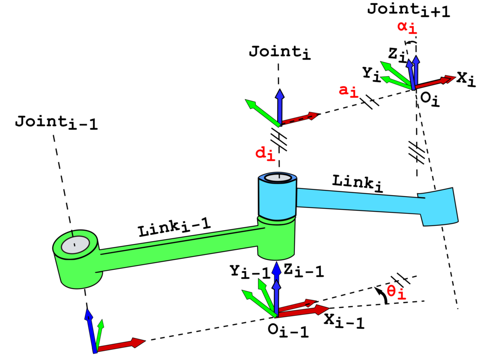
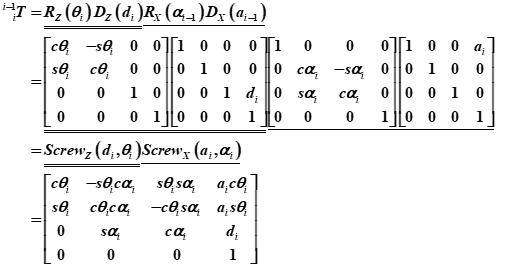
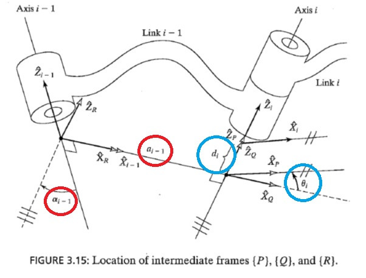

로봇 기구학(Kinematics)과 동역학(Dynamics)은 로봇의 움직임을 분석하고 제어하는 데 필수적인 지식이다. 로봇팔에서는 더더욱 필수적이기에 취업을 준비하며 이 분야에서 일할 때 꼭 필요한 지식이라는 생각이 들었다(이 분야는 물론 로보틱스다). 때문에 이 글에서는 **정기구학(Forward Kinematics)**, **역기구학(Inverse Kinematics)**, **로봇 동역학(Dynamics)** 등의 개념을 다루며 학부 시절에 배운 지식을 되뇌이며 복습하고 정리하는 시간을 가질 것이다.

---

## 1. 정기구학 (Forward Kinematics)
정기구학은 로봇의 각 조인트의 각도와 사이의 길이 등을 알고 있을 때, 말단**(End-Effector)**의 위치와 자세를 구하는 과정이다.

### 1.1 DH 파라미터 (Denavit-Hartenberg Parameters)
로봇의 각 관절과 링크를 체계적으로 표현하기 위해 **Denavit-Hartenberg (DH) 파라미터**를 사용한다. DH 파라미터에는 **Classical DH**와 **Modified DH** 두 가지 방식이 있으며, 각각의 특징과 차이점을 이해해야 한다. 교육이나 연구 쪽으로는 Modified를 쓰는 것으로 알고 있으나 ROS 등의 기술을 이용하는 산업에서는 Classical(Standard DH)을 주로 사용한다고 한다.

#### DH 파라미터 정의
| 변수         | 설명                           |
|--------------|--------------------------------|
| $\theta_i$   | 관절 회전 각도(zi−1 축을 중심으로 회전)|
| $d_i$        | 링크 오프셋 (zi−1 축을 따라 이동)|
| $a_i$        | 링크 길이(xi 축을 따라 이동)|
| $\alpha_i$   | 링크의 트위스트 각(xi 축을 중심으로 회전)|
(위 표는 Classical 방식 기준)

#### Classical 방식과 Modified 방식 비교
DH 파라미터는 로봇의 링크와 관절을 표현하는 표준화된 방법이지만, 두 가지 주요 방식이 존재한다.

| **항목**            | **Classical DH**                  | **Modified DH**                  |
|---------------------|-----------------------------------|-----------------------------------|
| **좌표계 위치**     | 링크의 끝부분                    | 링크의 시작 부분                 |
| **장점**            | 직관적이고 전통적                | 일관성 있고 현대적 설계에 적합   |
| **사용 예**         | 간단한 구조의 로봇               | 복잡한 직렬 매니퓰레이터         |

  
  

- **Classical DH**: 원래의 DH 방식으로, 각 링크의 좌표계가 링크의 끝부분에 위치한다. 직관적이지만, 복잡한 로봇 구조에서는 파라미터 설정이 다소 번거로울 수 있다.

- **Modified DH**: John J. Craig가 제안한 방식으로, 좌표계가 링크의 시작 부분에 위치한다. 특히 직렬 매니퓰레이터에서 파라미터 설정이 더 일관되고 직관적이다.

참고: https://wisepubliclife.tistory.com/8

#### 간결하게 정리한 Modified DH, Classical DH 방식 비교표

| 구분                   | **Classical DH (표준)**                      | **Modified DH (변형)**                      |
|-----------------------|----------------------------------------------|---------------------------------------------|
| **프레임 부착 기준**   | 링크 i의 **끝단(zᵢ축 기준)**                 | 링크 i의 **시작점(zᵢ₋₁축 기준)**            |
| **변환 행렬 순서**     | Rz(θᵢ) → Tz(dᵢ) → Tx(aᵢ) → Rx(αᵢ)            | Tx(aᵢ₋₁) → Rx(αᵢ₋₁) → Tz(dᵢ) → Rz(θᵢ)       |
| **a (링크 길이)**      | aᵢ: xᵢ와 xᵢ₊₁ 사이의 거리                    | aᵢ₋₁: xᵢ₋₁와 xᵢ 사이의 거리                 |
| **α (링크 꼬임각)**    | αᵢ: zᵢ와 zᵢ₊₁ 사이의 x축 기준 각도           | αᵢ₋₁: zᵢ₋₁와 zᵢ 사이의 x축 기준 각도        |
| **d (조인트 오프셋)**  | dᵢ: zᵢ축을 따라 이동한 거리                  | dᵢ: zᵢ₋₁축을 따라 이동한 거리               |
| **θ (조인트 회전각)**  | θᵢ: zᵢ축 주위 회전 각                        | θᵢ: zᵢ₋₁축 주위 회전 각                     |
| **기준 인덱스**        | 모두 **i** 기준 (현 조인트)                  | 일부 **i-1** 기준 (a, α는 이전 링크 기준)    |

#### 변환 행렬
각 링크의 변환 행렬은 다음과 같이 정의된다 (Classical DH 기준):

$$
T_i^{i-1} =
\begin{bmatrix}
\cos\theta_i & -\sin\theta_i\cos\alpha_i & \sin\theta_i\sin\alpha_i & a_i\cos\theta_i \\
\sin\theta_i & \cos\theta_i\cos\alpha_i & -\cos\theta_i\sin\alpha_i & a_i\sin\theta_i \\
0 & \sin\alpha_i & \cos\alpha_i & d_i \\
0 & 0 & 0 & 1
\end{bmatrix}
$$

전체 변환 행렬은 각 링크의 변환 행렬을 곱하여 구한다:

$$
T = T_1^0 \cdot T_2^1 \cdot \dots \cdot T_n^{n-1}
$$

이를 통해 말단 좌표계를 기준 좌표계에서 표현할 수 있다.

---

## 2. 역기구학 (Inverse Kinematics)
역기구학은 말단(End-Effector)의 목표 위치와 자세가 주어졌을 때, 각 관절의 변수를 구하는 과정이다.

### 2.1 이론해석적 방법(Closed form Solution)
단순한 경우, 기하학적 관계를 이용해 직접 해를 구할 수 있다. 예를 들어, 2-DOF 평면 로봇의 경우:

$$
\theta_2 = \cos^{-1}\left( \frac{x^2 + y^2 - l_1^2 - l_2^2}{2 l_1 l_2} \right)
$$

$$
\theta_1 = \tan^{-1} \left( \frac{y}{x} \right) - \tan^{-1} \left( \frac{l_2 \sin\theta_2}{l_1 + l_2 \cos\theta_2} \right)
$$

### 2.2 수치해석적 방법(Numerical Solution)
고차원 로봇의 경우 **자코비안 행렬(Jacobian Matrix)**을 사용해 수치적으로 해를 구한다.

#### 자코비안 행렬
자코비안 행렬은 속도 관계를 나타내며, 다음과 같이 정의된다:

$$
J(q) = \frac{dX}{dq} = 
\begin{bmatrix} 
\frac{\partial x}{\partial q_1} & \frac{\partial x}{\partial q_2} & \dots & \frac{\partial x}{\partial q_n} \\
\frac{\partial y}{\partial q_1} & \frac{\partial y}{\partial q_2} & \dots & \frac{\partial y}{\partial q_n} \\
\frac{\partial z}{\partial q_1} & \frac{\partial z}{\partial q_2} & \dots & \frac{\partial z}{\partial q_n} 
\end{bmatrix}
$$

역기구학을 풀기 위해 **뉴턴-라프슨(Newton-Raphson)** 방법을 사용하며, 반복적으로 관절 변수를 업데이트한다:

$$
q_{k+1} = q_k + J^+ (X_{goal} - X_{current})
$$

여기서 $J^+$는 자코비안의 의사역행렬(Pseudoinverse)이다.

#### 2.3 특이점 (Singularity)
특이점은 로봇이 특정 자세에서 자유도를 잃거나 제어가 어려워지는 지점을 의미한다. 이는 자코비안 행렬의 랭크가 감소하여 역행렬이 존재하지 않게 되는 경우 발생한다.

- **역기구학에서의 특이점**: 특이점에서는 로봇의 끝점(End-Effector)이 특정 방향으로의 속도를 가질 수 없게 된다. 이를 Singularity라 부르며, 보통 동작을 중지하는 등의 예외처리를 한다.
- **동역학에서의 특이점**: 특이점 근처에서는 작은 외력에도 큰 관절 토크가 요구되거나, 제어 알고리즘이 불안정해질 수 있다.

**손목 특이점(Wrist Singularity)** : 5번 축이 0º에 근접하여 로봇의 손목 부분이 일직선이 되는 경우
**어깨 특이점(Shoulder Singularity)** : 1번 축과 6번 축이 동일 선상에 있는 경우
**팔꿈치 특이점(Elbow Singularity)** : 3번 축이 0º에 근접하여 로봇이 일직선이 되는 경우

특이점은 로봇의 작업 공간 설계와 제어 알고리즘에서 가장 중요한 고려 사항이다. 특히 요즘 비전과 로봇팔을 융합하여 사용할 때에는 역기구학에서의 특이점 고려가 거의 필수적이다.

출처: [두산 로보틱스 매뉴얼](https://manual.doosanrobotics.com/ko/user/2.9/3.-E-Series/singularity)

---

## 3. 로봇 동역학 (Robot Dynamics)
로봇 동역학은 힘과 가속도를 고려하여 로봇의 움직임을 해석하는 과정이다.

### 3.1 뉴턴-오일러 방법
뉴턴-오일러 방법은 뉴턴의 두 번째 법칙을 직접적으로 적용하여 각 링크의 좌표에서 링크의 힘과 모멘트로 나타내는 것이다. 
각 링크에 **뉴턴-오일러 방정식**을 적용해 힘과 토크를 계산한다.

#### 선속도 및 각속도
$$
\dot{v}_i = \dot{v}_{i-1} + \alpha_i \times r_i + \omega_i \times (\omega_i \times r_i)
$$

#### 힘과 토크
$$
F_i = m_i \dot{v}_i
$$

$$
\tau_i = I_i \dot{\omega}_i + \omega_i \times (I_i \omega_i)
$$

아래 블로그의 자료와 예제를 통해 이해를 도울 수 있을 것 같다.
https://pg365.tistory.com/48
### 3.2 라그랑주 역학
라그랑지 방정식은 에너지를 기반으로 로봇의 운동을 해석한다.

$$
L = K - U
$$
$$
\frac{d}{dt} \left( \frac{\partial L}{\partial \dot{q}_i} \right) - \frac{\partial L}{\partial q_i} = \tau_i
$$

여기서:
- $K$: 운동 에너지
- $U$: 위치 에너지
- $\tau_i$: 일반화된 힘

운동 에너지는 다음과 같이 표현된다:

$$
K = \frac{1}{2} m v^T v + \frac{1}{2} \omega^T I \omega
$$

---

## 4. 결론
로봇 기구학과 역학의 기초 개념을 정리했다. 정말 기초고, 내가 정리를 하긴 했지만 식과 같은 경우엔 천천히 계속해서 읽어봐야 할 것 같다,,(학부 때도 경험했지만 익숙해지기엔 쉽지 않다) **정기구학**과 **역기구학**으로 로봇팔의 조인트를 계산하며, **동역학**으로 힘과 토크를 분석하는 방법을 다뤘으며, DH 파라미터의 **Modified와 Classical 방식** 및 **특이점(singularity)**에 대한 내용를 통해 로봇의 움직임을 제어하는 것에 도움이 될 것이다. 이를 바탕으로 로봇 제어에 대해 수행할 때 더 흥미를 가질 수 있을 것 같다.(원래 인간은 어떤 분야든 어느정도 아는 척을 할 수 있어야 흥미가 도진다)

앞으로도 이처럼 로봇이나 AI에 대해 다룰 예정이다. 현재로선 취업이 목적인 취준생 신분에 최선을 다할 테니 취업하는 직무에 따라서 어떤 분야는 먼 훗날이 될지도,,