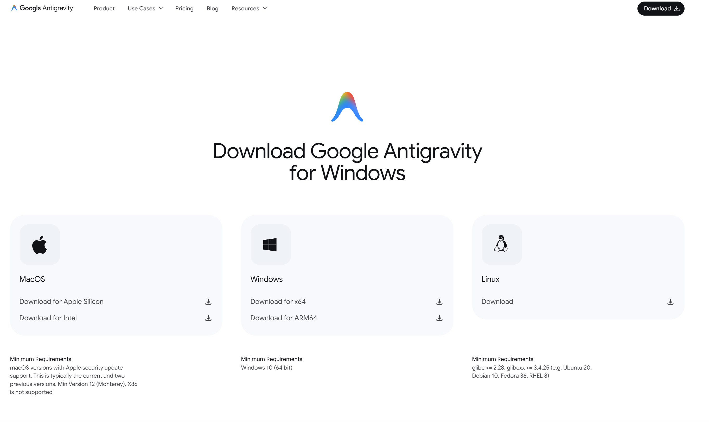
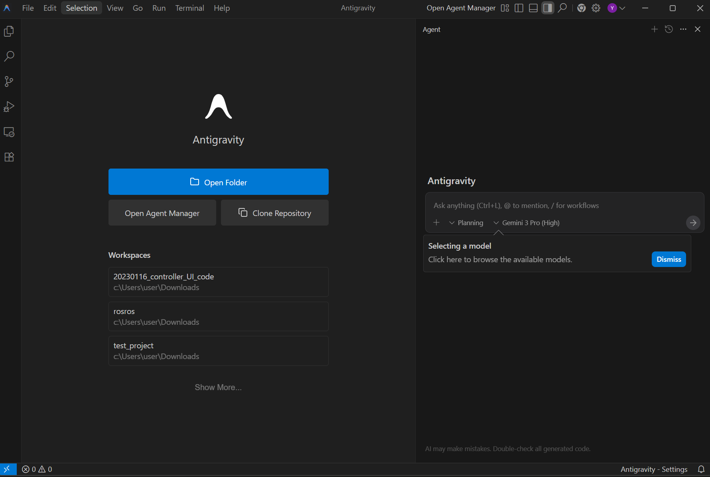
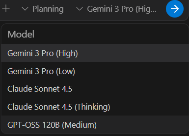
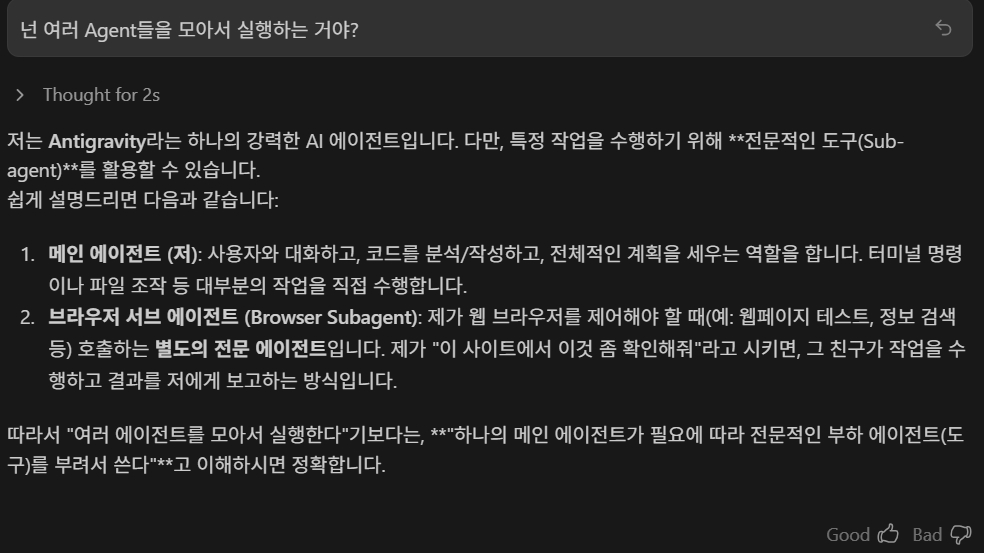
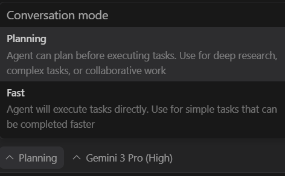
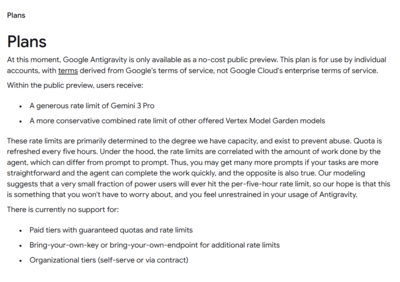

대학생 무료 혜택을 받고 졸업하여 아직까지 무료로 gemini pro를 쓰고 있는데
오늘 새벽에 gemini3가 발표되며 그와 함께 새로운 AI IDE인 Google Antigravity가 등장했다.

>Google이 발표한 **Antigravity**는 더 이상 “코드 에디터”가 아니라,  
**에이전트들을 지휘하는 컨트롤 센터** 개념의 새로운 개발 환경입니다.  
에디터·터미널·브라우저가 에이전트 내부의 ‘도구’로 통합되어 있습니다.

라고 한다.
## 바로 설치

google에 google antigravity라고 치면 바로 나오는 사이트에서 다운받으면 된다. 
맥, 윈도우, 리눅스 모두 지원하나보다.

그렇게 설치된 화면인데

cursor나 windsurf, IDE확장으로 받은 claude code와 같은 사용법으로 사용할 수 있는 걸 보니 뭔가 친숙하다. 

다른 점은 이거

새로 나온 Gemini3 Pro를 사용할 수 있다.
추가로, Antigravity 안에서 구글 gemini 모델뿐만 아니라 Claude Sonnet 4.5, GPT-OSS와 같은 타사 모델도 쓸 수 있다.

일단 듣기로는 "여러 Agent들을 모아서 각각에 특화된 작업을 시키고, 인간은 관리감독만 할 수 있다"라는데

그렇다고 한다. 

아무튼 새로 나온 건 좋은 거라는 인식이 가득한 나

mode는 Planning과 Fast모드가 있다.

## 정리 

발표 내용을 정리하면 아래와 같다.
- **Agent-First 개발**
파일이 아니라 *에이전트*를 관리.
예: “OOO 어플리케이션 만들어줘" → 에이전트가 계획, 코딩, 터미널 실행 및 브라우저 테스트까지 자동 수행.

- **Computer Use (컴퓨터 제어)**
에이전트가 직접 브라우저를 띄우고 클릭하며 앱을 검증함.

- **실시간 협업**
작업 중에도 비동기로 피드백 가능.
구글 닥스처럼 결과물에 댓글 달기 + 스크린샷 특정 영역에 주석 달기 지원.

- **개방형 생태계**
구글 모델뿐 아니라 **Claude Sonnet 4.5, GPT-OSS** 등 외부 모델도 선택 가능.

## 마무리
영상 시연에서 Flight Tracker라는 앱을 만들게 시켰는데, 
그때 사용자가 요구사항만 입력하면 Antigravity 내의 Gemini가 필요한 파일 구조를 스스로 생성하고 코드를 작성하며 실행 도중 발생하는 에러까지 스스로 원인을 파악해 수정하는 모습을 보여줬다고 한다.

그런 점에선 Claude Code의 장점까지 도입했다고 보고 있다.
아직 성능에 대해서 자세히는 모르겠지만 한동안 개인적으로 써보고자 한다.

현재 Antigravity는 Public Preview 기간 동안 개인 사용자에게 무료로 풀렸다고 한다. 
Gemini 3 리미트도 꽤나 많이 제공한다고 하니 써볼 거면 지금 써보시길.