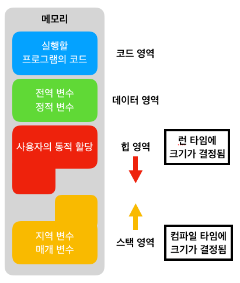
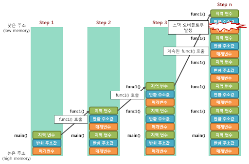
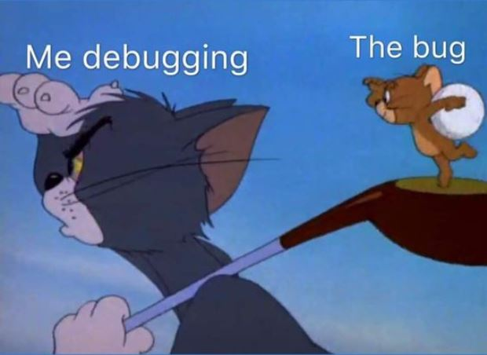

스택 오버플로우가 발생했다.

처음엔 그게 무슨 소린지도 몰랐다.
나는 그저 코드를 수정하던 중, 버퍼를 늘렸더니 서버가 동작하지 않았던 현상이 있었을 뿐이다.
이게 무슨 현상인지 검색해보니, 스택 오버플로우라고 한다.

우선 실무 환경이니 빠르게 이것저것 찾아보며 버퍼를 힙으로 옮겨서 해결했는데,

과연 이게 무엇이고, 어떤 동작 방식이길래 발생했는지 정리해보고자 글을 작성하기로 했다.

---

## 스택 메모리

프로그램이 실행되면 메모리는 크게 스택과 힙으로 나뉜다.

스택은 함수 호출과 함께 사용되는 메모리 영역이며,
함수가 호출될 때마다 지역 변수, 매개변수, 반환 주소 같은 정보가
스택 프레임 형태로 차례대로 쌓인다.

함수가 종료되면 해당 스택 프레임은 자동으로 제거된다.

이 구조 덕분에 스택은
할당과 해제가 빠르고 관리 비용이 적다.
대신 **크기가 제한적**이다.

---

## 스택 오버플로우

스택 오버플로우는  
이 스택 영역이 할당 가능한 범위를 초과했을 때 발생한다.

대표적인 원인은 다음과 같다고 한다.

- 종료 조건 없는 재귀 호출
- 지나치게 깊은 함수 호출
- **스택 영역에 큰 지역 변수나 버퍼를 할당한 경우(내가 이걸 겪었다.)**

스택은 크기를 동적으로 늘릴 수 없기 때문에,
한계를 넘는 순간 프로그램은 더 이상 정상적으로 동작하지 않는다.

그래서 내가 본 현상은 그냥 서버의 모든 기능이 정지하는 현상이었다.

---

## 힙 메모리와의 차이

힙은 동적 메모리 할당을 담당하는 영역이다.
런타임 중 필요에 따라 크기가 조절되며,
상대적으로 큰 데이터를 저장하는 데 적합하다.

그래서 크기가 큰 버퍼나 수명이 긴 데이터는
스택이 아닌 힙에 두는 것이 일반적이다.

나는 대학교 고급 프로그래밍 수업 중 발생한 포인터 기피증상으로 인해 피하다가 문제가 생겨버렸던 것.

이번 이슈에서도
버퍼를 힙으로 옮기자 바로 문제가 해결됐다.

---

## 마무리

스택은 함수 호출을 위한 메모리 영역이며, 빠르지만 크기가 제한적이다.
큰 데이터를 스택에 할당하면 스택 오버플로우가 발생할 수 있다.

이런 경우에는 **힙 메모리를 사용하는 것이 적절**하다.

일단 어떻게든 에러는 해결했지만,
원리를 이해하고 나니 왜 문제가 발생했는지도 정리됐다.

누군가에겐 쉬운 개념이겠지만, 부딪히며 배우고 있는 입장에선
그런 작은 것들에서 배울 점이 참 많은 것 같다.

