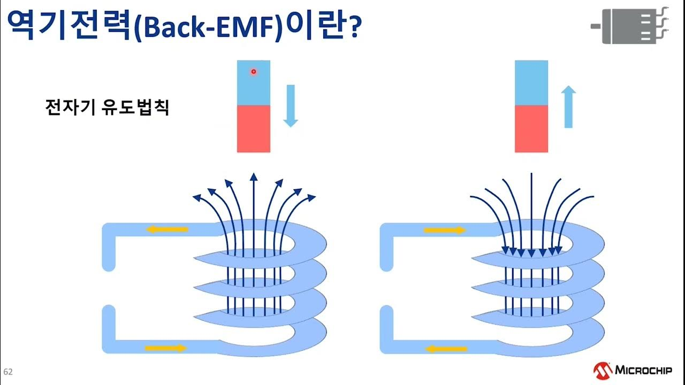
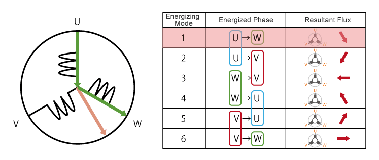
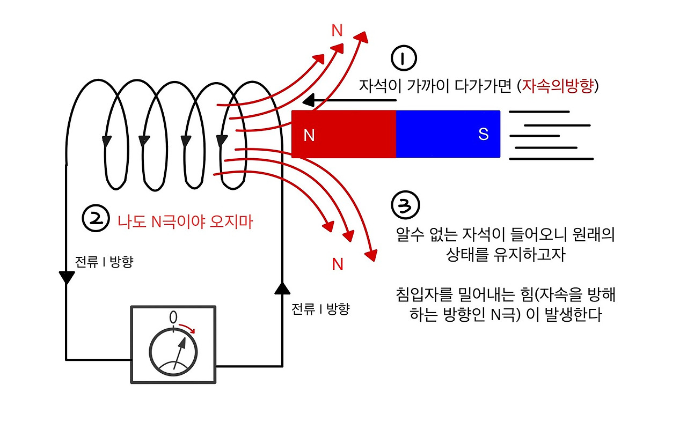
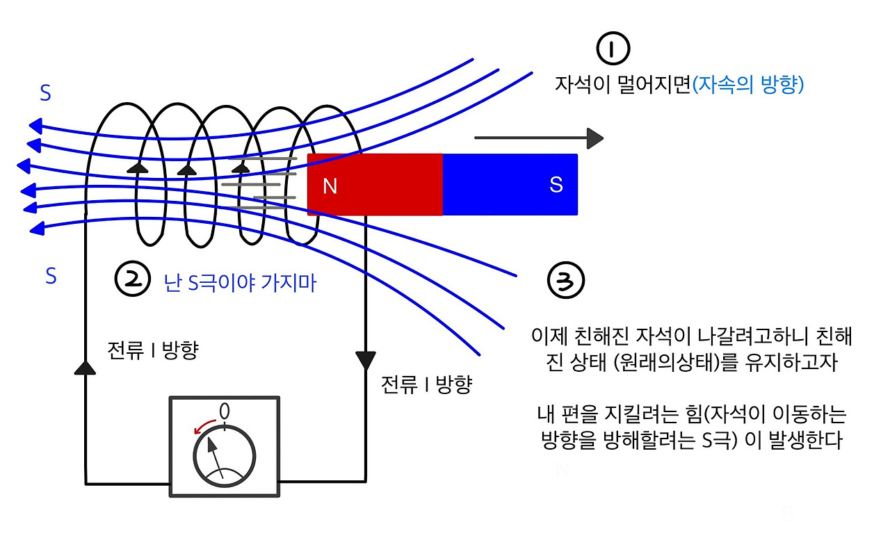
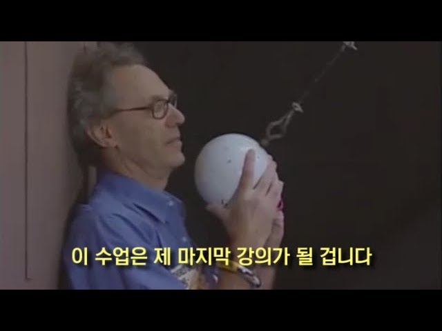

로봇을 개발하는 환경에선 모터가 포함된 기구부를 손으로 돌려야 할 일이 꽤나 있다.
그때 분명 전원이 들어가 있지 않은 상태였는데, 이상하게도 늘 축이 꽤 빡빡하게 돌아갔다.

그냥 원래 그런 기구인가 싶었는데,
우리 팀 책임연구원님이 모터의 **역기전력** 때문에 그렇다고 설명해주셨다.

하지만 MZ 신입사원답게 직접 보지 않은 건 크게 신뢰하지 않기에

> "그럼 UVW 저거 제거하면 부드럽게 움직이나요?"

하고 기구 내부 모터 드라이버의 UVW 선 연결을 제거하자
거짓말처럼 **갑자기 아주 부드럽게 돌아갔다.**

전기도 안 들어오는데,
선만 연결돼 있다고 이렇게 달라질 수 있나?

이론적으로 조금은 알고 있었지만 아무튼 직접 보니 많이 신기했다.
흥미가 생긴 김에 **역기전력**이라는 개념을 다시 정리하며,
내가 깨달은 역기전력의 실체를 알아보기로 했다.

## 상황을 정리해보자

먼저 그날 있었던 일을 단순하게 정리해보면,

	모터 드라이버 전원: OFF
	모터 UVW 선: 연결됨
	기구부를 손으로 회전

**브레이크가 살짝 걸린 듯한 묵직함**
힘을 주면 돌아가긴 하는데, 그냥 모터 자체가 너무 빡빡한 느낌이었다.

그리고 여기서 UVW 선을 제거했다.

	모터 드라이버 전원: OFF
	모터 UVW 선: 제거
	기구부를 손으로 회전

**눈에 띄게 부드러워짐**
아무 저항 없이 기구 본연의 마찰만 느껴졌다.

각 실험군의 조건은 전혀 바뀌지 않았다.
달라진 건 오직 전기적 연결 상태(UVW)뿐이었다.

## 모터와 발전기

우리가 흔히 떠올리는 모터는 이렇다.

	전기를 넣으면 → 회전한다

하지만 조금만 관점을 바꾸면 이야기가 달라진다.

모터의 본질은 전자기 에너지를 바꿔주는 장치다.
방향만 바꾸면?

	외력으로 회전시키면 → 전압이 만들어진다

즉,

> **모터를 손으로 돌리는 순간, 모터는 발전기처럼 동작한다.**

모터와 발전기는
**방향이 다른 것뿐**이라는 것이다.

## 그래서 역기전력이 뭔데

모터가 회전하면, 고정자 코일(UVW)에는 전압이 유도된다.
이 유도 전압을 **역기전력** 이라고 부른다.

또한 이는 우리가 돌리는 방향의 반대로 작용하는 힘이기에,
상황에 따라 역할이 조금 달라진다.

- 전원 ON 상태
	속도가 빨라질수록 역기전력이 커져서 모터를 자연스럽게 제한한다
- 전원 OFF + 외력으로 회전
	역기전력은 **전류를 만들어낼 수 있는 원인**이 된다

이번 사건은 역기전력의 두 번째 경우(전원 OFF 상태에서 외력으로 회전)였다.

## 왜 빡빡해지는 걸까?

핵심은 하나다.

> **UVW 선이 연결되어 있었다는 점**

전원이 꺼져 있어도, 선이 연결되어 있으면
전류가 흐를 수 있는 길이 열려 있다는 것이다.

순서를 따라가 보자.

### 1) 내가 손으로 축을 돌린다
-> 모터 내부 자속이 변한다
-> 고정자 코일에 전압이 생긴다
이것이 바로 **역기전력**

### 2) UVW가 연결된 상태다
드라이버 내부 회로로 인해 전류가 흐를 수 있는 폐회로가 이미 만들어져 있다
폐회로는 그냥 끊어진 곳 없이 전기가 흐를 수 있는 상태의 회로라고 생각하면 된다.

로봇에서 흔히 쓰는 모터는 3상(UVW) 구조라
이 세 선이 드라이버 내부 회로나 외부 결선에 의해 연결된 상태면 전류가 순환할 수 있다.

### 3) 전류가 흐른다
-> 자기장이 만들어진다
-> 그 자기장은 **내가 로봇에 주는 회전을 방해하는 방향**으로 힘을 낸다.

이 원리가 바로 **렌츠의 법칙**이다.

## 렌츠의 법칙

렌츠의 법칙은 이렇게 요약된다.

> 유도된 전류는, 그 원인이 된 변화를 **방해하는 방향**으로 흐른다.

이를 너무 쉽게 표현한 자료가 아래에 있다.

정리하면,

내가 모터를 돌린다
-> 그 움직임을 방해하는 토크가 생긴다
-> 모터가 빡빡하다

그날 느꼈던 저항은
베어링의 문제나, 기구 간섭이 아니었다.

## 그럼 왜 갑자기 부드러워졌을까?

UVW 선을 제거하면 상황은 단순해진다.

모터를 돌리면 역기전력은 여전히 생긴다고 볼 수 있다.
하지만 전류가 흐를 경로가 없고, 그로 인해 자기장이 만들어지지 않으며,
회전을 방해하는 토크도 없다.

그래서 모터가 아무런 힘도 내지 않는 것처럼 회전을 방해하는 전기적 토크가 거의 사라진다.

그래서 이때 손으로 돌리면 기구 본연의 마찰만 남기에, 부드럽게 느껴진다.

## 이 현상이 쓸모도 있나?

사실 이 원리는 **의도적으로도** 많이 활용된다.

대표적으로 로봇 팔 관점에서 보면,
드라이버 전원 OFF 시 로봇이 축 쳐지는 현상을 막기 위해 저항 브레이크로서 활용된다.

그래서 모터를 운반할 때 일부러 선을 묶어두어 브레이크처럼 쓰기도 하고,
반대로 수동 조정이 필요할 땐 분리하기도 한다.

지금 생각났는데 예전에 프로젝트로 두산 로봇팔 m0609를 썼을 때,
수동 모드로 부드럽게 좌표를 잡았던 기억이 있는데 

뭐 아예 툭 떨어진 건 아니니 중력보상이 이루어진 것 같고, 역기전력을 감지하고 전압을 조절하는 임피던스 제어가 수행된 것 같다.

마냥 부드럽지만은 않았던 것도 그 제어 한계값 때문인 것 같다.

추억을 떠올리며 보는 부캠시절 우리 팀의 망한 도미노짤

## 마무리

외국 대학 물리학 수업에서 재밌는 실험을 통해 학생들의 흥미를 끄는 장면을 유튜브에서 본 적이 있다.

아무튼 그런 것처럼 확실히 실제로 경험해보면 흥미의 정도가 달라지고,
그 흥미는 결국 내 실행력이 되는 것 같다.

결국 하나하나 경험이고 쌓여서, 
실무에서 발생하는 다양한 현상의 원인을 파악하기 쉬워지고,
엔지니어로서의 역량 역시 길러지고 있는 것 같다.
(물론 모든 사항에 대해 이렇게 글을 적으면 좋겠지만 상당히 귀찮다)

Velog에서도 회고가 제일 재밌는 이유가 그 사람의 경험을 온전히 느낄 수 있어서라고 생각한다.
관련 지식이야 뭐 이미 잘 정리된 블로그도 많고 AI든 검색이든 통해서 다 알 수 있지만,
개개인의 경험과 그와 연계된 배움은 뺏어오기 쉽지 않다.

남의 경험을 흡수하려면 일단 내 경험이 정리되어야 한다.
그래서 요즘 글을 쓰고, 읽는다.
각자의 스토리가 담긴 글들이 재밌고 얻어갈 게 많은 것 같다.

### 참고자료:
[BLDC 모터 컨트롤 Part 5 - 역기전력(Back-EMF)](https://youtu.be/MJ_ZzxxVu5o?si=rzcrC1iYlI7CEJck)
[BLDC 모터( Brushless DC motor) 의 제어](https://m.blog.naver.com/paynoh/221322336204)
[렌쯔의법칙 10분만에 이해하기](https://yong1704.tistory.com/31)
