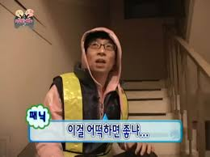
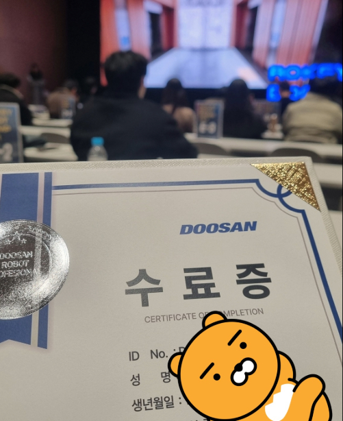
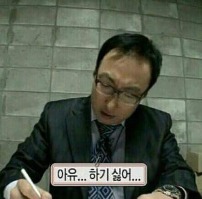
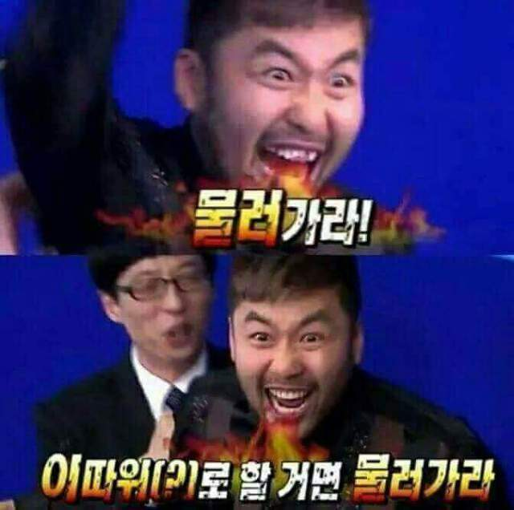
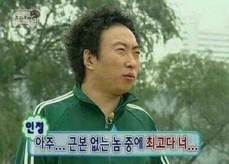

>흘러가는 대로 살자

이게 내 마인드였다.

어찌저찌 좋은 고등학교에 들어가서 그냥 그게 가능했다.
괜찮은 인서울 대학교에 들어가서 그냥 시간을 허비했다.

어떠한 의지도 목적도 없었다.

그렇게 4학년.. 졸업할 시즌이 다가왔고, 발등에 불이 떨어졌다(!!)
학점은 낮고, 인턴이나 대외활동, 수상 경력이나 자격증도 없다.


그렇다고 당장 할 수 있는 건 많지 않기에
그냥 정신을 붙잡아 내 장점을 만들고,
당당하게 누군가에게 이런 내 삶에 대해 **이래서 이랬다고 말할 수 있는 스토리**를 짜고자 취준을 시작했다.

---

## 나만의 스토리를 만들자

어영부영 살던 나에겐 강제성이 필요했다.
도화지 같은 정신머리이기에 오히려 무슨 일이든 성취감과 만족감은 자리잡을 수 있었다.

그러던 중 학부 사이트에 올라온 부트캠프 하나가 눈에 들어왔다.
```두산 로보틱스 부트캠프 ROKEY```

또한, 선정 이유는 커리큘럼도 있지만 비전공자가 포함이라서다.
비전공자 포함이면 수준이 전공자 대상에 비해 많이 낮지 않을까?

내가 딱 원하던 곳이다.


흥미가 없어 해이하게 살았던 과거를 인정하고,
캡스톤을 하며 흥미가 다시금 생기게 되었으며,
그때부터 정신을 고쳐 먹고 교육도 새로 듣고 공부도 하며 노력했다는 스토리가 뇌리에 스쳤다.

마음에 든다.

로봇학부 출신인 나로서는 공부에 소홀했더라도 주워들은 것이 많아 다시 배우기엔 수월할 것이다.
그렇게 지원하여 합격하고, 프로젝트를 진행했다.

근데 프로젝트와 수업은 생각보다 난이도가 있어서 당황했다.
하지만 최후의 보루인 만큼 팀원 분들과 함께 어찌저찌 해냈다.



물론 스토리를 생각하기 시작한 마지막 학년은 학점도 4점대로 열심히 챙기기도 했다.
캡스톤을 하면서 실전과 함께하니 학점도 올랐다는 스토리..
정신 차리고 하니까 되긴 하더라.
평소엔 3점 간당간당했던 것 같은데

아무튼 이곳에서 해낸 프로젝트들은 낮은 학점임에도 같은 분야로의 진로를 원한다는
내 의지를 드러내기에 너무나도 충분한 경험이었다.


---

## 이력서에 경험을 녹여보자

처음부터 스토리를 생각해왔기에, 이력서 쓰기는 생각보다 수월했다.
그냥 내가 생각하고 있는 그대로 적었다.

- YOLO를 통한 비전 인식 스크립트를 제작해봤다
- 캡스톤을 비롯하여 부트캠프의 다양한 프로젝트에서 ROS2를 다방면으로 다루었다
- SLAM 및 Navigation에 대해 프로젝트 경험이 있다 
- 기구학과 회로에 대해선 학부 때 배운 배경지식으로서 적응이 빠를 것이다

기술적인 부분은 크게 이정도로 녹일 수 있을 것이다.

쓰다 보니 이력서 내용이 부족한 게 느껴져서 OPIC을 바로 지원하여
그냥 뻔뻔 당당 컨셉으로 밀어붙여 IM2를 얻었다.

---

## 면접은 실전으로

초반 면접은 많이 준비하진 않았다.
하루이틀정도 배경 지식에 대해 이론 정립하는 거?
"그냥 대화하듯 내 경험과 이력서에 적어놓은 내 의지를 말하면 되겠지"라는 날먹의 마음가짐으로 임했다.

그래서 면접장에서도 평소처럼 말하고 말았다. 🤦‍♂️

>"대학 시절엔 그냥 놀았고, 배운 게 거의 없다고 봐도 무방합니다"
"그 부분에 대해선 개념 정도는 알지만 당장에 활용하긴 힘든 상태입니다."
"마지막으로 궁금한 점은.. 없습니다."


면접 자체는 긴장한 상태였는데.. 지금 생각해도 그냥 방식이 돌아버렸다.
그렇게 계속 부딪혔다.

처음 임원면접을 갔을 때도

>"연봉이 많이 적다면 쉽지 않을 것 같기도 합니다."
연구인턴 면접에서도:
"대학원은 아직 생각이 없고, 다녀보고 결정하겠습니다."

주옥같은 어록이다.


당연하게도 혼나는 식의 면접이 된 경우도 있었다.
그럼에도 취업을 해야겠다는 목표가 있기에, 
매일 지난 면접을 피드백하고, 자기소개서를 다듬음과 동시에 관련 이론에 대한 공부를 지속해갔다.

아무튼 그렇게 여기저기 쓰다보니 면접에 대한 스킬과, 관련 이론,
내 포트폴리오나 이력서에 대한 방어 및 논리 정립을 확실하게 하게 됐다.

캡스톤과 부트캠프만으로 부족했던 프로젝트는 학부시절 수업 중 진행한 프로젝트들을 다시 공부하며 채워나갔다.
그걸 기록으로 남겨서 증명하고자 벨로그를 만들기도 했다. (그래서 처음엔 거의 그냥 취업용으로 생각했었다.)

관련 지식이 늘어나고, 면접에 대한 대응도 능숙해질 때쯤
비로소 합격의 느낌이 오기 시작했다.

---

## 입사

그렇게 흘러가다 보니
결국 여러 곳을 **합격**했다.
합격 문자를 받을 때 쾌감은.. 거의 로또다.

아무튼 나름의 고민을 거쳐 현재 회사에 연구원으로서 다니게 됐다.


여기서는 로봇을 처음부터 만든다.
커리어의 시작으로도 좋고, 들어와보니 사람들이 다들 좋은 분들이어서 마음에 든다.

스토리를 짠다곤 했지만, 면접을 보면서 스스로를 세뇌 시키는 과정을 거치다 보니
결국 그냥 **내가 선택한 길**이 된 것 같다.

---

## 회고

결국엔 잘 선택한 것 같다.

취업 준비를 하면서 거창한 깨달음은 없었다.

그냥 돈을 벌어야 해서 시작했고,
내 배경과 당장 할 줄 아는 걸 기반으로 몸통박치기를 했고,
결국 나름의 노력 끝에 맞는 회사에 들어온 거다.

그냥 딱 그 정도

아무튼 이제는 나도 퇴근만을 바라는 어엿한 직장인이다.


그렇게 6개월이 지나고 돌이켜보니, 그 취준 기간은 조금 즐길 필요도 있었다.
취준하면서 가장 고단했던 건 **심리적 압박감**이었던 것 같다.
과거의 나에게 한 마디 해줄 수 있다면

>진짜 미친듯이 죽어라 할 거 아니면
조금 놀 건 놀면서 해도 좋다고 해주고 싶다.

심리적으로 압박을 받나마나, 어차피 내가 하는 양 자체는 같을 테니 말이다