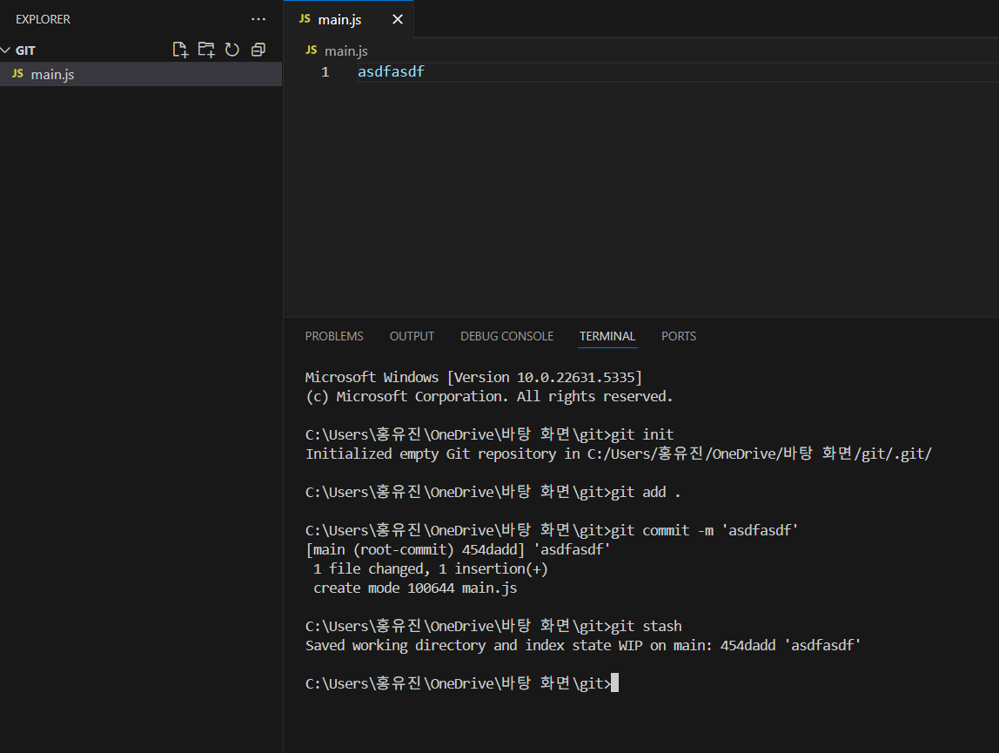
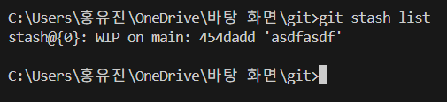
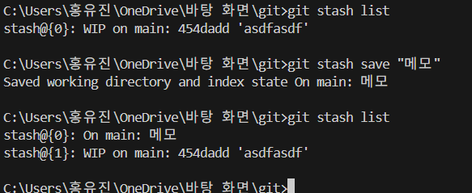
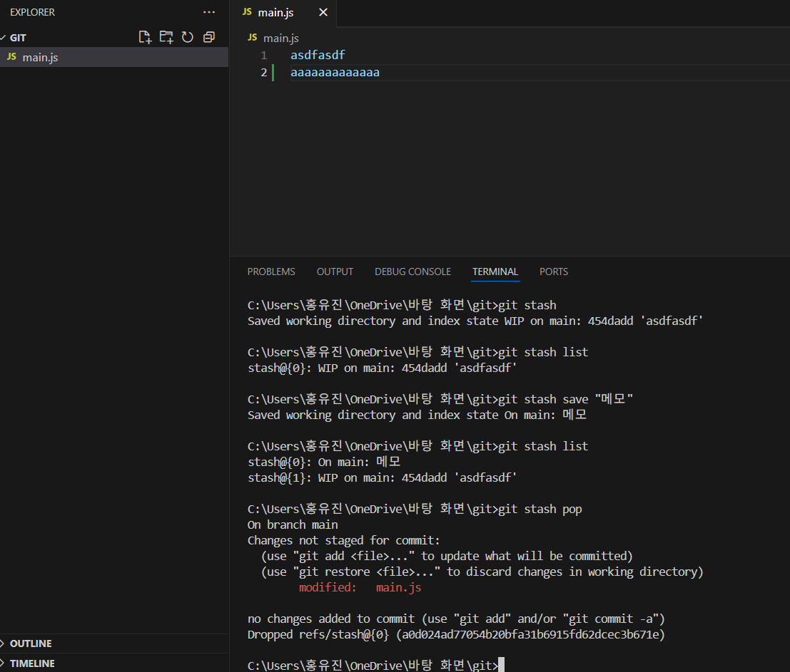
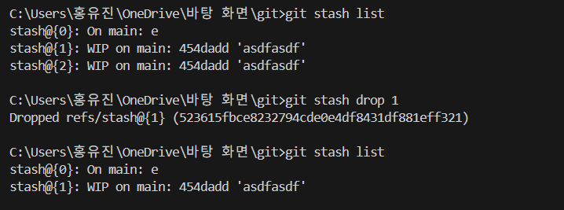
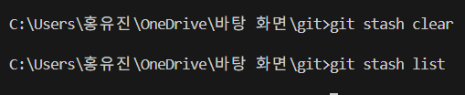

이제 마지막 강의다. 22년도 강의라 최신 정보들이 부족하긴 한데 개념을 알기엔 뭐 나쁘지 않은 것 같다.

---

아무튼 그건 그렇고 여기에 쓰레기같이 만들어둔 코드가 있다고 치자.

그 코드를 빼놓고서 개발을 진행하고 싶을 때, 주석 처리를 해도 되겠지만

`git stash` 명령어를 이용해도 잠깐 코드를 치워둘 수 있다. 

##  git stash가 뭔데
우선 main.js라는 폴더에 `asdfasdf` 라는 코드를 작성하고 스테이징 및 커밋을 한다.

그리고 그 아래에 `qwerqwer`라는 코드를 추가했다. 


그런데 이게 마음에 들지 않아서 잠깐 삭제하고 싶을 때
`git stash`를 사용하면 더 깔끔하게 관리할 수 있다.
### 1. git stash

`git stash`를 입력하면


이렇게 임시 공간으로 이동을 한다. 

보관된 코드를 보려면 `git stash list`를 입력하면 된다.


아무튼 이 stash라는 것은 최근 commit 이후에 했던 변경사항들을 저장해주는 거라고 보면 된다.

주의할 점은 **스테이징을 안 해놓은 새로운 파일은 저장되지 않을 수도 있다는 점**
### 2. Stash에 메모 추가하기
이제 파일을 다시 수정하고 이를 다시 stash에 저장해놓고 싶다.

그런데 이번에는 메모를 입력하고 싶다고 치자.

그럴 땐 save 명령어를 이용하면 된다.
```bash
git stash save "bbb 코드짰는데 망함"
```




이는 나중에 어떤 변경 사항인지 쉽게 파악할 수 있게 도와줄 수 있다.

### 3. Stash에서 코드 다시 불러오기
근데 생각해보니 전에 만들었던 코드가 더 좋은 것 같아서 다시 불러오려면
pop을 이용하면 된다.


```bash
git stash pop
```



그러면 이제 가장 최근에 보관한 Stash를 현재 작업 디렉토리로 불러온다.

불러온 stash는 물론 삭제된다.

항상 최근 것을 불러오기 때문에 지정할 수도 있다.


#### 근데 주석 써도 되는 거 아닌가?
주석이 있기에 이게 필요한가 싶을 수 있다. 

그러나 주석도 commit에 반영되기 때문에 commit 시에 쓸데없는 걸 숨기고 싶다면 stash를 사용하면 된다.

### 5. Stash 삭제하기
이렇게 이것저것 작업하다 보면 특정 stash를 삭제하고 싶을 수 있다.

그럴 때 drop을 이용해서 list를 통해 확인한 특정 stash를 삭제할 수 있다.

```bash
git stash drop <Stash ID>
```


전부 삭제하고 싶다면 `git stash clear`를 입력하자.


## 마무리

기능 A와 B를 만들어야 하는데 A는 완성하고 B를 반쯤 완성했을 때,
팀장님이 A만 빨리 commit하고 merge하라며 독촉했을 경우에 이런 `git stash` 같은 걸로 저장해놔도 괜찮을 것 같다.

### 그런데 브랜치 새로 만들어서 거기다 코드 짜는 거랑 다를 바가 없는데요

그렇다고 한다. 그냥 stash를 쓰기 싫거나 모른다면, 간단하게 브랜치를 만들어서 보관하자.

그렇지만 극단적으로 커밋 기록을 깔끔하게 하고 싶거나 내가 임시로 쓰는 브랜치가 삐죽 튀어나온 게 마음에 안 든다면, `git stash`를 활용하는 것도 좋을 것이다.

뭐 이런 것들은 알아두면 상황에 맞게 활용할 선택지가 느는 거니까 알아서 효율적인 개발을 하도록 해보자.