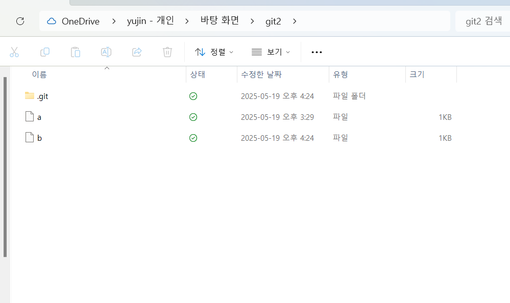
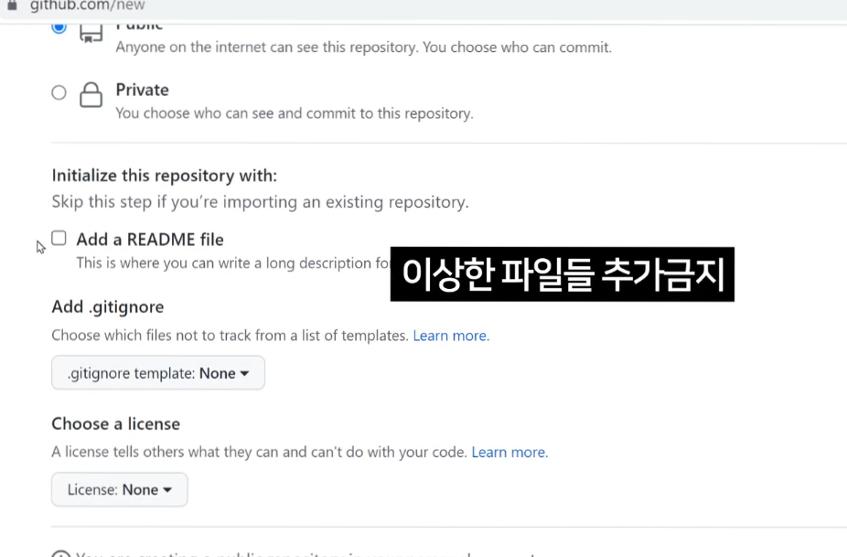
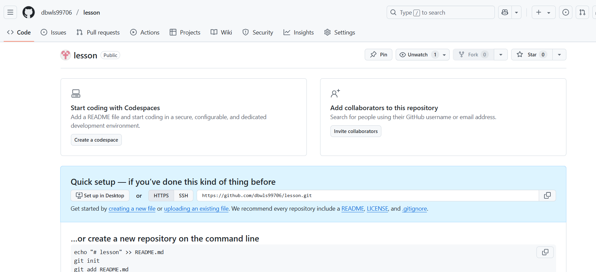
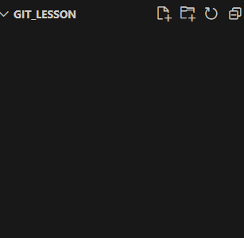
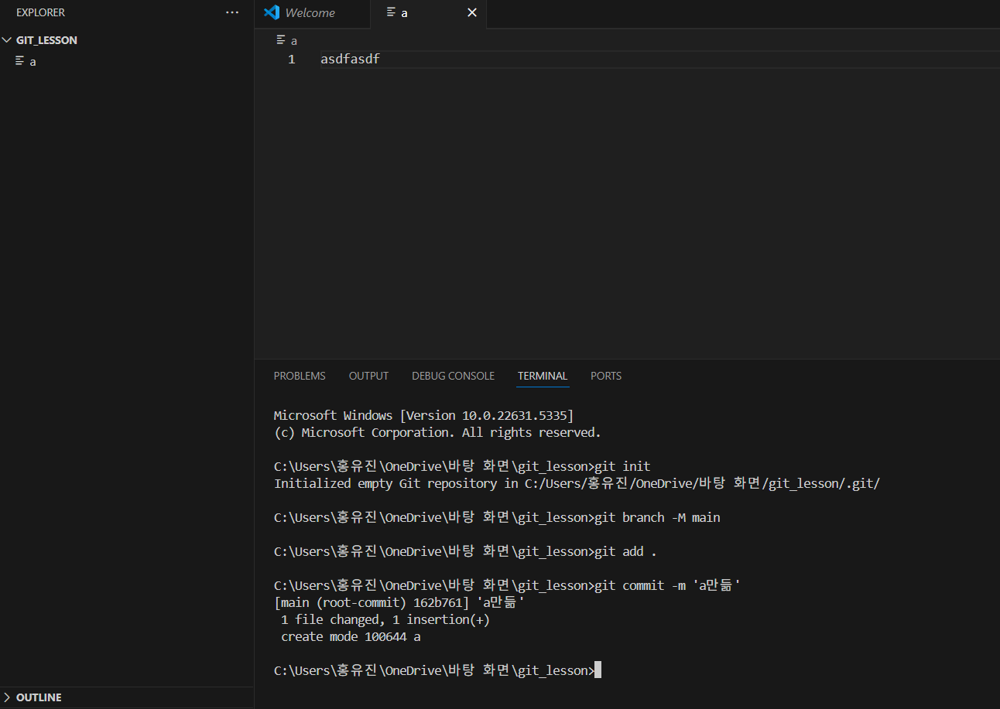
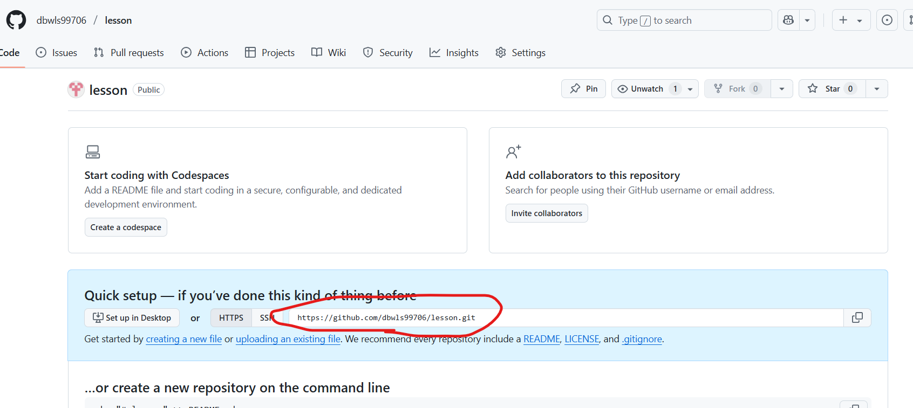
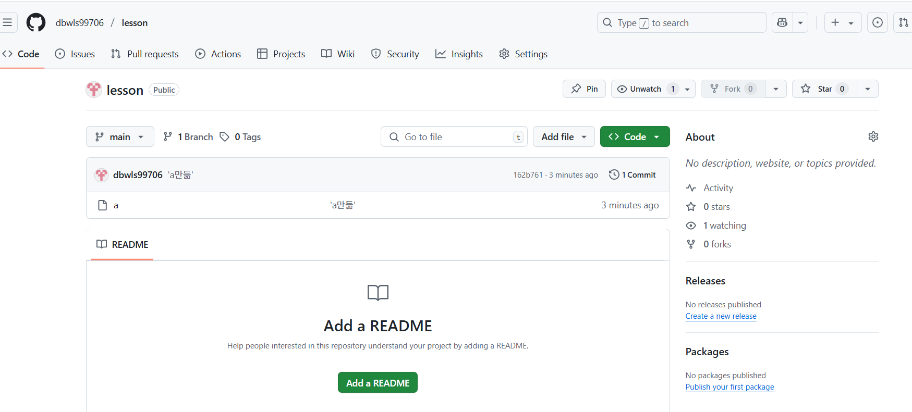
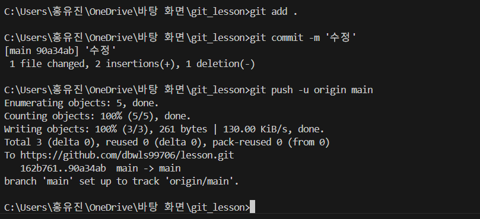
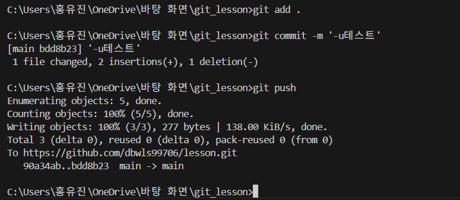
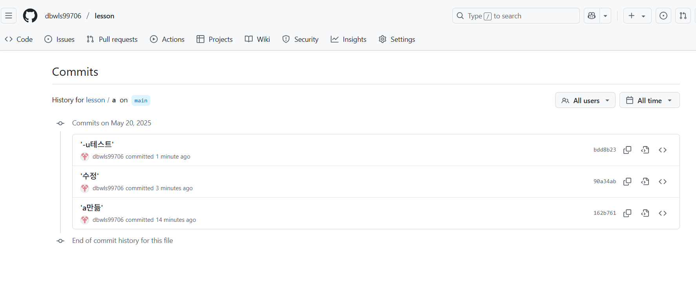

`git push`, `git pull` 어쩌구 배우기 전에

원격 `repository` 개념과 왜 사용하는지부터 알고 지나가자. 

그래야 자신있게 `git push` 이런 거 사용가능 

## repository가 뭐냐면
- repository는 Git이 파일을 온라인에 저장하는 저장소다.
- 로컬 작업폴더엔 .git 폴더가 있는데 그게 repository다.
- repository는 이 로컬 저장소를 인터넷에 백업한 것이다.

이게 내 로컬 레포지토리라고 보면 된다.

### 실습 
실습을 위해서 온라인 저장소 [github.com](https://github.com/)에 lesson이라는 repository를 하나 만들어보겠다. 

README 같은 파일들도 다 추가하지 않고 빈 저장소 하나를 생성한다.

이렇게 원격 저장소 하나가 생성되고, 여기에 내 로컬 저장소에 있는 파일들을 백업하기 위해 폴더 하나를 다시 만들어서 commit하고 이것저것 해보겠다.

이렇게 git_lesson 이라는 폴더를 생성했고, 이제 터미널을 열고 `git init`을 하면 저장소가 된다.

`git init`을 해주니 `.git`이 생성됐고, github에선 메인 브랜치를 main으로 한정한다고 하니 branch 명을 바꾸는 명령어를 실행했다. (물론 기본이 main일 거라 안 해도 된다.)

이제 파일 만들어서 commit을 몇 번 해보자.

### 이제 push해보자
a라는 파일을 만들고 스테이징하고 commit하고 그랬다. 이제 `git push`를 해보자.
`git push` 명령어는 다음과 같다.
> git push -u 원격저장소주소 main(올릴 로컬 브랜치명)

주소는 repository에 그대로 나와있다.

주소에 `.git`만 붙이면 된다. 아무튼 입력해보면

이제 레포지토리를 새로고침해서 확인해보자.

로컬에 있던 파일이 잘 올라가있고 코드도 확인할 수 있다.
### git 변수문법
여기서 예를 들어 내 레포지토리 주소인 https://github.com/dbwls99706/lesson.git 를 수정할 때마다 push하기 귀찮다면, 변수문법을 활용하면 된다.

git에서도 제공하는 변수 문법은 바로 `git remote`.
위의 저 주소를 origin이라는 변수로 활용하고 싶다! 그러면 아래를 입력하면 된다.
> git remote add origin https://github.com/dbwls99706/lesson.git
(git remote add 변수명 저장소주소)

이를 잘 입력했다면 이제 파일을 수정하고 다시 push를 할 때, 저 주소 자리에 origin이라는 변수를 입력하면 된다.

그런데 아까 `git push`할 때 썼던 `-u`는 뭘까?
그건 이 변수명보다 편하다고 한다. 그냥 내 레포지토리 주소를 저장해주는 것이다.
한 번 `-u`를 써서 push했다면 이제 앞으론 `git push`만 입력해도 된다.(진작 알려주시지 속은 느낌)

아무튼 실습이 중요하니 대충 다시 commit하고 `git push`를 입력해보자.

물론 잘된다.

커밋 히스토리도 잘 보인다. 

이런 명령어들은 평소 프로젝트할 때 썼던 건데도 잘은 몰랐는데 이번 기회에 잘 알게 되는 것 같아서 마음에 든다. 굿
