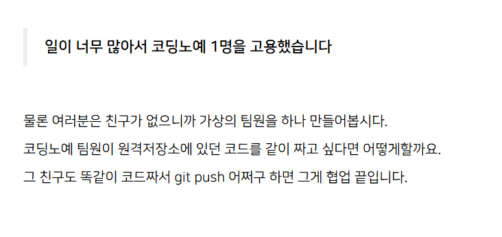
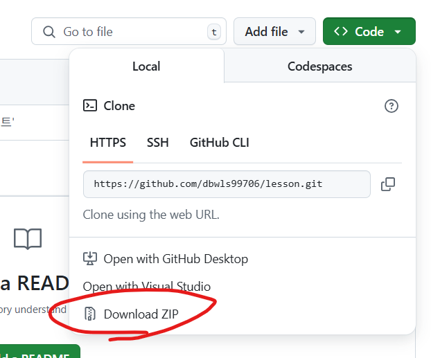
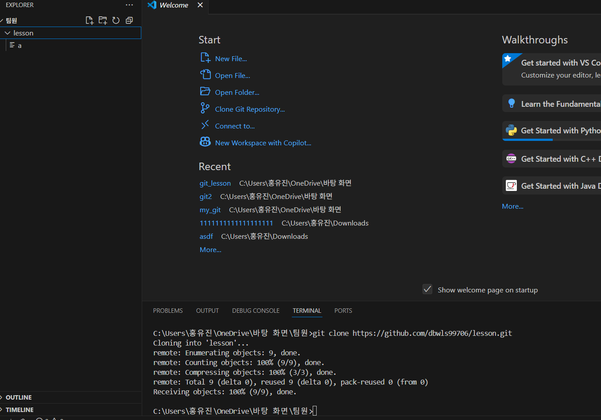
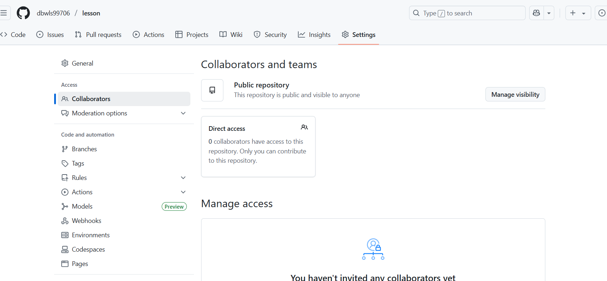
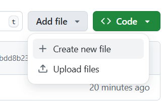
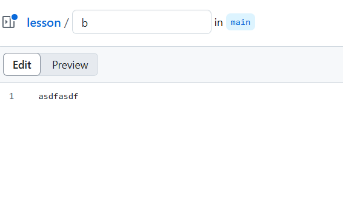
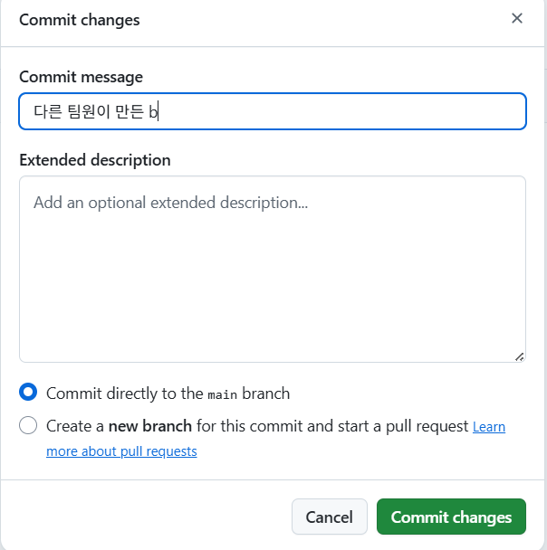
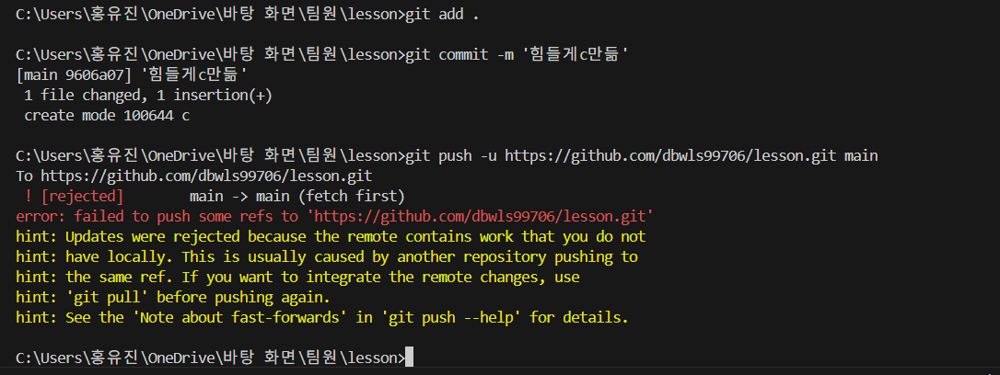
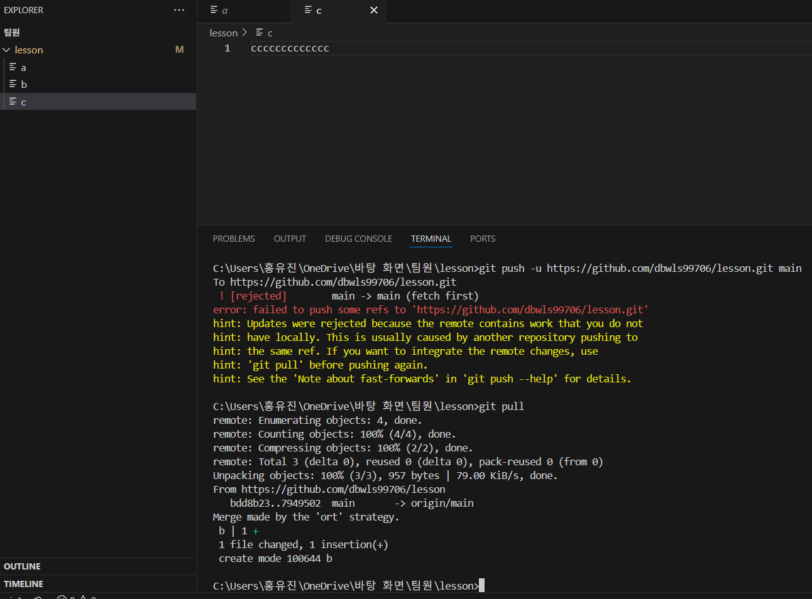
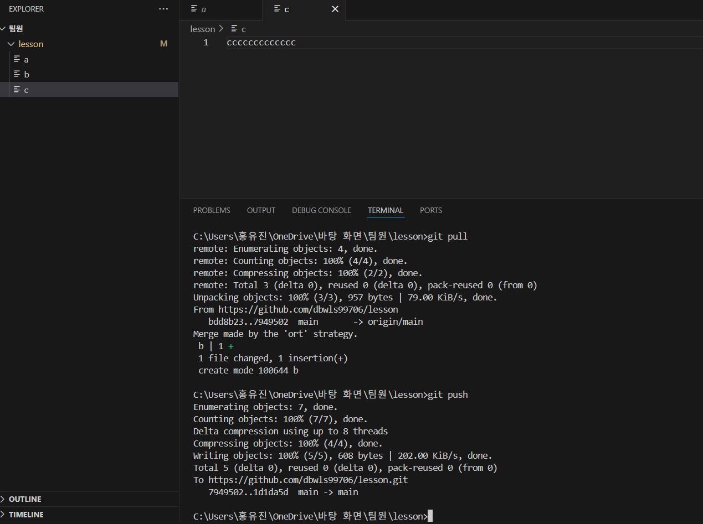

원격저장소의 장점은 남들과 협업할 수 있다는 것이다. 

그게 어려운 게 아니고 개발자 10명이서 각각 작업한 내용을 원격저장소에 올리면 그게 협업이니까 네.

협업해봅시다.

왠지 눈물이 나는 강의

## git clone
아무튼 그 팀원이 소스 코드가 없거나 새로 합류해서 뭐가 뭔지 잘 모르겠다면, 원격 저장소에 올라온 소스코드를 다운받으면 된다. 

대표적으론 그냥 저걸 눌러서 ZIP 파일로 다운받으면 되는데

그것보다 쉬운 방법이 있다.

그게 바로 `git clone`이다.

### 실습
폴더를 하나 만들어 팀원의 로컬 저장소라고 가정해보겠다.

아무것도 없는 텅빈 폴더다. 이제 팀원 폴더를 vs code로 열고 터미널에서 `git clone`을 해보자.

init도 입력할 필요 없이 그냥 입력하면

이렇게 원격 저장소에 있던 내 파일이 팀원 로컬 저장소에 들어온다.

이제 이 팀원도 여기서 짜서 `git push`하면 된다.

물론 아무나 이게 되는 건 아니고, 그 전에 세팅이 하나 필요하다.

이렇게 세팅에 collaborators에 그 팀원의 github 아이디를 등록을 해놔야 `git push`가 정상적으로 동작한다.

## 원격 저장소에 먼저 파일이 추가됐다면
정상적으로 계속 `git push`가 되면 좋겠지만 현실은 그렇지 않다.

갑자기 다른 팀원이 만든 파일이 원격저장소에 불쑥 생기면 `git push`를 마음대로 하지 못한다. 

예를 들어 지금 원격 저장소에 아무 파일이나 만들고 `commit`해보자..

난 여기서 b라는 파일을 대충 만들어보겠다.

이를 commit해보자.

이제 팀원이 c라는 파일을 만들어서 이를 `commit`하고 `git push`를 한다고 가정해보면

c를 힘들게 만들었는데, 에러가 나서 push하지 못하는 상황이 발생한다.

이렇듯 남이 먼저 `git push`를 해버리면 내 로컬과 원격 저장소 파일 간의 차이가 발생해서 에러가 발생한다.

## git pull
이럴 때 `git pull`을 사용하면 된다.
> git pull 원격저장소주소

`git pull`이 뭐냐면, 원격저장소에 있던 모든 브랜치 내용을 가져와서 로컬저장소에 합치라는 뜻이다.

이제 이를 통해서 팀원 폴더에 고립된 브랜치에 최신 내용을 추가해보자.

_앞서 `git push`를 할 때 `-u`를 잘 입력했다면, `git pull`만 입력해도 된다._

아무튼 이렇게 원격 저장소에 추가되었던 b파일도 잘 들어와있음을 확인할 수 있다.

이처럼 로컬 저장소도 최신의 상태를 유지해야 `git push`가 가능하다.

이제 `git push`를 진행해보면,

이렇게 잘 동작하고

원격 저장소에도 잘 올라가 있음을 확인할 수 있다.

### 추가로
- `git pull`할 때 브랜치 명도 명시가 가능하다.
- `git pull`은 엄밀히 말하면 `git fetch` + `git merge`임.(`git fetch`는 원격 저장소 신규 `commit` 가져옴, `git merge`는 내 브랜치에 `merge`)
- 그래서 가끔 comflict 발생함. (이땐 전에 배운 것처럼 알아서 수정하고 comflict 해결)

## 한 줄 요약
`git push`하기 전에 `git pull`먼저 하십쇼.

