프로젝트에 신기능을 추가하고 싶다면, 
괜히 main브랜치에 만들고 `merge`나 `push`하다가 충돌나고 그러면서 괜히 코드 망치지 마시고
따로 branch를 만들어서 거기서 기능을 제작하는 것이 안전하다고 배웠었다.

이는 원격 저장소에서 branch를 제작하고 삭제하고 이런저런 수정을 해볼 수 있지만
로컬에서 만들고 활용하는 것이 아무래도 간편하다.

## local에서 branch를 만들어보자
이미 이전에 배웠겠지만 앞으로의 실습을 위해서 branch를 하나 제작해보자.

우선 이전에 만든 git_lesson 폴더에 들어가서 `git pull https://github.com/dbwls99706/lesson.git`을 입력해주었다.

이제 여기서 강의에서처럼 mining이라는 branch를 만들어주겠다.
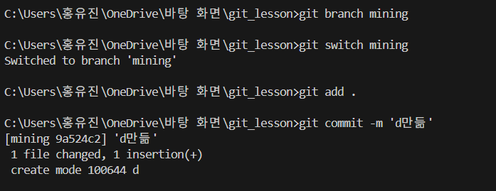

`commit`을 몇 번 해보라고 해서 d를 만들었고, 
conflict가 발생할 때도 다시 복습하기 위해 
a파일의 첫 번째 줄도 수정해주었다.

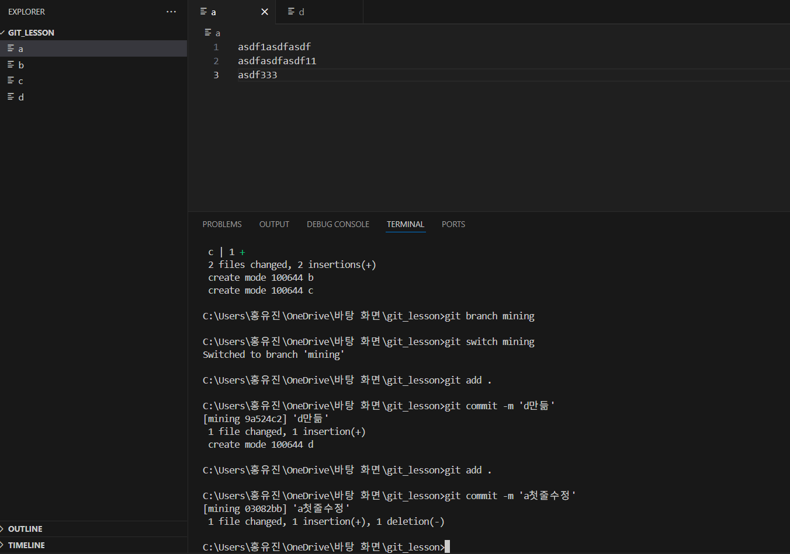

이제 다시 `main`으로 돌아가서 거기서도 a파일 첫줄을 수정하고 `commit`해본다. 

## Pull Request해보기
이제 mining branch를 한 번 `push`해보자.

`push`하고 나면 이런 식으로 mining branch가 `push`됐다고 뜬다.

근데 이제 mining branch에서 만든 기능이 너무 잘돼서 main에 합치고 싶다고 가정을 하자.

local에서 합쳐서 `push`해도 되겠지만 
협업을 할 때는 `merge`하기 전에 많은 사람들의 검토를 거쳐야 한다.

이때문에 branch를 `merge`할 때는 온라인에서 진행하는 경우가 많다.
그 방법이 바로 저 `pull request`다.
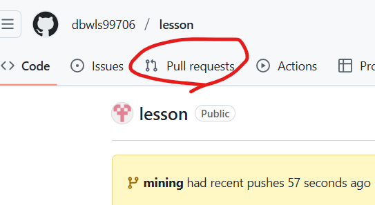

이제 여기를 클릭해서 들어가게 되면 

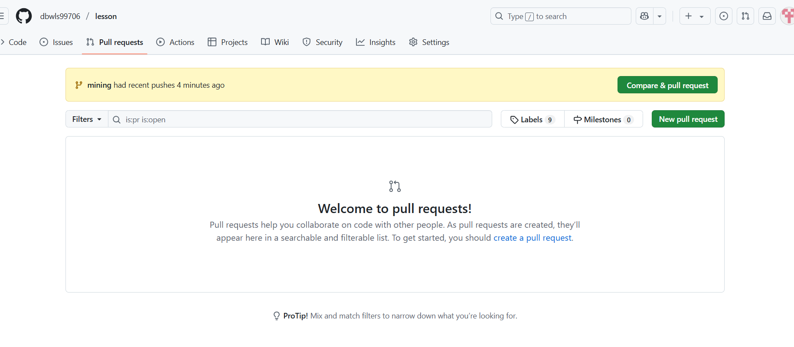

이렇게 뜨는데 여기서 `New pull request`를 눌러보겠다.

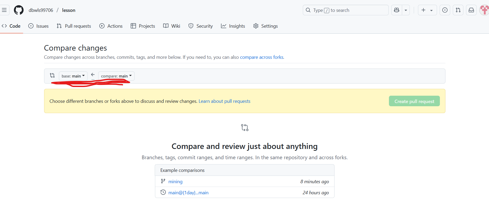

여기서 어떤 브랜치를 어디다가 합칠 지 `merge` 요청을 보낼 수 있다.

나는 main 브랜치에 mining을 합칠 것이다.

이렇게 선택해두면 아래쪽에 
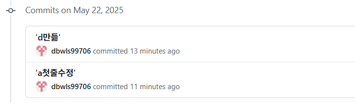

commit 내역 같은 것도 뜨고 그러는데
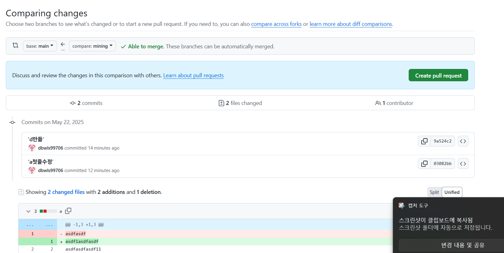

잘 봤다 싶으면 Create pull request를 눌러보자.
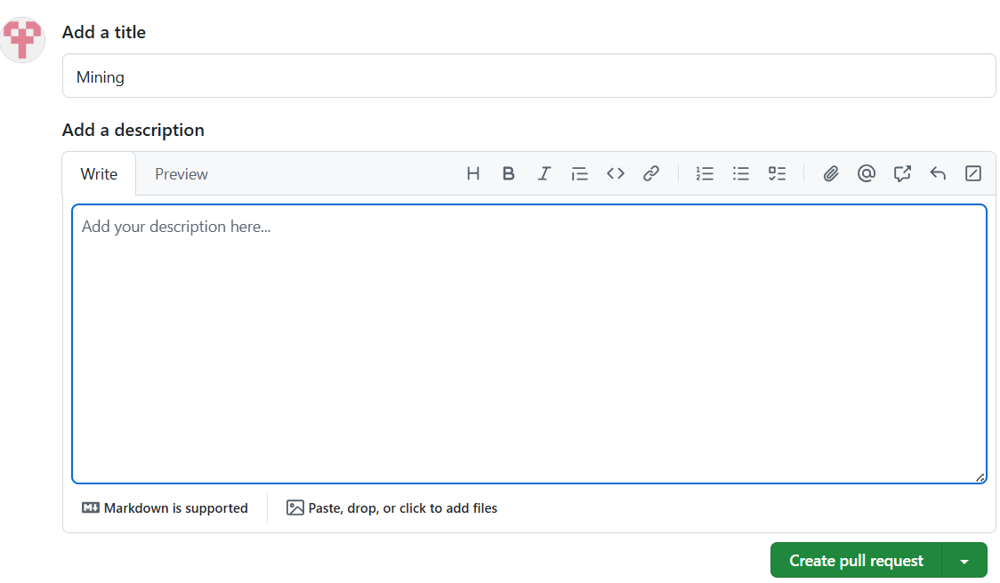

댓글도 달고 싶다면 달아주고 다시 Create pull request 버튼을 누르면
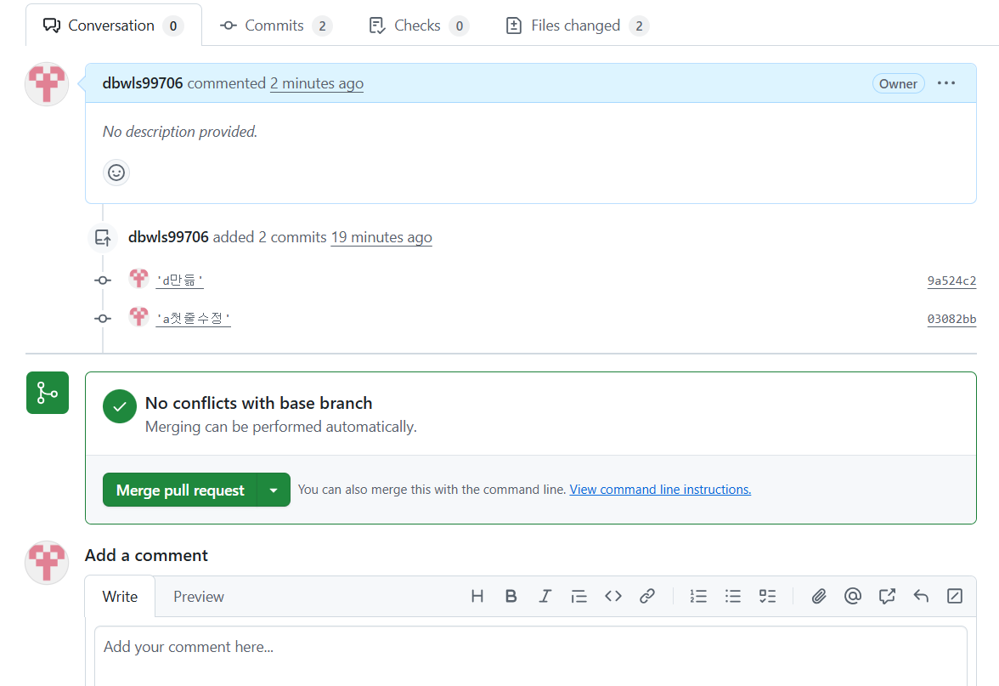

이렇게 뜨는데 a를 수정했는데 conflict가 뜨지 않는다. 
그러고보니 main 브랜치를 수정해놓고 push하지 않아서 그런가보다. 
아무튼 그건 그렇고

만약 conflict가 뜬다고 하면 
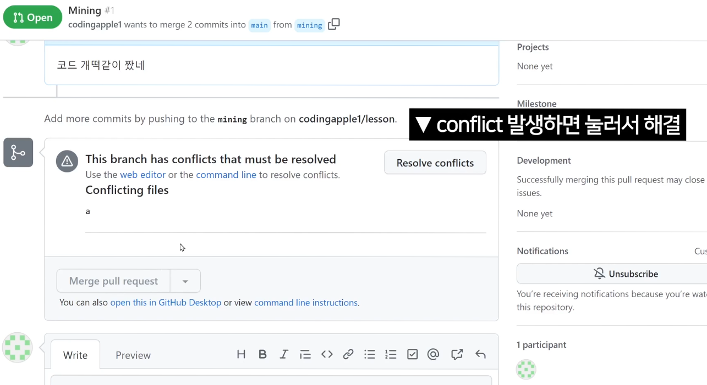

이렇게 뜨는데 저걸 눌러서 해결해주면 된다.

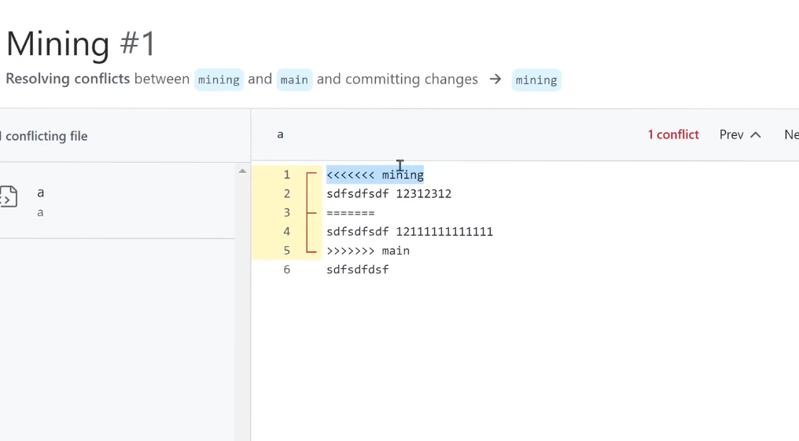

누르면 이렇게 보이는데 어떤 코드를 남길지 알아서 잘 수정하면 된다.
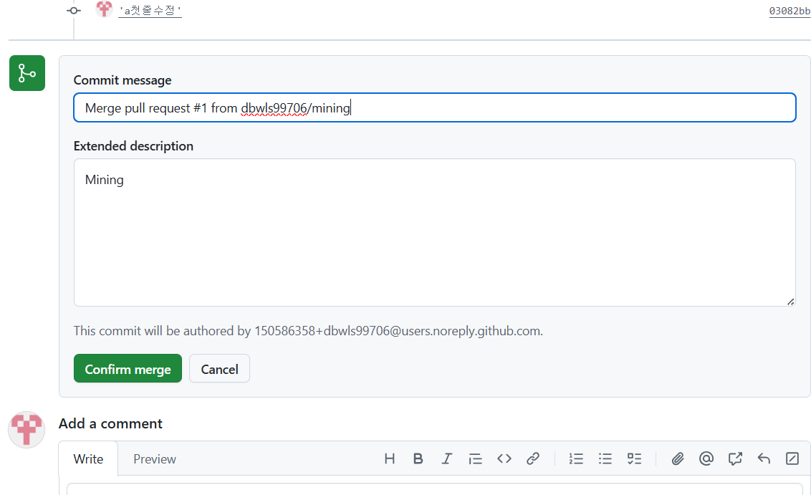

난 저게 안 떴으니까 그냥 컨펌해주겠다.

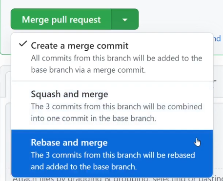

`merge`할 때 이렇게 `3-way merge`와 `squash and merge`, `Rebase and merge`를 선택할 수 있는데 
난 그냥 3-way를 했다.
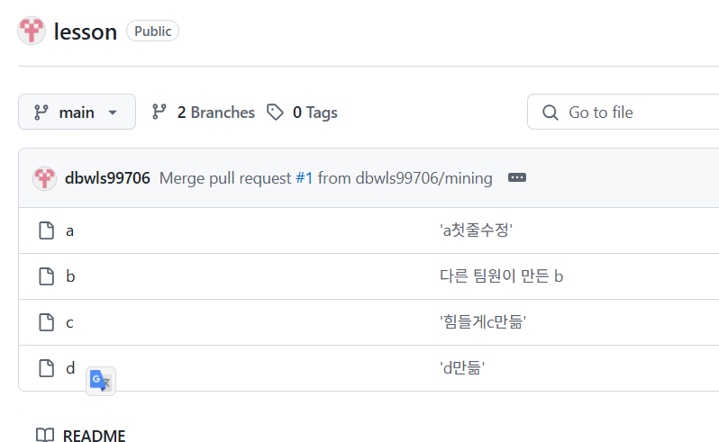

이렇게 파일이 잘 합쳐졌음을 확인하면 된다.

이제 다시 로컬 저장소로 `pull`해보면 conflict가 뜨는데 잘 해결해주고 
`git log --oneline --graph`를 쳐보면

이렇게 이전에 했던 거랑 이것저것 많이 나옴을 알 수 있다.
그냥 깔끔하게 squash할 걸 그랬다.

