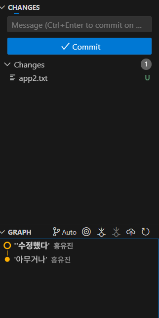
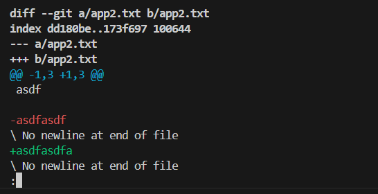
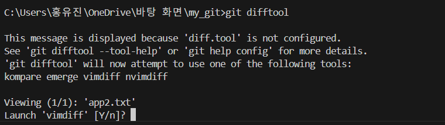
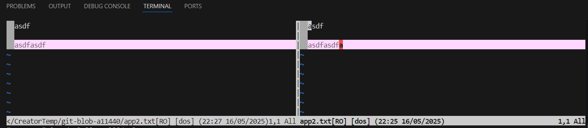
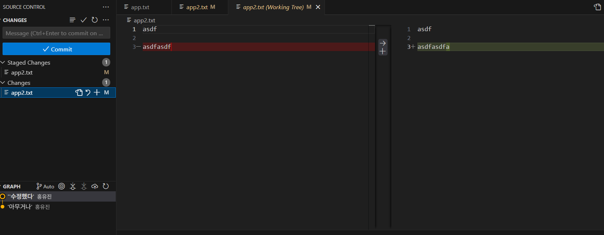
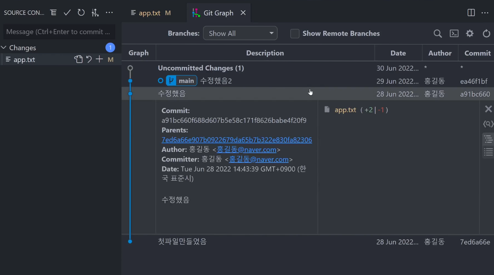

### git commit 뭐하러 터미널에 입력함

강의를 열자마자 적혀있는 말이다. 아니 5번 해오라매!!(안함)

---

## 그냥 에디터 부가기능 쓰는 게 더 나을지도
아무튼 이유를 들어보니 요즘 웬만한 에디터들엔 기본적으로 git에 대한 기능들이 내장되어있기 때문이란다.
예를 들어 지금 쓰고 있는 vscode의 이 버튼이 바로 git 기능을 활용할 수 있게 해준다. 


(그러고보니 브랜치 모양이다)
눌러보면



이렇게 간편하게 볼 수 있다. +-버튼을 통해 스테이징(```add```)를 할 수 있고 위 메세지로 ```commit```도 작성 가능하다. 강의에서는 이것저것 알려줬는데 지금 버전에선 그냥 가시적으로도 뭐가 뭔지 쉽게 확인할 수 있었다.
쓰는 에디터가 확정되고 익숙해진다면 이런 식으로 관리할 때가 터미널로 할 때보다 간편해질 것 같다.

그리고 ```git diff```


파일을 수정하고 ```git diff```를 입력하면 Vim 에디터 같은 게 터미널에 열린다.


대충 수정을 하고 저장한 후에 git diff를 입력하면 위와 같이 
asdfasdf를 지웠다가 asdfasdfa를 썼다는 메세지와 함께 Vim 특유의 :가 떠있다.
:가 이미 있으므로 그냥 j/k로 스크롤바를 조작하며, 에디터를 끄고 싶다면 q를 누르면 된다고 한다.
그러나 좀 업데이트가 된 건지 스크롤바는 그냥 휠로 조정 가능했다.

또한, 스페이스바나 엔터키 등을 썼다가 지우면 그것도 전부 지웠다가 다시 쓴 걸로 인식한다는 버그가 있다는데 그것도 고쳐진 듯하다. 
아무튼 그런 버그 때문에 ```difftool```을 쓴다.



입력하면 위처럼 뜨는데 그냥 y를 누르고 엔터


그럼 이렇게 시각적으로 확인할 수 있는 툴이 나온다. (이 또한 Vim이다)
근데 업데이트된 vs code는 이것 역시 그냥 확인할 수 있다.


그냥 파일 수정 후에 좌측에 Changes에 있는 파일을 누르면 바뀐 점이 잘 보인다. 

---

또한 다른 명령어들도 알려준다.

```git diff 커밋id``` = 최근 commit이 아닌 과거의 특정 commit과 현재 파일을 비교하고 싶으면 해당 커밋id를 입력해서 비교 가능하다. 커밋id는 ```log```를 통해 확인할 수 있다.

```git diff 커밋id1 커밋id2``` = 과거의 특정 두 커밋을 비교

그리고 이는 ```difftool```도 마찬가지다.

강의에서 사용한 건데 vscode 확장 프로그램 중에 git graph라는 것을 깔면 아까 말한 최신 기능 같은 것도 쓸 수 있었던 것 같다.


아직까지 완전 기초라서 아무 무리가 없었는데 아무튼 일단 이런 용어들이나 사용법들은 익숙해져 놓으면 좋을 것 같으니 이미 시작한 강의는 다 들어봐야겠다.