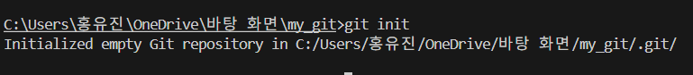
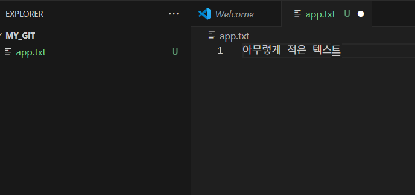
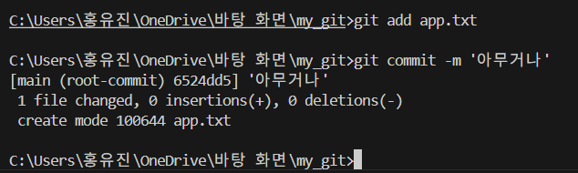
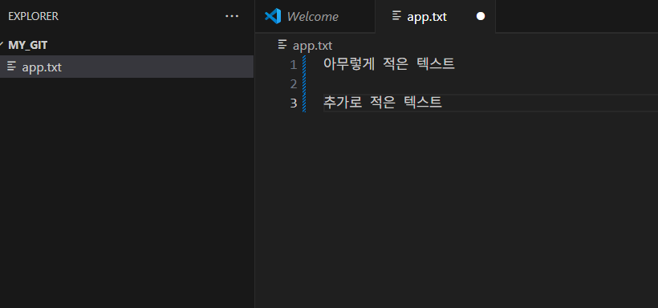
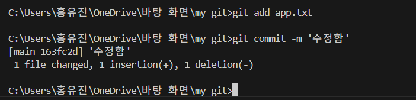
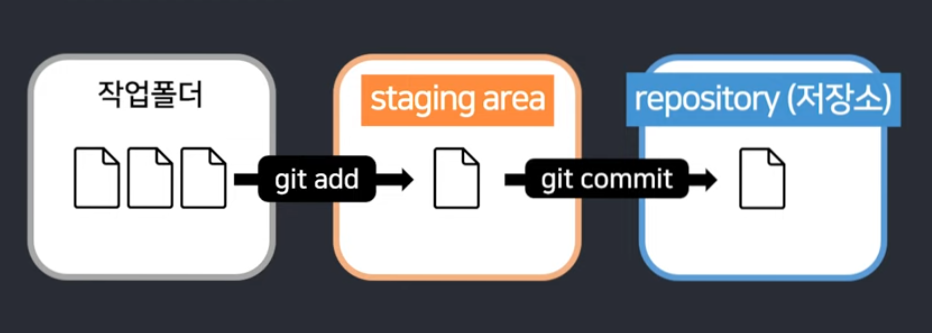

지난 시간에 이어서 두 번째 강의를 들어봤다.

먼저 visual studio code를 켠다. 
나는 이전에 만들었던 my_git이란 폴더에서 진행하는 것이기에 해당 폴더를 열었다.
해당 폴더를 vs code에서 열었다면, 터미널을 열고 git init을 입력한다.

``` git init ``` = 나 지금 여기서 git 쓸 거야


그 다음에 우선 실습을 위한 파일을 대충 만들어본다.

이제 저장하고 이를 백업해보자.

내가 만든 파일인 app.txt를 백업하고 메모를 commit해보자.
> git add app.txt
git commit -m '메모'

스테이징 영역을 열고 커밋 문구를 적으면 되는데 커밋 규칙에 대해선 우선 넘어가는 듯하다.

---
아무튼 이렇게 백업을 하고 원본 파일에 코드를 추가했다면, 


똑같이 commit해주면 된다.(만족할 시점에 저장 꼭 해두고)


이렇게 된다.

저번 실습에서 스테이징 영역에 대해 공부했지만 강의에서 한 번 더 정리해줬다.



간결하다. 굿

---
강의 마지막에 유용한 명령어도 정리해준다!


그러나 초보 때부터 꿀빨지 말란다


아무튼 그 뒤로 명령어를 조금 다룬다. 다루는 명령어는

```git add 파일명1 파일명2``` = 여러 파일 스테이징하려면 이렇게 하면 된다
```git add .``` = 모든 파일 스테이징
```git status``` = 상태창!!!! 어떤 브랜치에서 어떤 파일을 스테이징했는지, 수정이 됐는지 보여준다.
```git log --all --oneline``` = 내가 커밋한 내역들을 쭉 알려준다. 그래프를 보고 싶으면 --graph를 추가로 입력하면 되는데 조금 보잘 것 없다. (이전 실습할 때 써봤는데 보잘 것 없긴 하더라)
```git restore --staged 파일명``` = 스테이징을 취소하고 싶다면 이거 입력

#### 숙제: 새로운 작업 폴더에서 commit 5번 해오기
이전에 여러 번 했으니까 전 스킵하겠습니다,, 
그러면서 파일 저장하는 것 마냥 5초마다 commit하는 초보자 분들에게 그러지 말라고 당부를 전한다. 
간단한 기능 같은 걸 완성했을 때마다만 하자.
