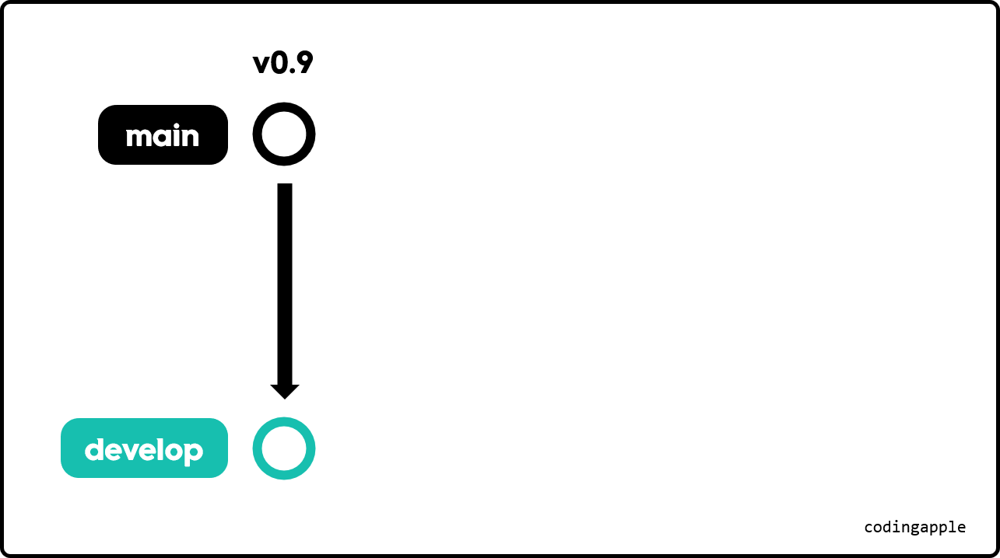
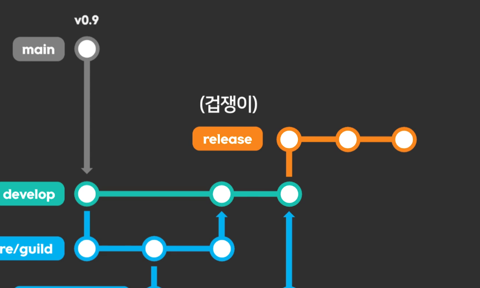
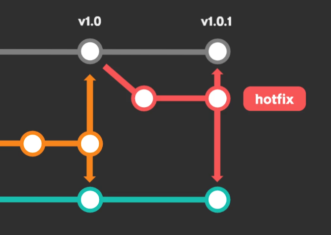
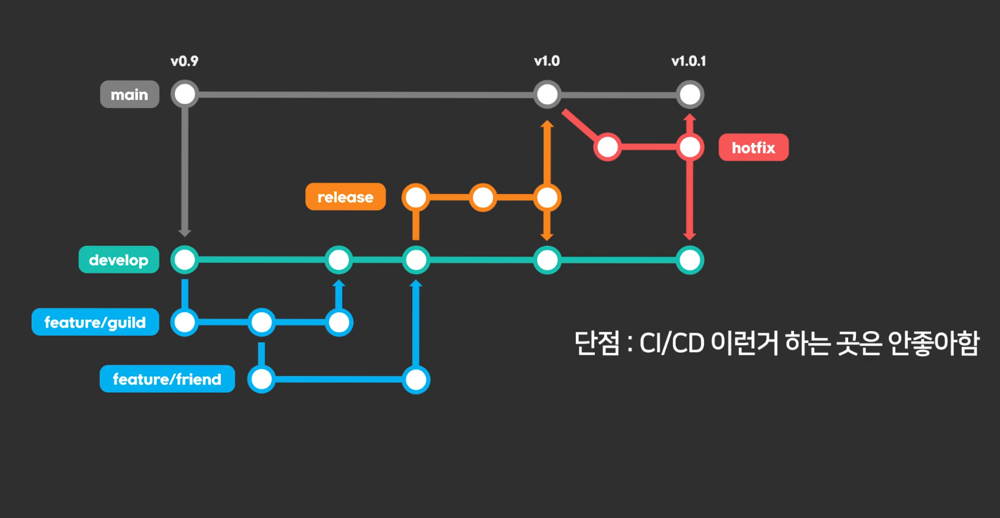
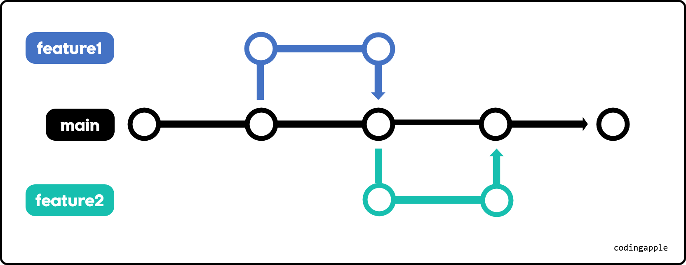

여러 명의 개발자가 동시에 협업할 때 브랜치를 마음대로 합치고 만들고 그러면 개발 과정이 복잡해지고 추적이 어려워진다.

이를 해결하기 위해 `git flow`, `trunk-based`, `github flow` 등 다양한 브랜치 방법론 같은 게 존재한다.

이런 전략을 적용하면 브랜치 관리가 쉬워지고 팀원이 많아도 개발 절차가 매끄러워진다.

평생 시키는 것만 하는 코딩 노예가 자기 꿈이다! 싶으면 몰라도 되고,
프로젝트를 리드하거나 팀장이라면 혹은 그런 것들을 하고 싶다면 알아두면 좋다.

---

## 안정적인 운용 git flow 개발 전략

항상 안정적인 release를 해야한다면 이 전략이 적합하다.
주요 브랜치는 다음과 같다:

- `main` 브랜치
- `develop` 브랜치 (개발용)
- `feature` 브랜치 (develop에 기능추가용)
- `hotfix` 브랜치 (`main` 브랜치 버그해결용)
- 가끔 `release` 브랜치 (develop 브랜치를 main 브랜치에 합치기 전에 최종 테스트용)

강의에선 이론만 하나하나 설명을 하면 재미가 없다며 예시를 들어서 설명한다.
### 여러분들은 지금 게임 개발 팀장이다.

대충 지금까지 주먹구구식으로 협업해서 0.9버전까지 나온 상황이다.

근데 이제 1.0 버전부터는 신기능도 많아져서 제대로 개발을 진행하고 싶다.

그래서 git flow를 도입하기로 한 것이다.

기존 main 브랜치에 0.9버전이 있다고 치자.

1. **develop 브랜치**
   - 기존 0.9버전 main 브랜치를 복사해 develop 브랜치를 만든다.
   - **모든 개발은 develop에서 진행한다.**

근데 develop 브랜치에다가 직접 코드를 막 `push`해버리면 상황이 어지러워질 수 있다.
그래서 신기능 개발은 feature 브랜치를 만들어 개발한다.

2. **feature 브랜치**
   - 기능별로 develop에서 feature 브랜치를 따서 개발한다.
     예를 들어 `feature/guild`, `feature/friend`와 같이 만들어서 기능을 개발한다.
   - 기능 개발이 끝나면 develop에 merge한다.
   - 중요하지 않은 브랜치는 squash and merge도 활용 가능하다.
   
그런데 이제 develop에 있는 코드가 어느정도 완성이 된 것 같다.

이제 출시를 하고 싶은데, 상남자답게 바로 main 브랜치에 합쳐도 되겠지만 
우리 코드는 생각보다 연약하기 때문에 불안한 것이 현실이다.

그래서 겁쟁이 브랜치를 하나 만들어준다.

3. **release 브랜치**
   - develop에서 release 브랜치를 만들어 최종 테스트나 QA를 진행한다.
   - 대개 `release/1.0` 이런 식으로 이쁘게 이름을 짓는다.
   - 테스트 후 main에 merge하여 배포하고, 다음 개발을 위해 develop에도 merge한다.

그런데 유저들이 골드 무한 복사 버그 이런 걸 발견했다고 치자. 

이럴 땐 상당히 급하기 때문에 main 브랜치에서 브랜치를 하나 만들어서 빠르게 수정한다

이게 바로 hotfix 브랜치다.

4. **hotfix 브랜치**
   - 운영 중 발견된 버그는 main에서 hotfix 브랜치를 만들어 즉시 수정한다.
   - 수정 후 main과 develop에 모두 merge한다.

물론 유저들은 점검이나 업데이트 이런 거 안 좋아하니까
점검 보상 같은 데이터 쪼가리들을 챙겨줘서 민심을 관리하도록 하자.

### git flow의 특징

이렇게 `git flow`는 안정적으로 버전 별 배포를 할 수 있다는 장점이 있지만, CI/CD 같은 거 하는 곳은 별로 적절치 않을 수 있다.

(CI/CD는 CI 단계에서 빌드되고 테스트된 후, 배포 준비 상태가 확인되면 개발자 혹은 검증팀이 수동으로 배포하는 것이다)

아무튼 그래서 대규모 프로젝트, 릴리즈 관리가 중요한 서비스엔 적합하다.

---

## Trunk-based 개발 전략

Trunk-based는 쉽게 말하면 **"브랜치 하나만 잘하자"**라고 볼 수 있다.

브랜치 구성을 살펴보면

- `main` (trunk)
- 필요할 때마다 `feature/*` 브랜치만 잠깐 생성

이정도로 운영된다.

대충 운영 방식을 더 상세하게 설명해보면

- 기능 추가나 버그 픽스는 main에서 feature 브랜치를 따서 개발하고,
개발이 끝나면 main에 merge 후 브랜치 삭제하면 된다.

- main 브랜치의 코드를 바로 배포한다.

이정도로 보면 된다.
### Trunk-based의 특징

Trunk-based의 특징은 브랜치가 main과 feature밖에 없어서 단순하기 때문에 관리가 쉽고, merge 충돌이 적다.

코드가 항상 배포 가능한 상태여야 하므로 많은 테스트를 거치거나 테스트 자동화 같은 걸 해야 하고 코드리뷰도 자주 해야 한다.

---

## 표로 정리해보면

|구분|git flow|Trunk-based|
|-|-|-|
|브랜치 구조| main, develop, feature, release, hotfix 등| main(trunk), feature만 일시적으로|
|릴리즈 관리|체계적, 단계적|빠른 배포, 통합|
|복잡성|브랜치 많음|단순함|
|적합한 팀/상황|대규모, 안정성 중시, 체계적 관리 필요|소규모, 빠른 개발 및 배포|
|단점|브랜치 관리 복잡, merge 충돌 가능|테스트 많이, 자주해야 함|

---

## 마무리

프로젝트 특성, 팀 구성, 배포 방식에 따라 전략을 유연하게 선택하면 될 것 같다.

어느정도 개발이 진척됐거나, 팀에 프로 코딩 전사 이런 분들이 가득하면 trunk-based 이런 게 더 편하다. (최근 CI/CD 형식으로 개발하는 팀들은 보통 trunk-based를 사용한다고 한다)

안정성이 중요하거나 아직 뼈대가 확실하지 않은 연구식 프로그램이면 `git flow`전략이 적절할 수 있다. (물론 정해진 건 없다)

훗날 개발자들 관리하는 관리자 이런 게 된다면 유용하게 써먹을 수 있을 것 같다. 
그때 뭐 자동으로 관리하는 툴 이런 게 나올 가능성도 있지만 일단 알아두면 좋으니 공부해둬서 나쁠 건 없다고 여긴다.