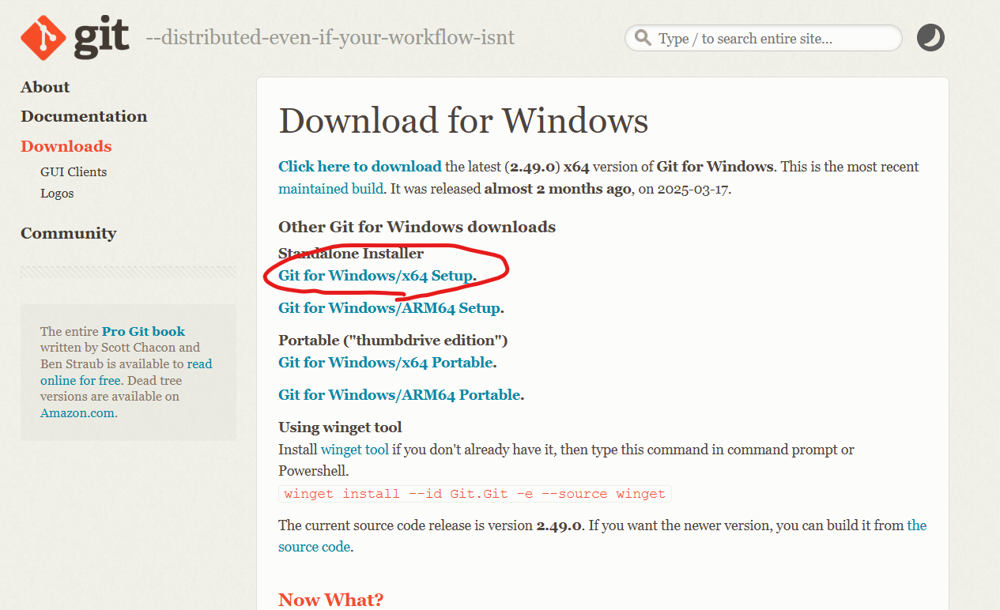
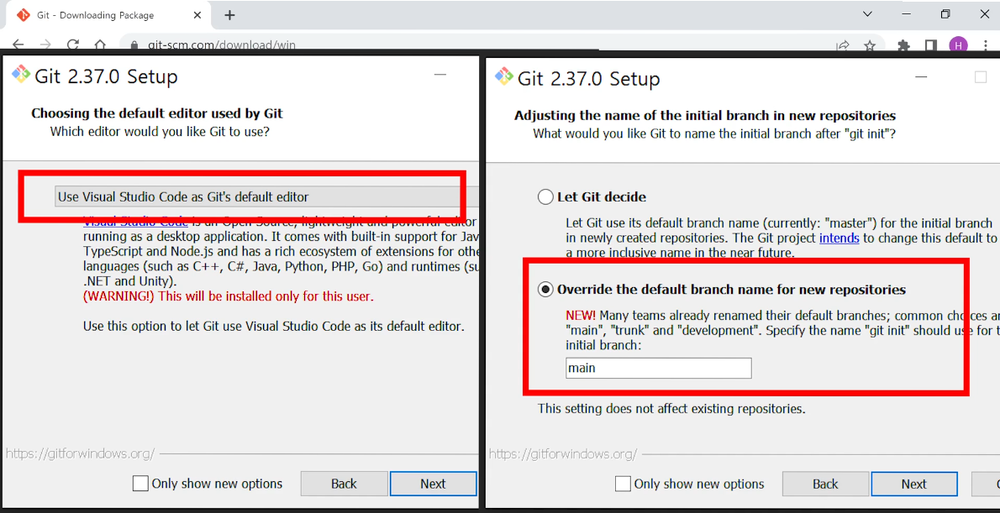
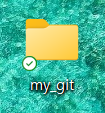
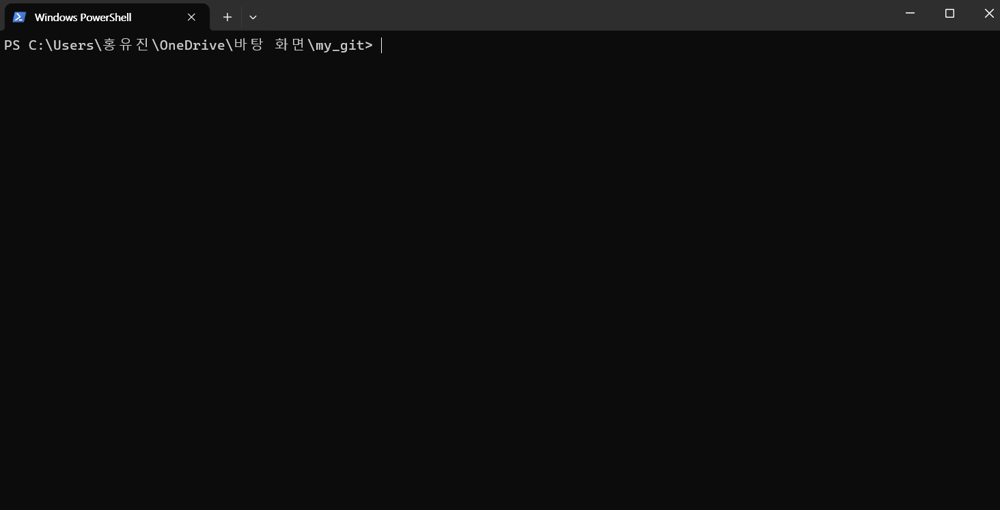
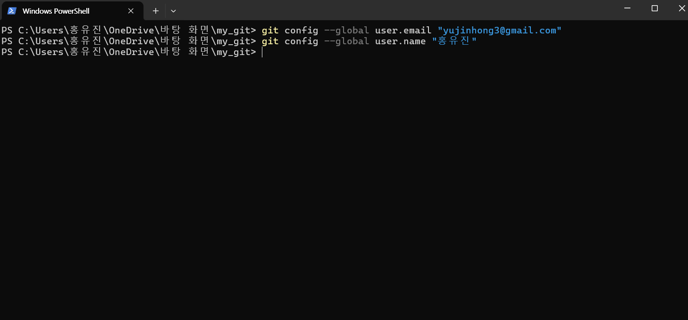

코딩유튜버 코딩애플 님(영상 매우 재밌다)이 만든 사이트에 
[[(무료) 매우쉽게 알려주는 git & github]](https://codingapple.com/course/git-and-github/)
라는 무료 강의가 있어 마침 관련한 지식이 필요하다 느낄 때라 천천히 수강해보기로 했다. 
강의평들도 현업에 직결되어있다는 평이 많아서 복습할 필요가 있을 것 같다.

강의는 위 링크 클릭해서 들어가면 된다. (가입은 필수지만 요구하는 정보가 이름, 메일 뿐이다)

위 강의는 다음과 같은 순서로 진행된다.

* git add, commit으로 파일 기록해놓을 수 있음
* git add, commit, diff 쉽게 하는 법 (VSCode)
* git의 branch 만들기다양한 git merge 방법 (3-way, fast-forward, squash, rebase)
* 코드짜다가 실수했다 되돌아가자 (git revert, reset, restore)
* Github 사용법 1. 내 코드 올릴 땐 git push
* Github 사용법 2. 타인과 협업하기 (git clone, pull)
* Github 사용법 3. 브랜치로 협업하기 (pull request)
* git flow / trunk-based 브랜치 전략
* git stash로 코드 잠깐 보관하기

이제 강의를 하나하나 들으며 복습한다는 마음가짐으로 글을 적어내려보겠다.

### git 설치법 (윈도우)

강의의 프롤로그. git이 왜 필요한지로 서론을 열고 설치법을 간략하게 알려준다.

#### 그렇다면 git은 왜 필요할까?

git은 코딩을 작업한 코드들을 기록 및 저장하는 등의 기능을 간편하게 해준다. 범용적으로 많이 쓰이기에 개발자들끼리 소통하기 용이하다.

강의에선 이를 간단하게 정리했는데 

그렇다고 한다. 빠꾸가 가능하다는 점은 개발을 해본 사람이라면 그 필요성에 대해 끄덕일 수 잇을 것이다.

#### git 설치법(윈도우)
저번 포스트에선 리눅스 환경에 깔아놨던 git을 활용하여 branch, commit 등을 실습해봤기 때문에 설치법부터 따라가도록 하겠다. 

윈도우와 맥에서 설치하는 법을 각각 알려주는데 난 윈도우 환경에서 진행했다. 

저길 클릭하고 들어가서

이걸 클릭하고 다운 받으면 된다.

이 두 가지만 체크하고 나머진 그냥 넘겨서 설치하면 된다. (저장 공간은 알아서,,)

vs code를 활용한 실습이기에 vs code로 설정했고,
기본 브랜치 이름 설정을 main으로 설정한다. 다르게 해도 좋으나 요즘 다들 main을 기본으로 쓰기에 그대로 놔두면 좋을 것이다.

#### git을 처음 컴퓨터에 적용한다면?
이용할 폴더를 하나 만들어서 한다

그리고 shift+우클릭하여 "여기에 PowerShell 창 열기(S)"라는 항목이 있는데 이를 클릭한다.
그럼 창이 하나 열린다.

여기에 아래같이 입력하면 된다
> git config --global user.email "홍길동@gmail.com"
git config --global user.name "홍길동"

현재 git을 누가 쓰고 있는지 아이디 등록 같은 개념이라 얘기한다.

그렇게 세팅이 된다면 설치가 잘된 거니깐 설치는 끝이다.