## branch란?
커밋을 하면서 코드를 짤 때 새로운 기능을 추가해야 하는 경우가 많다.
원본 코드에 코드를 추가하고 커밋해도 되겠지만 진짜진짜 혹시나 무언가 잘못돼서 그동안 짰던 프로그램이 다 망가진다면? 하는 걱정이 있을 것이다.

이럴 때 안전하게 프로그램의 복사본에서 작업을 하면 좋을 것 같은데 그때 사용하는 게 바로 branch다.


말 그대로 git에서 branch는 프로젝트의 복사본이다.
원본 코드를 건드리지 않고도 그 프로젝트를 새로운 기능을 추가하거나 테스트해볼 수 있는 것이다.

## branch 만드는 법

- `git branch 브랜치이름`: 새로운 branch를 생성한다.
- `git switch 브랜치이름`: 생성한 branch로 이동한다.
  (옛날엔 `git checkout 브랜치이름` 썼지만, 요즘은 `switch`가 더 직관적임.)
- `git status`: 현재 어느 branch에 있는지 확인한다.

이 명령어를 이용해서 실습을 하나 진행한다.
### 실습
1. `git branch coupon`으로 branch 생성.
2. `git switch coupon`으로 이동.
3. coupon branch에서 파일을 수정하고 커밋한다.
   main branch는 영향 안 받음.
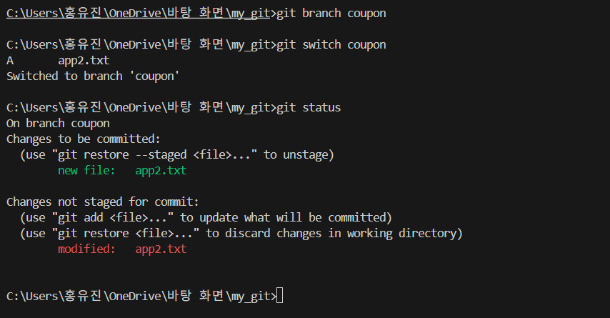

switch까지 했다면 파일 수정을 진행한다.
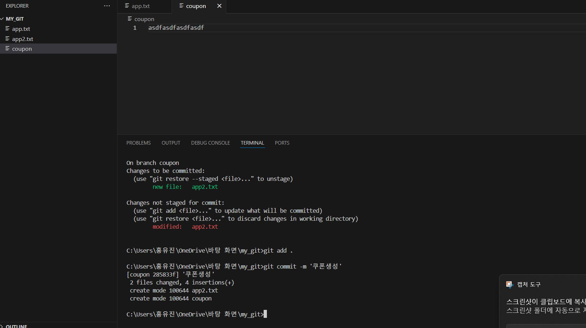

수정한 후에 스테이징과 커밋까지 진행했다.

이러고 다시 ```main```브랜치로 이동하면 
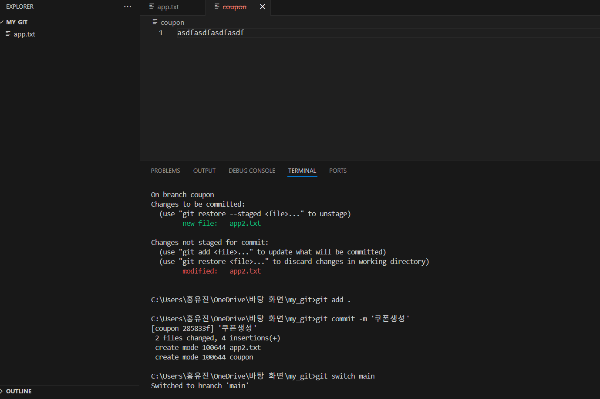

추가했던 파일이 사라지며 다시 아까의 상태로 돌아간다. (```main``` 브랜치)

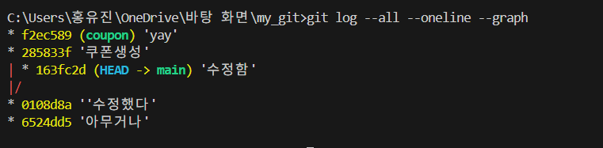

yay라고 커밋을 한 번 더하고 다시 ```main```에서 ```log```를 보면 이렇게 나뉘는 것을 확인할 수 있다.

그리고 수정한 사항이 잘 동작되어서 main에 합치고싶다! 그러면 ```merge```를 쓰면 된다.
## branch 합치기 (merge)


```branch```에서 작업한 내용이 마음에 들면 원본인 ```main branch```에 합칠 수 있다.
이를 ```merge```라고 한다.

### merge 방법
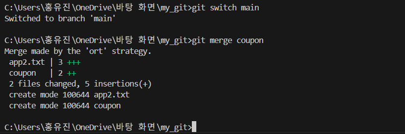


1. `git switch main`: main branch로 이동한다.
2. `git merge 브랜치이름`: 해당 branch 내용을 main에 합친다.
   예: `git merge coupon` → coupon branch의 코드가 main에 추가됨.

### merge 시 주의사항: conflict

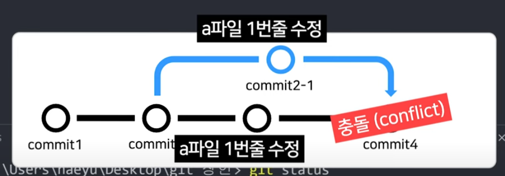


같은 파일의 같은 부분을 main과 branch에서 다르게 수정하면 conflict가 발생한다. 우리 컴퓨터가 혼란스러워하는 것이다.
- 에디터에서 충돌 파일을 열어 수정한다.  
- `<<<<`, `>>>>`, `====` 같은 표시는 지우고 원하는 코드만 남긴다.
- 수정 후 `git add 파일명`, `git commit -m '메세지'`로 해결한다.


### 실습
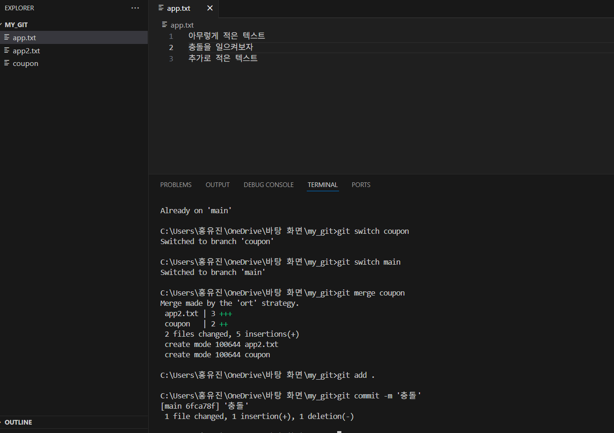

```main branch```에서 ```app.txt```의 두 번째 줄을 수정해보겠다.

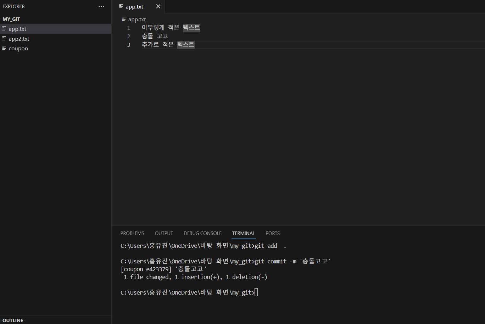

그리고 ```coupon branch```에서 두 번째 줄을 다르게 수정해봤다.

이제 ```main branch```로 이동해서 ```coupon branch```를 ```merge```해보자.

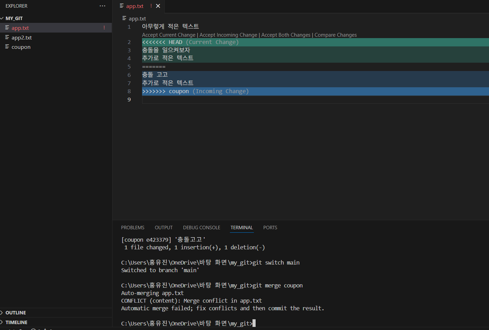

이렇게 뜨는데 여기서 원하는 코드를 남기고 다 지워보자. (vs code는 위에 1번 줄 밑에 버튼을 눌러서 해결해도 된다)
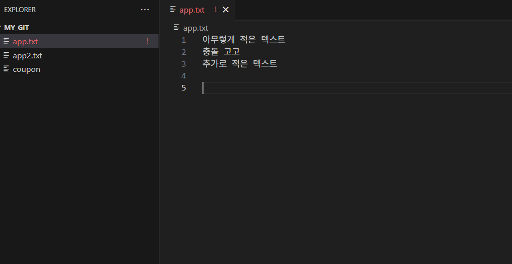

이제 다시 ```add```하고 ```commit```하면 된다.

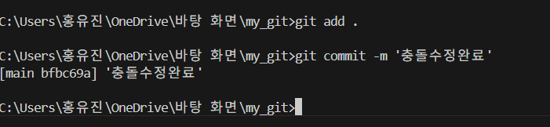


이제 log를 보면 잘 해결되었음을 알 수 있다.
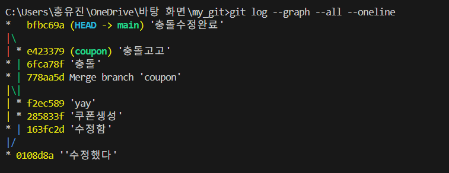


### 협업 시 branch 활용
- 각자 branch에서 작업 후 main에 merge한다.
- 코드 충돌을 줄이고 안정적으로 개발할 수 있다.

여기까지도 실습해봤던 내용이라 아주 쉬웠다! 실습을 통해 조금 더 익숙해진 느낌 정도?


