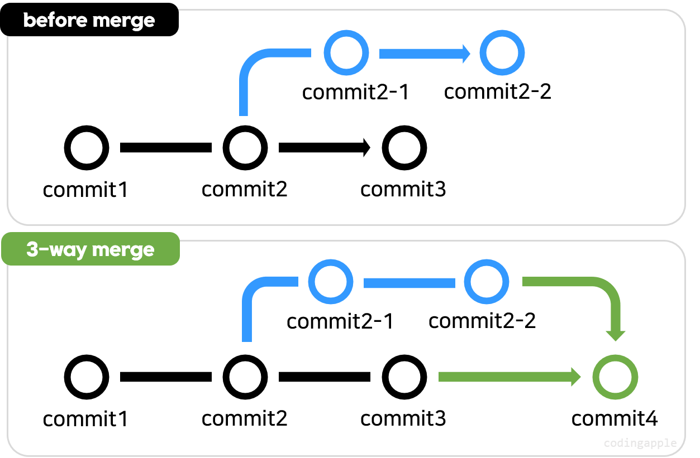
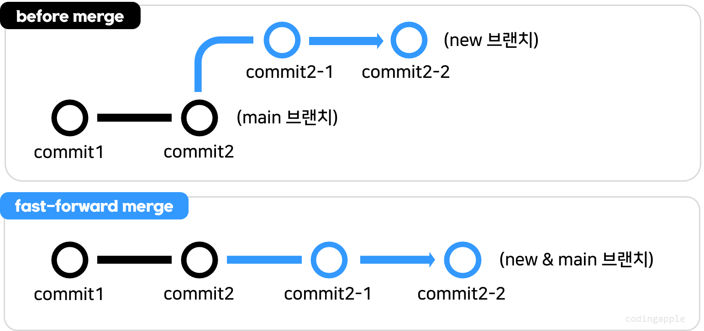
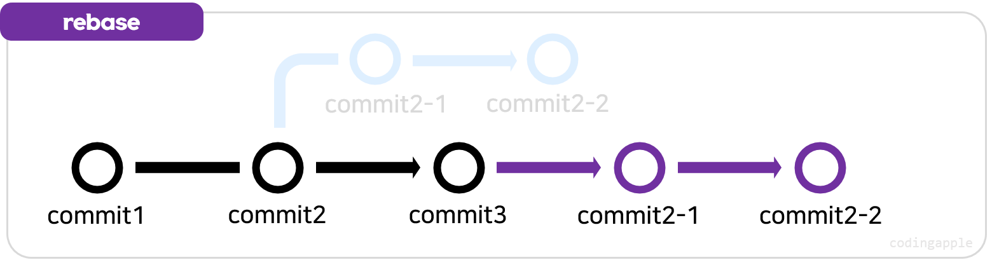
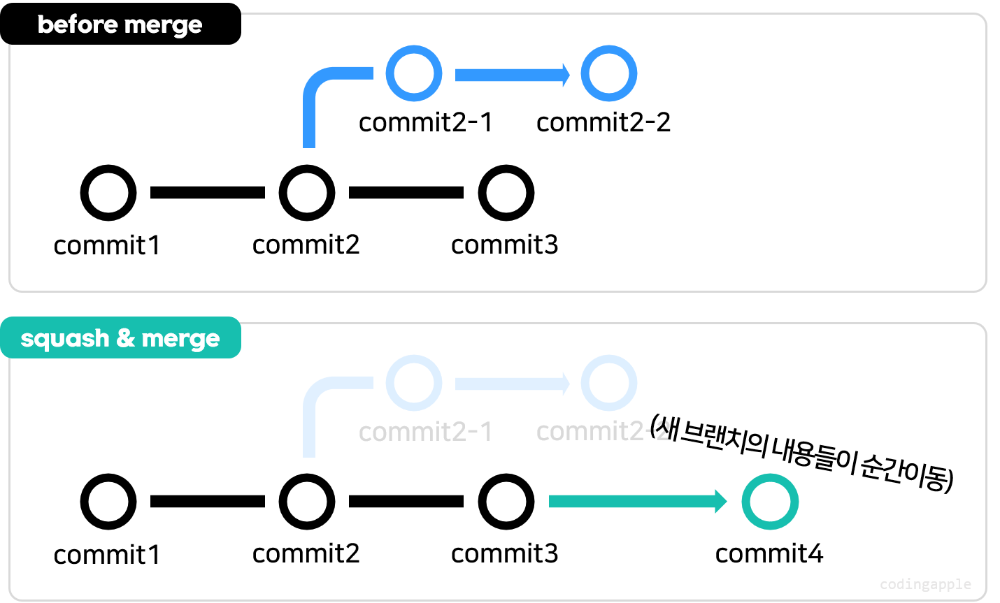
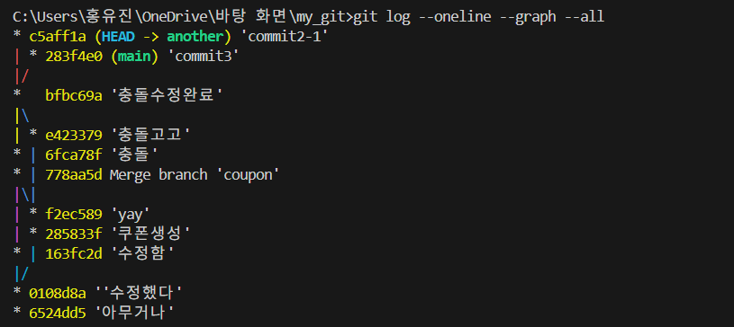
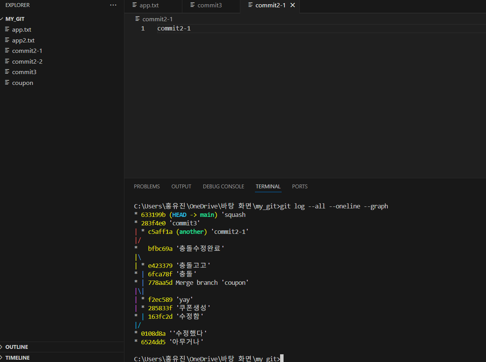

평소 포스팅을 작성할 때 강의를 한 번 이해하며 듣고, 후에 강의를 다시 들으며 게시글을 쓰면서 정리한다. 그냥 그렇다는 말을 하고 싶었다. 

어쨌거나 이번 강의는 git의 다양한 merge 방법과 그 기능에 대해서 설명해준다.

## 3-way merge
브랜치에 각각 신규 커밋이 하나 이상 있을 때 `git merge`를 실행하면 두 브랜치의 코드를 합쳐 새로운 커밋을 자동으로 생성한다.

이를 3-way merge라고 부르며, git merge의 기본 동작 방식이다.

## fast-forward merge
새로운 브랜치에만 커밋이 있고, 기준 브랜치(main)에 신규 커밋이 없을 경우 `git merge`를 실행하면 fast-forward merge가 발생한다. 

딱히 합칠게 없어서 그냥 신규브랜치 보고 **"지금부터 니 이름은 main 브랜치여"**하는 것이다.

새로운 브랜치의 커밋을 main 브랜치로 그대로 이동시키며, 별도의 merge 커밋을 만들지 않는다. 

물론 싫으면 `git merge --no-ff 브랜치명`을 사용해서 강제로 3-way merge를 하면 된다.

## 브랜치를 삭제하려면
merge를 하더라도 브랜치는 자동으로 삭제되지 않는다. 따라서 아래 명령어를 입력해줘야 한다.
- `git branch -d 브랜치이름`: 병합 완료된 브랜치 삭제.
- `git branch -D 브랜치이름`: 병합되지 않은(merge 전) 브랜치 강제 삭제.

## rebase and merge
rebase는 브랜치의 시작점을 다른 커밋으로 옮기는 작업이다.

### rebase and merge 방법
>git switch 새로운브랜치
git rebase main
git switch main
git merge 새로운브랜치

rebase & merge를 한 줄로 쉽게 비유하자면 "강제 fast-forward merge"다.

#### rebase 장점
- 3-way merge 대신 강제로 fast-forward를 원할 때.
- 커밋 히스토리를 단순화하고 싶을 때.

#### rebase 단점
- 브랜치 간 차이가 크면 충돌이 많이 발생할 수 있어 해결이 번거롭다.

## squash and merge
초보자들은 그냥 3-way merge를 쓰면 된다고 한다.
그런데 대충 모든 브랜치를 3-way merge 해버리면 나중에 참사가 일어날 수 있다.
squash and merge는 브랜치의 모든 커밋을 하나로 합쳐 main 브랜치에 단일 커밋으로 추가한다.

- 3-way merge처럼 복잡한 히스토리를 남기지 않고, 변경사항만 main에 적용한다.
- `git log`에서 다른 브랜치의 커밋 히스토리가 출력되지 않아 깔끔하다.

### squash and merge 방법
>git switch main
git merge --squash 브랜치명
git commit -m '메세지'

main 브랜치의 log를 깔끔하게 유지하고 싶을 때 쓰면 좋다.

조금 더 이해를 함과 동시에 익숙해지기 위해 `main branch`에 commit3를 만들고 `another branch`를 만들어 commit2-1을 했다.

이를 squash and merge해보면

중간에 오류가 뜨긴 했는데 another에서 commit된 결과가 삭제해도 잘 들어온 걸 보니 된 듯

굿

## 어떤 merge를 사용할까?
- 그럼에도 초보자는 고민 없이 기본 3-way merge를 사용해도 좋다. (충돌은 배웠으니 알아서 해결하자)  
- 프로젝트에 따라 merge 가이드라인이 있을 수 있으니, 팀의 기준을 따르거나 없다면 도망..은 장난이고 스스로의 기준을 세우는 것이 좋다.

그리고 숙제가 있다

1. 브랜치 하나 만들어 커밋 후 `squash and merge` 해보기.  
2. 브랜치 하나 만들어 커밋 후 `rebase and merge` 해보기.  
3. 병합 완료된 브랜치 삭제해보기.

따라만 치거나 보기만 한다고 이해가 되는 건 아니니깐 다 해보는 것이 좋을 것이다.
나도 해봐야지