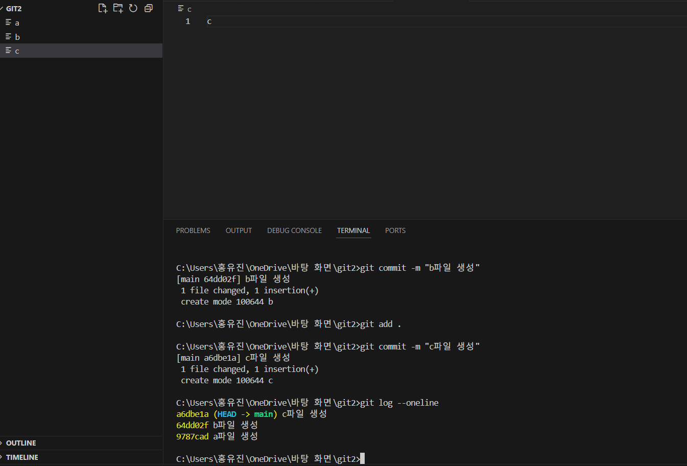
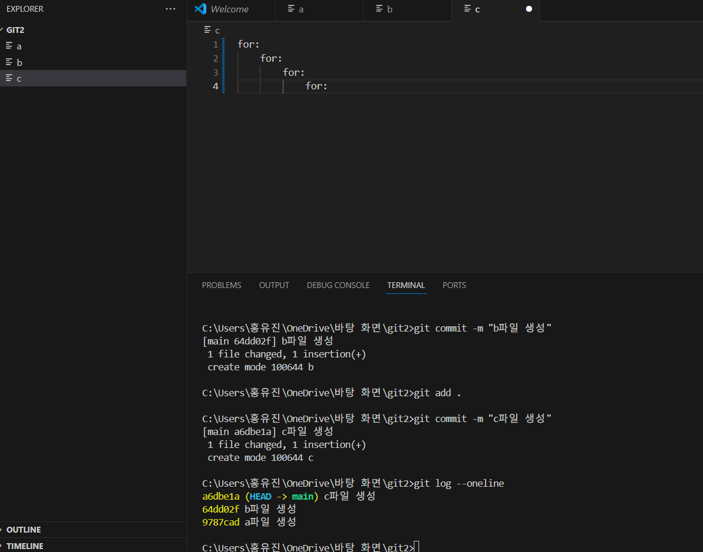
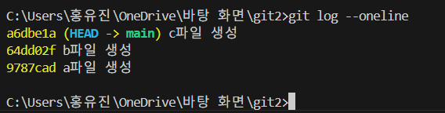
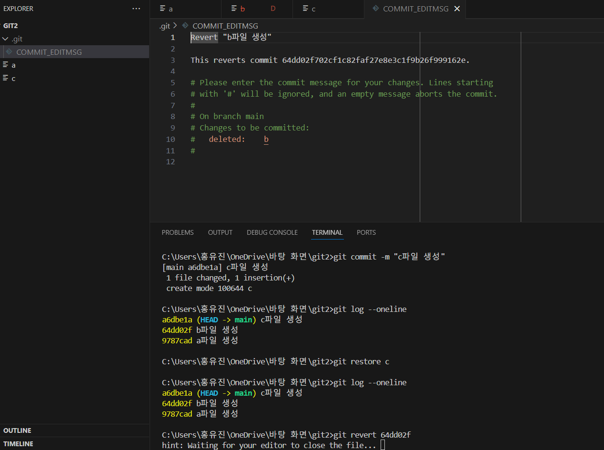
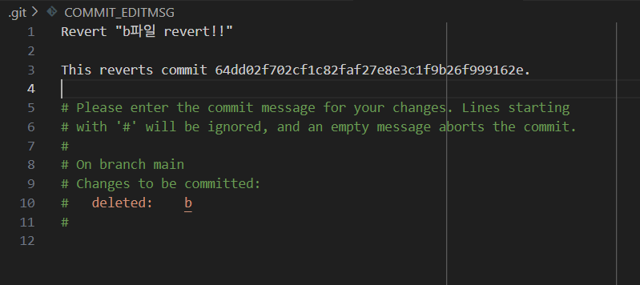
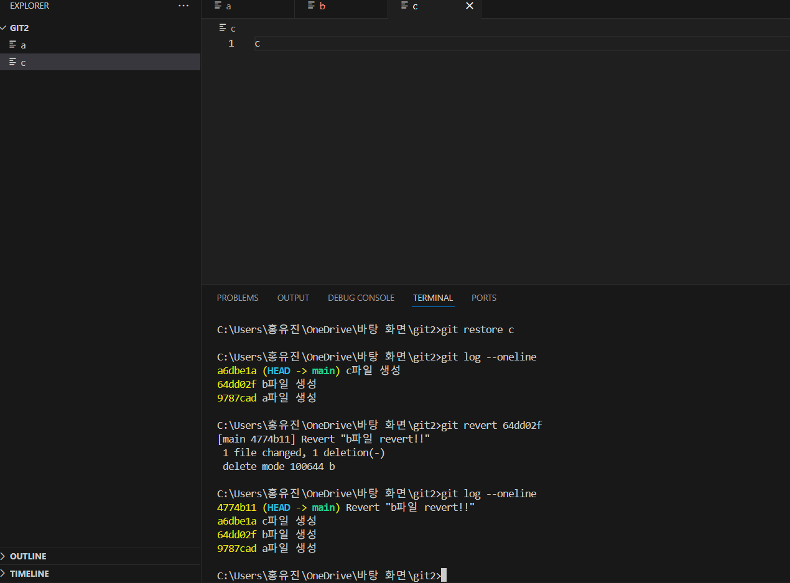
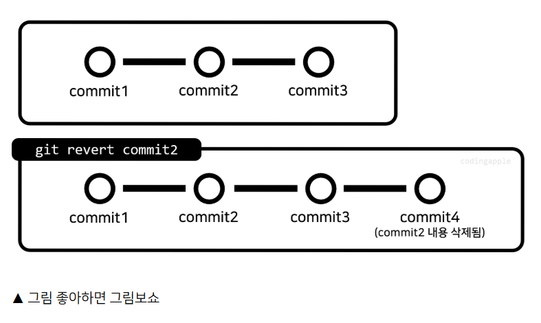
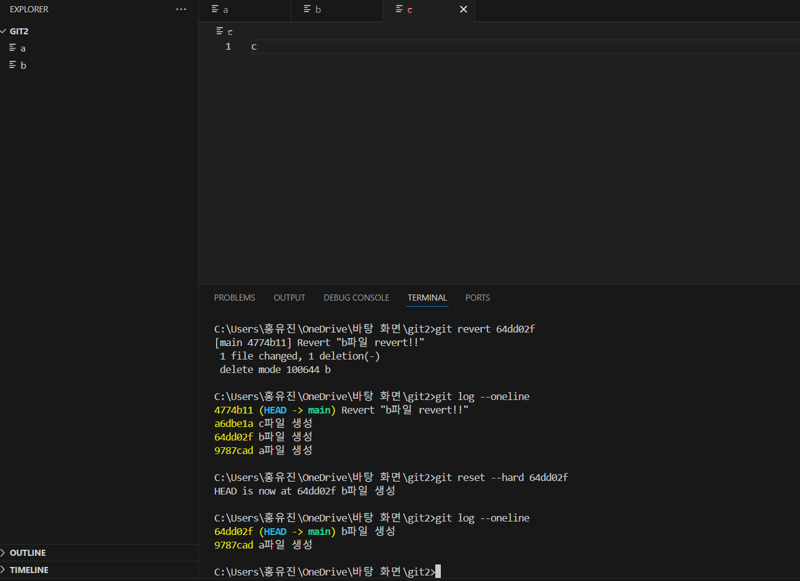

commit만 주구장창 하다 보면 실수할 때가 있다. 다행히 git은 버전 관리 프로그램이라 언제든 이전 상태로 돌아가거나 문제를 취소할 수 있다. 각각 `git restore`, `git revert`, `git reset` 명령어로 파일 복구, 커밋 취소, 시간 되돌리기가 가능하다.

참고로 오늘 배울 내용은 크게 많이 쓰는 내용은 아니라서 나중에 필요할 때 다시 찾아서 쓰는 걸 추천한다고 한다. 일단 알아두고 나중에 쓰면 더 수월하게 쓸 것 같으니 일단 잘 배워보자. 

깔끔하게 시작하기 위해 새로운 작업 폴더를 만들어서 환경을 세팅해본다.

## 일단 commit 몇 번 해보기
일단 난 git2라는 폴더를 만들었다. 새 작업 폴더에서 `git init`로 초기화하고, 파일 3개를 만들어서 각각 커밋해보자.
a, b, c 파일을 만들면서 각각 commit했다면 `git log --oneline`으로 로그를 살펴보면,

위와 같이 나온다. 이전에 학습했듯이 왼쪽 노란색 글자가 커밋의 고유 ID고, 이 ID를 이용해 특정 commit을 명시할 수 있다.

## 파일 하나를 되돌리려면 git restore
파일 수정이 잘못됐을 때 `Ctrl + Z`로 되돌릴 수도 있지만, 컴퓨터가 꺼져서 그게 불가능하거나 수정사항이 많다면 restore 명령어를 이용할 수 있다.

예를 들어 c파일에 이런 식으로 코드를 마구잡이로 작성했다고 가정해보자.

이 코드가 잘 안되면 최근 commit된 상태로 되돌릴 수 있다.
바로 restore 명령어를 이용하면 된다.
여기서 저장하고 생쇼를 해두고 `git restore c`만 입력하면

깔끔하게 이전 상태로 돌아가는 것을 확인할 수 있다.

### 정리해보면
- `git restore 파일명`: 최근 커밋 상태로 파일을 되돌린다.
- `git restore --source 커밋아이디 파일명`: 특정 커밋 시점으로 파일을 복구한다.
- `git restore --staged 파일명`: staging 상태를 취소할 수 있다. (복구와는 별개다.)

## commit을 되돌리려면 git revert
코드를 열심히 짜다가 과거 커밋 하나가 문제를 일으켰다면 어떻게 할까

예를 들어서 b 파일에 심각한 문제가 있다고 가정하고 실습해보자.
b커밋을 취소하기 위해 `git revert 커밋아이디`를 이용해서 해당 커밋을 취소한 새 커밋을 생성할 수 있다. 

말 그대로 아예 b커밋을 제거하는 것이 아니라, b커밋이 사라진 새로운 커밋을 만드는 것이다.

여기서 b파일을 지우고 싶으니 `git revert 64dd02f`를 입력해보겠다.

이러면 이렇게 파일이 뜬다. 큰따옴표 안에 commit 메세지를 입력하면 된다. 

이러고 닫고 다시 로그를 확인해보면,

이렇게 b파일이 사라진(b파일을 만들었던 commit이 사라진) 상태의 commit이 하나 생성된다.

이후 커밋은 b파일의 영향을 받지 않는다는 것이다.

### revert할 시 참고
- `git revert HEAD`: 최근 커밋만 취소할 때 편리함
- 여러 커밋을 한 번에 revert하고 싶다면 여러 개의 commit id를 입력하면 됨
- merge 커밋도 revert하면 병합이 취소된다.

## 전부 시간을 되돌리려면 git reset
우리가 개발 지옥에서 열심히 살다가 갑자기 7살 어린 시절로 돌아가고 싶다면,, 그건 불가능합니다. 
하지만 git에서는 그런 것이 가능하다고 한다.

그동안 실습을 진행했는데, 여기서 갑자기 b커밋이 만들어진 시점으로 돌아가고 싶다고 가정해보자.
그렇다면 `git reset --hard 64dd02f(b커밋아이디)` 를 입력하여 b 커밋 시점으로 모든 걸 되돌릴 수 있다. 컴퓨터가 그 이후의 기억은 모두 잃는 것이다.

이를 실행해보면, 아래처럼 작업 폴더 파일들까지도 모두 그때의 상태로 바뀐다.

### 주의사항
- 협업 리포지토리에서는 reset을 피하자. 팀원 코드가 사라져 팀원과 원수가 될 수 있다.
- untracked 파일(스테이징 안 된 파일)은 유지된다. 이들은 `git clean` 명령어를 찾아서 쓰면 지울 수 있다.

### reset 옵션
reset 뒤에 hard / soft / mixed 설정을 넣을 수 있다.
- `git reset --hard b커밋아이디`: 파일까지 모두 그 시점으로 완전히 되돌림
- `git reset --soft b커밋아이디`: b파일에 대한 커밋은 취소되지만, staging에는 남음
- `git reset --mixed b커밋아이디`: 커밋 취소, 변경사항도 staging 해제. 이제 git add 하고 commit 하고 그럴 수 있다.

따라서 검토 후에 다시 커밋하고 싶으면 `--soft`나 `--mixed`를 사용하자.

숙제가 있는데 실습해보면서 다한 것 같다. 직접해보는 게 확실히 이해가 쉬우니 다들 직접 해보도록 하자.